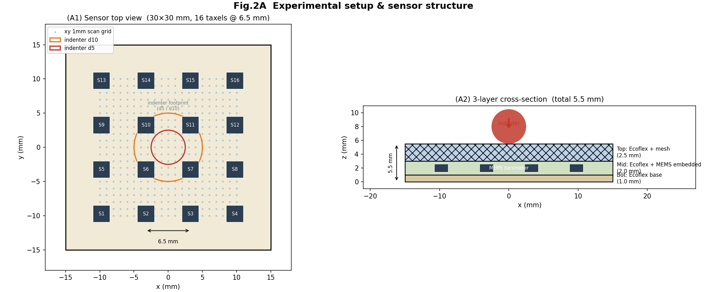
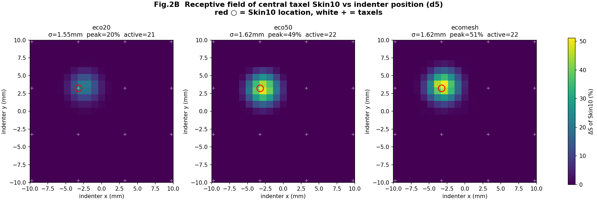
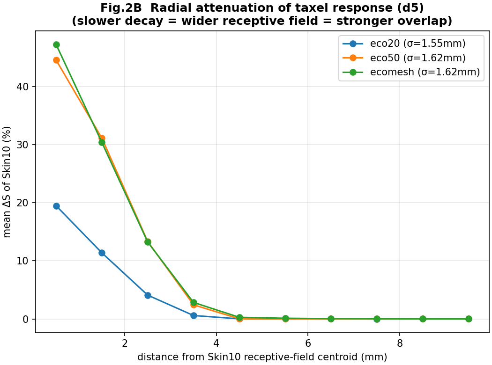
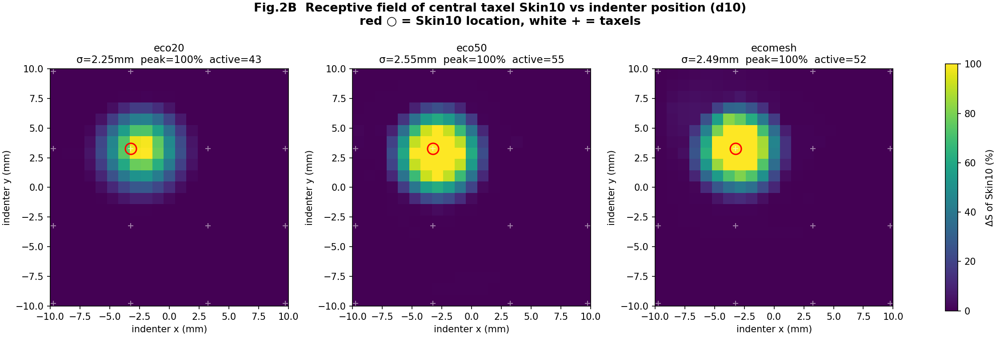
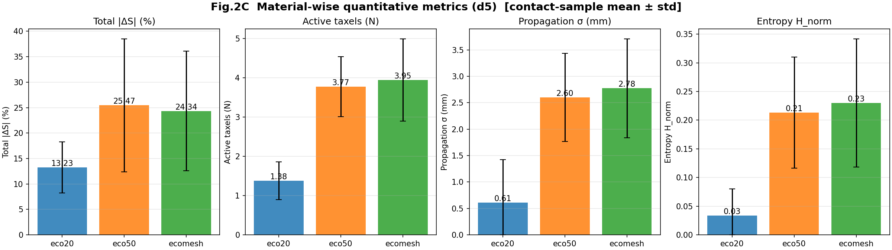
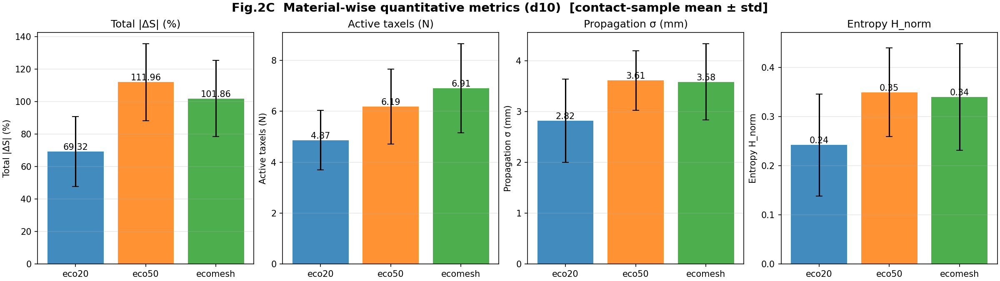

# Fig.2 — 소재 ablation (C1) 결과 보고서

> 논문 *"Development of a Flexible Tactile Sensor with Super-Resolution Capability"* §6 Fig.2.
> 주장(C1): **mesh 압력전달층이 인접 taxel 간 수용장(receptive field) 중첩을 공학적으로 키워, 민감도를 잃지 않으면서 SR에 유리한 입력 분포를 형성한다.** 최종 선택 = **mesh20(ecomesh)**.
> 데이터: `fig2_heatmap/xy_1mm/` — ±10mm 영역을 1mm 격자로 압입(인덴터 원형 d5·d10), 소재 eco20 / eco50 / ecomesh 각 1세트.
> 모든 그림은 동일 폴더(`Analysis_Results/`)에 생성됨. 재현: `python visualizing_scripts/xy_1mm/generate_panelA_schematic.py`, `generate_2d_heatmap.py --diameter all`, `generate_panelC_metrics.py --diameter all`.

---

## 방법 요약 (Methods)

- **센서**: 16 taxel(MEMS barometer)을 4×4 격자(간격 6.5mm, ±9.75mm)로 sparse 배치. 외형 30×30×5.5mm, 3중층.
- **신호 정의**: 각 taxel ΔS = `-(raw - baseline)/baseline × 100` (%). 압력 증가를 양수로.
- **baseline (2026-06-25 수정)**: 각 격자점 압입 사이클의 **접촉 직전(travel 높이, stage z<13mm 무접촉) per-taxel 평균** = **per-press local baseline**. 이전엔 스캔 맨 처음 30 burst 전역 평균을 끝까지 고정했는데, 긴 스캔(수천 초·수백 압입)에서 센서 drift로 후반·원거리 taxel이 누르지 않아도 ~0.5~1% 떠 확산지표를 부풀렸다(특히 d5 eco20 σ_prop 3.22→0.61로 교정).
- **동기화**: due(센서, burst 평균) ↔ ethermotion(인덴터 위치) ↔ loadcell, `time_s` 보간. 인덴터 위치 = encoder pulse ×1e-4 mm.
- **접촉 게이팅**: 어떤 taxel이라도 ΔS>5% 인 샘플(소재·인덴터 무관 robust; loadcell 절대임계는 d5/연질에서 0검출되어 폐기).
- **인덴터**: 동일 지름(d5 또는 d10)으로 3소재 비교 → 소재 효과만 분리.

---

## Fig.2A — 실험 셋업 / 센서 구조

- **(A1)** 센서 평면도: 30×30mm 본체, 16 taxel(6.5mm 간격), xy 1mm 스캔 격자(±10mm, 21×21), 인덴터 d5/d10 풋프린트(원점 동심원 — taxel 간격 대비 인덴터 크기). d10(⌀10mm)은 인접 taxel 간 거리(6.5mm)보다 커 한 번에 여러 taxel을 덮고, d5(⌀5mm)는 국소 압입에 가깝다.
- **(A2)** 3중층 단면: **Top**(Ecoflex+mesh, 2.5mm) / **Mid**(Ecoflex+MEMS embedded, 2mm) / **Bot**(Ecoflex base, 1mm), 총 5.5mm. mesh는 Top층 내부의 준강성 하중분산 골격으로 작동.

---

## Fig.2B — 수용장(receptive field) 2D 맵

중심 taxel(Skin10)의 ΔS를 **인덴터 격자 위치 (x,y)** 함수로 그린 맵 = 그 taxel의 수용장. 넓을수록 인접 압입에도 반응 = 중첩↑.

### d5 (소재 대비 선명)

| 소재 | peak ΔS (%) | 평균 수용장폭 (mm) | σ (mm) | active cells |
|---|---|---|---|---|
| eco20 | 22.1 | **3.56** | 1.54 | 20.3 |
| eco50 | **46.8** | 3.61 | 1.62 | 22.3 |
| **ecomesh** | 44.0 | **3.78** | 1.68 | 23.8 |

> 수용장폭 = **16 taxel 중 중앙 4개(Skin6,7,10,11) 각각의 half-max 지름(자기 peak 50%)을 평균**. Skin10 하나만 쓰면 그 taxel 특이성으로 d5 eco20 이 거꾸로 넓어 보이던 착시가 평균으로 사라짐. 가장자리 taxel(±9.75)은 스캔(±10mm)에 잘려 제외.

**해석**: eco20(연질)은 평균 수용장폭 최저(3.56) → undersampling. d5(작은 인덴터)는 국소라 셋 다 ~3.6mm 로 **taxel 간격 6.5mm 에 한참 못 미침**(겹침 약함). 소재 우열은 d10 에서 갈림.

### d10 (큰 인덴터, 포화)

| 소재 | peak ΔS (%) | 평균 수용장폭 (mm) | σ (mm) | active cells |
|---|---|---|---|---|
| eco20 | ~100 | 5.07 | 2.25 | 42.5 |
| eco50 | ~100 | **6.63** | **2.55** | **54.5** |
| **ecomesh** | ~100 | 6.25 | 2.48 | 51.5 |

**해석**: d10은 peak~100%로 포화 → peak 으로는 구분 불가. 대신 **평균 수용장폭(중앙4)** 으로 보면 **eco20 5.07mm < ecomesh 6.25 ≈ eco50 6.63mm**. eco50·mesh 는 **taxel 간격 6.5mm 에 근접/도달** → 이웃 수용장이 겹쳐 **SR 보간 가능(overlap)**; eco20 은 pitch 미달 → undersampling 간극. (σ·active 도 같은 순서, eco20 최저.)

---

## Fig.2C — 정량 메트릭 (소재별)

각 격자점의 **peak 압입 순간**을 대표로, **|ΔS| 절댓값 + 절대 노이즈 floor 0.5%**(실측 noise std~0.01%의 50배) 로 노이즈 제거 후 16-taxel 배열에서 산출. 평균. (이전의 상대임계 0.15·peak + 부호 있는 ΔS 는 d5 처럼 1개 taxel 이 압도적인 경우 active=1 → σ·entropy 가 0 으로 퇴화하고 음수 이웃 응답을 버려서 폐기.)

### d5

| 메트릭 | eco20 | eco50 | ecomesh | 의미 |
|---|---|---|---|---|
| Total \|ΔS\| (%) | 13.2 | **25.5** | 24.3 | 민감도 — eco20 ≪ eco50≈ecomesh |
| Active taxels (N) | 1.38 | 3.77 | **3.95** | 중첩 정도 — eco20 최저, ecomesh 최대 |
| Propagation σ (mm) | 0.61 | 2.60 | **2.78** | 확산폭 — eco20 최저, ecomesh 최대 |
| Entropy H_norm | 0.034 | 0.213 | **0.230** | 응답 분산도 — eco20 최저, ecomesh 최대 |

> per-press local baseline 적용 후 **d5 eco20 propagation σ 가 3.22→0.61 로 교정**(이전엔 drift 가 가짜 퍼짐으로 잡혔음) → 이제 eco20 이 4지표 모두 최저로 일관.

**핵심**: d5 에서 **4지표 모두 eco20 ≪ eco50 ≤ ecomesh** — eco20(연질)은 신호가 약하고 한 taxel 에 집중(국소). ecomesh 가 active·σ·entropy 에서 eco50 보다 근소 우위지만(작은 인덴터라 대비 작음), mesh 우위의 결정적 조건은 d10.

### d10

| 메트릭 | eco20 | eco50 | ecomesh |
|---|---|---|---|
| Total \|ΔS\| (%) | 69.3 | **112.0** | 101.9 |
| Active taxels (N) | 4.87 | 6.19 | **6.91** |
| Propagation σ (mm) | 2.82 | **3.61** | 3.58 |
| Entropy H_norm | 0.242 | **0.349** | 0.340 |

**d10 (정직한 결과, per-press local baseline).** 인덴터(⌀10mm>taxel 간격 6.5mm)가 여러 taxel 에 걸친다. eco20 은 4지표 모두 최저(국소·undersampling). **ecomesh 의 분명한 우위는 active taxel 수(6.91, 최대)** — 가장 많은 taxel 을 동시에 깨운다. 단 **σ_prop·entropy 는 eco50 과 사실상 동급**(eco50 3.61/0.349 ≈ mesh 3.58/0.340; 이전 전역-baseline 에서 mesh 가 크게 앞선 건 drift 부풀림이었음). 민감도(Total)는 eco50 이 최고, mesh 는 그 ~91%.

> **C1 주장 재정리(중요)**: "mesh 가 σ·entropy 로 가장 넓고 고르게 퍼진다"는 **더 이상 성립하지 않음**(eco50 와 동급). 데이터가 지지하는 정직한 주장 = **"mesh 는 가장 많은 taxel 을 활성화(active 최대)하면서 eco50 급 민감도를 유지하고, eco20 의 undersampling 을 피한다"** = SR 입력으로서 다중-taxel 관여가 가장 풍부.

---

## 종합 결론

1. **mesh = 가장 많은 taxel 관여.** **d10**(접촉이 여러 taxel 에 걸치는 조건)에서 ecomesh 가 **active taxel 수 최대(6.91)** → 한 압입을 가장 많은 taxel 로 동시에 전달. σ_prop·entropy 는 eco50 과 동급(3.58/0.340 ≈ 3.61/0.349)이라 "퍼짐 폭·균등성"에서 mesh 단독 우위는 아니다(per-press local baseline 적용 후 drift 부풀림이 빠진 정직한 결과). eco20 은 모든 지표 최저(undersampling).
2. **민감도 유지.** ecomesh의 Total|ΔS|·peak이 eco50급(d5에서 eco20의 ~1.6배). eco50처럼 넓되 신호가 죽지 않음 → "중첩과 SNR의 균형".
3. **eco20의 한계.** 연질 균질 엘라스토머는 신호가 국소·약함(낮은 peak, 좁은 확산) = SR undersampling. **eco50은 확산은 늘지만** d5 민감도가 ecomesh와 비슷/약간 높은 수준 — 다만 큰 하중 포화(d10에서 모두 ~100%)와 위치 gradient 손실 위험.
4. → **최종 소재 = mesh20(ecomesh).** Fig.2A/B/C가 그 근거를 셋업·수용장·정량 메트릭 3단으로 제시.

---

## 한계 & 남은 작업

- **σ_prop의 저SNR 취약성**: peak이 낮은 소재(d5 eco20)는 σ가 노이즈로 inflated(절대 floor 0.5%로 0 퇴화는 해소했으나 d5 eco20 σ는 여전히 높게 나옴) → 확산 판단은 d10 + active·entropy 로. 향후 SNR metric 추가로 eco50의 "포화/SNR 손실" 주장 직접 입증 권장.
- **단일 세트**: 소재·지름당 1 test. 통계적 강건성 위해 3 set 반복(§7 체크리스트) 후 평균·분산 보고 필요.
- **패널 (D) 미진행**: 소재별 SATS 학습 RMSE/R² 비교는 `sensor_training/sats` 모델 학습이 필요 → 별도 진행. 완료 시 본 보고서에 추가.
- **인덴터 확장**: 논문 §6은 d15·사각(fillet2)도 명시 → 데이터 변환·동일 파이프라인 적용 가능(`DATASETS`에 추가).

---

*생성: 2026-06-23, 메트릭 갱신: 2026-06-25 (peak→half-max 폭 추가, σ 임계화, 배열 메트릭 |ΔS|+절대 floor 0.5%로 재계산). 스크립트 출력 PNG/CSV는 `Analysis_Results/{d5,d10}/` 및 본 폴더. 진행 기록은 `PROJECT_STRUCTURE.md`·Notion 연구일지 참조.*
