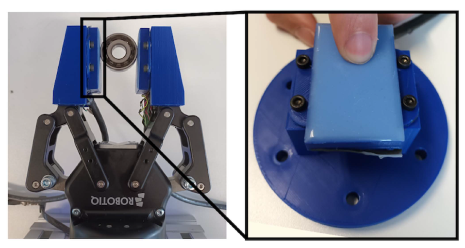

# A Soft Barometric Tactile Sensor to Simultaneously Localize Contact and Estimate Normal Force With Validation to Detect Slip in a Robotic Gripper _ 2022 RAL

## Abstract

소프트 촉각 센싱 기술은 로봇에 물체를 잡고 조작하는 촉각을 부여할 수 있는 잠재력을 제공한다. 이러한 작업 수행 중에는 접촉 위치와 정량적 힘을 넓은 힘 범위에서 정확히 아는 것이 중요하다. 산업적 적용을 위해서는 해당 센서가 저비용이고, 보정 절차가 거의 또는 전혀 필요하지 않으며, 제조가 용이해야 한다. 본 연구에서는 엘라스토머 층으로 덮인 마이크로전기기계시스템(MEMS) 기반의 기압 센서 배열을 제시한다. 센서 신호는 매개변수화된 가우시안 분포 유형에 기초하여 실시간으로 해석된다. 접촉 위치는 실시간으로 해당 가우시안 분포의 매개변수를 찾아 결정하며, 이 매개변수는 다시 **법선 접촉력 추정에 사용**된다. 결과는 **위치 추정 정확도가 0.5 mm**임을 보였으며, **법선 힘 오차는 최대 25 N 범위에**서 **10%**, **25–50 N의 고하중 범위에서는 15%임**을 보였다. 제안한 소프트 촉각 센서는 또한 다양한 물체를 그립할 때 **미끄러짐(슬립)을 감지하는 능력을 제공함이 검증**되었다.

## I. INTRODUCTION

지난 10년간 로봇용 소프트 촉각 센싱 기술이 등장하여 물체 특징 추출 및 분류 [1], [2], 슬립 감지 [3], [4], [5], [6], 정교한 인핸드 조작(핸드 내 조작) [7], 원격 존재감(텔레프리젠스) [8] 등 여러 연구 분야에서 활용되고 있다. 촉각 센서는 특히 약하고 가벼우며 변형 가능한 물체를 잡고 조작할 때 접촉 위치의 국지화와 접촉력 추정에 유용하다. [9]

---

광학 원리 기반 촉각 센서[10], [11], [12], [13], [14], [15], 자기 원리 기반[16], [17], 기압 기반[18], [19], [20], [21], 정전용량 기반[22], [23], 압저항(피에조저항) 기반[24], 전기 임피던스 기반[25] 등 다양한 원리를 이용한 촉각 센서가 존재한다.

---

SynTouch Bio-Tac [26] 및 Right Hand Robotic Takktile [27]과 같은 잘 알려진 상용 솔루션은 로봇 그리퍼에서 활용할 수 있는 최첨단 센싱 기능을 제공한다. 그러나 앞서 열거한 많은 센서들은 센서 신호를 해석하기 위해 광범위한 보정 절차와 정교한 머신러닝 학습을 필요로 한다. 이러한 제약은 상용 그리퍼에 촉각 센서를 쉽고 빠르게 통합하는 데 장애가 될 수 있다.

---

Fig. 1. Experimental setup of the presented tactile sensors mounted in the fingertips of a robotic gripper (left), Close-up of a single barometric tactile sensor being pressed with a finger (right).

본 연구에서는 **접촉 지점을 국지화하고 법선 접촉력을 동시에 추정할 수 있는 간단하고 저비용의 센서를 제시**한다. 이 센서를 기성 그리퍼에 내장하여 다양한 물체를 그립할 때의 **슬립 감지 능력을 실증**하였다(그림 1 참조). 제안 센서는 엘라스토머 층으로 덮인 저비용 마이크로전기기계시스템(MEMS) 기반 기압 센서 배열로 구성된다. **센서 배열에서 기록된 신호는 전용 매개변수화 모델을 사용해 해석**된다. **모델링 접근법은 소수의 매개변수를 가지는 가우시안 함수에 기반하며 오프라인 데이터 수집을 통한 보정을 필요로 하지 않는다.** 또한 제한된 수의 MEMS 센서로부터 얻은 정보만으로 평면 센싱 영역에서의 근사적인 압력 분포를 재구성할 수 있다.

본 연구의 주요 기여는 다음과 같다.

1. 평면 센싱 영역(648 mm²)에서 접촉 지점을 동시에 국지화하고 법선력을 최대 50 N까지 정확하고 실시간으로 추정할 수 있는 소프트 촉각 센서.
2. 가우시안 압력 분포를 가정함으로써 오프라인 보정이나 데이터 집약적 머신러닝 절차를 요구하지 않는, 저비용이고 배치가 용이한 센서.
3. 외부 하중이 가해진 상태에서 미끄러짐 조건으로 강제한 다양한 물체에 대해 검증된 국지화 기반 슬립 감지.

## II. RELATED WORK

### A. Tactile Sensors

로봇 그리퍼의 핑거팁에서의 위치 추정 및 힘 추정은 활발한 연구 주제다. 여러 센싱 원리가 탐구되었지만 세 가지가 해당 분야를 주도한다.

---

첫째는 비전(광학) 기반 촉각 센서다. 카메라와 같은 광학 장치는 외력이 가해졌을 때 연성 표면의 변형에 대한 고해상도 정보를 제공한다 [10]. 카메라에서 얻는 고해상도 정보를 의미 있는 데이터로 변환하기 위해 비전 기반 촉각 센서는 신경망 및/또는 광범위한 보정 절차에 크게 의존한다. 이들 센서는 일반적으로 접촉점 위치에 대해 정확한 추정을 제공하지만 최소 초점 거리가 필요해 **센서가 크고 부피가 커지는 단점**이 있다. **다중 카메라 접근법**을 사용하면 센서 두께를 크게 줄일 수 있음이 [10]에 상세히 설명되어 있다. 광학 촉각 센서는 복잡한 형상의 핑거팁에 비교적 쉽게 통합될 수 있다 [11], [12]. [13]에서는 **유한요소해석(FEA)으로부터 시뮬레이션 데이터를 사용해 신경망을 학습시키면 120 Hz에서 전체 힘에 대한 평균제곱근오차(RMSE) 0.281 N을 달성할 수 있음**을 보였다. 이러한 데이터 기반 광학 촉각 센서의 성능은 **압입 깊이와 압입체(인덴터) 형태에 영향을 받는 것으로 보인다.** [24]에서는 압입 깊이가 증가할수록 위치 추정 오차가 크게 감소함을 보고했다. 같은 경향이 [15]에서도 관찰된다. 신경망을 벗어나는 한 방법으로 확률적 접근이 있다. [12]에서는 베이지안 분류기를 사용해 최선의 경우 0.1 mm 정확도로 접촉점을 국지화했다. 신경망을 회피하는 또 다른 방법은 [14]에 있다. 여기서는 각 마커에서 최대 깊이를 찾기 위해 다항식 피팅(polynomial fitting) 알고리즘을 사용하고, 정확한 접촉 위치를 찾기 위해 가우시안 곡선 피팅을 결합했다. 그 결과 평균 오차는 약 3 mm였다. **신경망을 배제했음에도 이들 방법은 여전히 데이터 집약적 보정을 요구**한다.

---

둘째는 자기(마그네틱) 촉각 센서다. 여기서는 영구자석을 탄성층에 내장한다. 힘이 센서에 작용하면 탄성층이 변형되어 자석이 이동하고, 이 이동으로 인한 자기장 변화는 홀 센서를 이용해 감지되어 접촉력을 결정할 수 있다 [16]. 단일 영구자석 대신 유연한 자기 필름을 사용하면 접촉 위치와 힘을 0.1 mm 내외의 최대 오차와 10 Hz에서 RMSE 0.01 N 수준으로 검출할 수 있다 [17].

---

마지막으로 지배적인 원리는 기압(바로메트릭) 압력 센싱이다. 기압 센서는 표준 표면실장 패키지 안에 집적 신호 처리부, 아날로그-디지털 변환기, 버스 인터페이스를 갖춘 MEMS 트랜스듀서를 사용한다 [18]. 평면 배열로 배치하면 접촉을 통해 **물체의 형태와 위치를 추정**하는 데 사용될 수 있으며 평균 위치 오차는 0.8 mm에서 2 mm 사이로 보고되었다 [19]. 기압 센서는 또한 **접촉력**을 추정할 수 있다. 이들의 정확성은 센서의 배치 각도에 크게 영향을 받는다. [20]에서는 센서를 접촉판에 대해 45◦ 각도로 배치했을 때 최적 결과를 보였고, 법선력에 대해 최소 RMSE 1.74 N을 관찰했다. **기압 센서 배열 설계를 개선하기 위해서는 FEA 도구가 유용할 수 있으며 구성에 따라 센싱 정확성이 달라지고 크로스토크를 최대화할 수 있다** [21]. 크로스토크는 단일 센서의 활성화가 다른 센서들에서도 의미 있는 신호를 유발해 더 풍부한 압력 데이터를 만들어 낼 수 있는 현상이다. 최적 구성은 중앙값 오류 1.1 mm를 제공했다.

---

이 세 가지 주요 원리 외에 정전용량 기반 촉각 힘 센서도 존재한다. 이들은 작은 돌기(nip)의 이동에 따른 정전용량 변화를 기반으로 동작한다 [23]. 접촉점을 국지화하기 위해 비전 기반 촉각 센서와 유사한 베이지안 인식 기법을 정전용량 센서와 함께 사용할 수 있다 [22]. 능동적 베이지안 인식 접근을 사용하면 약 0.18 mm의 정확도를 달성할 수 있다. 또한 압저항(피에조저항) 촉각 센서도 존재하며 중앙값 오차 0.97 mm로 국지화할 수 있다 [24]. [25]에서는 SynTouch BioTac을 사용해 접촉점을 추정했다. 접촉점은 전극들의 임피던스 변화에 그들의 카르테시안 좌표를 가중평균하여 해석적으로 구해졌고 평균 오차는 0.29 mm였다. 표 I는 최신 기술들의 요구되는 학습/보정 데이터와 국지화 및 힘 오차를 요약해 보여준다.

### B. Slip Detection

일반적으로 **접촉의 국지화와 힘 추정은 별도로 수행**된다. 본 연구에서는 **접촉을 동시에 국지화하고 넓은 힘 범위에서 해당 힘을 추정할 수 있는 방법을 제안**한다. 이는 슬립 감지 등 촉각을 필요로 하는 로봇 그립 및 조작 과제에 다양한 기능을 부여한다. [4]는 슬립 감지에 사용되는 관련 방법과 센서들을 잘 요약하고 있다.

**기계학습 접근법도 슬립 감지**에 널리 적용되어 있다. [5]와 [6]에서는 정지 상태와 슬립 상태를 구분하기 위해 서포트 벡터 머신(SVM)을 사용한다. 슬립이 관측되면 그립력을 증가시켜 물체를 확보한다. 성공률은 [5]에서 95%이고 [6]에서는 74%였다.

또 다른 슬립 추정 방법은 촉각 신호를 미분하는 등 **신호 처리로 슬립 거동을 분석하는 것**이다. 물체가 미끄러지기 시작하면 스틱-슬립 거동이 작은 진동을 유발하며 이를 통해 슬립을 예측한다. [28]에서는 복합 재료의 저항 변화 측정을 통해 이 방법을 적용했다.

다른 슬립 검출 방법은 [23]에 소개되어 있다. 여기서는 정전용량 **촉각 센서의 주파수 스펙트럼을 관찰**하여 슬립을 검출했으며 94.4%의 성공률을 달성했다.

네 번째 일반적 방법은 **접선력과 법선 그립력을 비교**하는 것이다. 이 비율이 마찰계수보다 커지면 물체는 미끄러진다. 이 방법은 널리 사용되나 마찰계수에 영향을 주는 환경 변화에 취약하다.

본 논문에서 제안하는 **슬립 검출 방법은 소프트 촉각 센싱에 기반하며 접촉 국지화에 의존하는 방식을 실증한다. 이 접근법은 불확실한 마찰계수에 의존하지 않으며 데이터 집약적 기계학습을 필요로 하지 않는다**.

## III. METHODS

### A. MEMS-Based Barometric Tactile Sensor

제시된 바로메트릭 촉각 센서의 핵심은 디지털 마이크로 고도계(MS5840 [29]) 배열로 구성된다. 센서는 겔로 덮인 노출된 MEMS 트랜스듀서를 가지며 컴팩트한 크기(3.3 mm × 3.3 mm × 1.7 mm)를 갖는다.  센서들은 3개의 인쇄회로기판(PCB) 스트립에 납땜되었다. 각 스트립에는 5개의 센서가 장착되어 있다. 

인접 센서 중심점 간 간격은 9 mm이다. 단순한 직사각형 고정 박스는 3D 프린터(Ultimaker 2+, 재료: PLA)로 치수 30 × 50 × 7 mm로 제작되었고 바닥에는 구멍이 뚫려 있다. 세 개의 PCB 스트립은 박스 바닥에 접착되어 기압 센서가 구멍을 통해 노출되도록 배치되었다(그림 2). 

Fig. 2. Illustration of the tactile sensor components prior to rubber casting. On the left (1) we show a 3D printed holding box with PCB strips (2) glued to the bottom of the box. Finally, on the right (3) is a depiction of a single barometric MEMS sensor.

다음으로 연성 접촉 엘라스토머 층을 준비했다. 우리는 Resion ResinTechnology의 2성분 액상 엘라스토머 혼합물을 사용했다. 진공 펌프(EVD-VE115SV)를 이용해 엘라스토머의 기포를 제거한 뒤 센서 고정 박스에 부어 넣었다. 마지막 단계로 엘라스토머가 액상 상태인 채로 조립된 촉각 센서를 다시 한 번 감압(탈기)한 뒤 24시간 동안 경화시켜 고체 실리콘 고무로 만들었다. 하드니스는 Shore A 지수로 15이다. 탈기는 촉각 센서 제조에서 표준 기법이며, 보호된 MEMS 트랜스듀서와 엘라스토머 사이에 신뢰성 있는 접합을 얻기 위해 필수적이다[18].

### B. Model-Based Localization and Force Estimation

모델 기반 국지화와 법선력 추정 방법은 그림 3에 제시되어 있다. 

Fig. 3. Illustration of the working principle of the model-based simultaneous localization and force estimation. Left: Finger creates contact with the sensor. Middle: Optimization finds parameter values of the parameterized Gaussian pressure distribution that best fits the pressure data. Right: The found parameters values are used to simultaneously locate the contact and estimate forces.

이 작업에서는 가우시안 분포를 사용하여 직사각형 표면(데카르트 x, y 좌표)상의 압력 분포를 재구성한다. 수식은 다음과 같다.

$$
f(x,y) \;=\; \frac{1}{2\pi\sigma_x\sigma_y\sqrt{1-\rho^2}}\;
\exp\!\left(-\frac{1}{2(1-\rho^2)}\Delta\right)
$$

$$
\Delta \;=\; \left(\frac{x-\mu_x}{\sigma_x}\right)^{2}
-2\rho\left(\frac{x-\mu_x}{\sigma_x}\right)\left(\frac{y-\mu_y}{\sigma_y}\right)
+\left(\frac{y-\mu_y}{\sigma_y}\right)^{2} \tag{1}
$$

여기서 $\mu_x$와 $\mu_y$는 x와 y의 평균이고, $\sigma_x$와 $\sigma_y$는 각각 x 및 y 방향의 표준편차이며, $\rho$는 x와 y 간의 상관계수를 나타낸다.

식 (1)로부터 다음 형태의 압력 분포를 촉각 센서 표면에 가정한다.

$$
p(x,y,\theta)=p_0 \exp ^{ -\frac{1}{2}\frac{(x-x_c)^2+(y-y_c)^2}{\sigma^2}}  \tag{2}
$$

여기서 $p(\cdot)$은 압력이고 $\theta=[p_0,\sigma,x_c,y_c]$는 가우시안의 매개변수들이다. $p_0$는 바닥면에서의 최대 압력, $\sigma$는 가우시안의 표준편차, $(x_c,y_c)$는 가우시안 중심의 x,y 좌표이다.

---

중요한 가정은 표준 가우시안(식 (1))을 대칭 가우시안 $\sigma_x=\sigma_y=\sigma,\ \rho=0$으로 단순화하고, 식 (2)의 비례항 $p_0$가 바닥면에 가해진 최대 압력값과 연관된다고 보는 것이다.

---

이 가정 하에서 국지화 문제는 측정된 압력 데이터에 가장 잘 맞는 가우시안 분포(식 (2))를 찾는 최소화 문제로 재정식화될 수 있다. 최소화할 오차 함수는 다음과 같다.

$$
\mathrm{Err}(\theta)=\sum_{i=1}^{n}\bigl[p(x_i,y_i,\theta)-\hat p_i]^2\tag{3}
$$

여기서 $p(\cdot)$은 추정된 압력, $(x_i,y_i)$는 센서 (i)의 좌표, $\theta=[p_0,\sigma,x_c,y_c]$는 가우시안 매개변수, $\hat p_i$는 측정된 압력값(측정 벡터 $\hat {\mathbf p}$의 성분)이다.

---

알고리즘 효율을 높이기 위해 압력 판독값 중 (n)개의 가장 큰 값들만 사용한다. (n)을 증가시키면 정확도는 향상되지만 최적화 속도는 감소한다.

---

매개변수들은 최소제곱 최적화법으로 찾아 최적 $\theta^{*}$를 얻는다. 이로써 가우시안의 중심 위치를 구할 수 있으며 그것이 정의상 접촉점이 된다.

---

접촉점 국지화 정보를 사용해 접촉 영역의 법선력을 결정할 수 있다. 식 (2)를 (x,y)에 대해 적분하면 다음 식을 얻는다.

$$
F_z=\iint p(x,y,\theta^{*}) \ dxdy \\= 2\pi \ p_0 \ \sigma^2.\tag{4}
$$

두 매개변수 $p_0$와 $\sigma$가 추정되었으므로 법선력은 위 식으로 쉽게 계산할 수 있다.

### C. Force Controller With Slip Detection

**모델 기반 국지화와 법선력 추정 기능을 설명하기 위해**, 이 절에서는 **법선력 추정을 기반으로 한 힘 제어기**와 **국지화를 기반으로 한 슬립 감지기**를 **동시에 실행**하는 방법을 기술한다.

촉각 센서를 그리퍼의 핑거팁에 장착할 때, 그립 중의 그립력은 식 (4)에 따라 추정된다. PID 제어기를 사용하면 위치 제어된 그리퍼에 대해 다음 식들로 적용 그립력을 제어할 수 있다.

$$
e_f = F_{z,\mathrm{des}} - \frac{F_{z,l} + F_{z,r}}{2} \tag{5}
$$

$$
\Delta P = k_d e_f + k_i \int e(\tau)d\tau + k_d \dot e_f \tag{6}
$$

여기서 $e_f$는 그립력 오차이고, $F_{z,\mathrm{des}}$는 원하는 그립력이며, $F_{z,l}$ 및 $F_{z,r}$은 각각 왼쪽·오른쪽 핑거팁에서 추정된 그립력이다(보통 $F_{z,l}\approx F_{z,r}$라 가정한다). $\Delta P$는 핑거팁의 목표 위치 변경량이고, $k_d$는 비례 이득, $k_i$는 적분 이득, $k_d$는 미분 이득이다.

---

접촉점의 위치 정보를 이용해 국지화 기반의 슬립 검출기를 구현할 수 있다. 가장 최신의 접촉 위치를 이전 (n)개 시각의 위치와 비교하면 물체가 미끄러지는지를 감지할 수 있다. 다음과 같은 지표를 정의한다.

$$
\epsilon_i = \left(\frac{x_i - x_{i-1} + \cdots + x_{i-n}}{n}\right)^{2}
+
\left(\frac{y_i - y_{i-1} + \cdots + y_{i-n}}{n}\right)^{2} \tag{7}
$$

여기서 $\epsilon_i$는 슬립 거리, $x_i, y_i$는 시각 (i)에서의 추정 접촉 좌표이며, (n)은 이전 시각 단계 수이다. $\epsilon_i$는가 미리 정의된 임계값 $\epsilon_{\mathrm{thres}}$보다 크면 접촉이 슬립 상태로 간주된다.

## IV. RESULTS & DISCUSSION

### A. Data Collection and Processing

정확도를 평가하기 위해 광범위한 데이터 수집 캠페인을 수행했다.
**로봇 암(Universal Robot UR5e)을 사용해 다양한 포킹(poking) 궤적**을 생성했다. UR5e는 ROS 환경의 MoveIt 모션 제어 패키지로 제어되었고(ROS Noetic, Preemptive Linux 커널 패치 적용) 데이터는 x·y 방향 모두 4.5 mm 간격의 등간격 그리드(그림 4(b))에 따라 수집되어 21개 샘플 위치(3×7 그리드)를 만들었다. 로봇은 임의 위치들에서도 데이터를 수집하도록 프로그래밍되었다. UR5e는 위치 제어 방식이며 접촉점의 실제 위치 (x, y)를 제공한다(포즈 반복성 0.03 mm).

Fig. 4. Evaluation of the model-based localization accuracy when using the different indentors (a) for various samples distributed along a regular grid (b). The accuracy (c) is assessed by comparing the recorded (x,y) positions (position-controlled UR5e)  to the positions estimated from the signals originating from the tactile sensor

UR5e가 수행한 포킹 궤적은 그림 4(a)에 제시된 네 가지 3D 프린트 인덴터 중 하나를 엔드이펙터에 장착해 사용했다. 소형 구형 인덴터(d = 6 mm), 대형 구형 인덴터(d = 15 mm), 원통형 인덴터(d = 6 mm), 정육면체 인덴터(l = 6 mm)가 사용되었다. 포킹 동안 6-자유도 ATI M80-M8 힘/토크 센서로 세 공간 방향의 힘과 토크를 모두 측정했다. 법선력 Fz는 해상도 0.04 N로 기록되었다. UR5e를 이용한 인덴터 탭핑 외에, 센서는 크기와 변형성이 다른 5종의 임의 물체로 수동 포킹 실험도 수행되었다. 본 연구에서는 볼 베어링, 병 마개, 라임, 탁구공, 고무 오리의 다섯 물체를 사용했다(그림 5).

Fig. 5. Set of the 5 test objects.

---

Fig. 6. Pressure signals collected from the MEMS-based sensor array and measured force when poking near sensor 5.

촉각 센서는 20 Hz로 15개의 스칼라 압력값을 출력하며(그림 6) 이들은 벡터 $\mathbf{p}$로 배열된다. 바로메트릭 센서에서 수집된 압력값 $\mathbf{p}$는 각 접촉 사건 사이에 0으로 리셋되어야 함을 유의한다. 구현상 위치 판독과 힘 센서 판독은 압력 데이터보다 높은 샘플링 주파수(최대 500 Hz)로 수집되므로 20 Hz로 다운샘플링된다. 총 40,000개의 샘플을 수집했으며 각 샘플은 $[\mathbf{p}, x, y, F_z]$를 포함한다.

---

이 샘플들은 모델 기반 국지화(식 (2), 매개변수 $\theta^*$는 식 (3)을 최소화하여 도출)와 직접 측정된 접촉 위치 $x,y$를 비교하여 국지화 정확도를 평가하는 데 사용된다. 유사하게 직접 측정된 $F_z$ 값은 모델 기반 힘 추정식 (4)과 비교된다. 동영상 첨부는 촉각 센서의 성능을 추가로 보여준다.

### B. Localization: Error Evaluation

모델 기반 국지화 오차는 섹션 IV.A의 그리드 샘플링(그림 4(b))에 따라 소형 및 대형 구형 인덴터로 평가되었고, 두 인덴터의 국지화 오차 결과는 그림 4(c)에 합쳐서 제시되었다.

Fig. 4. Evaluation of the model-based localization accuracy when using the different indentors (a) for various samples distributed along a regular grid (b). The accuracy (c) is assessed by comparing the recorded (x,y) positions (position-controlled UR5e)  to the positions estimated from the signals originating from the tactile sensor

---

먼저, **인덴터의 위치를 개별 센서 위치에 대해 조사**했다. 인덴터가 단일 센서 바로 위(그림 4(b)의 빨간 점)에 위치할 때 **중앙값 오차는 0.54 mm**로 나타났다. 

그러나 인덴터가 두 센서 사이(그림 4(b)의 검은 선)에 위치할 때 중앙값 오차는 0.48 mm였고, 인덴터가 네 센서 사이(그림 4(b)의 흰 사각형 중앙)에 위치한 경우에는 중앙값 오차가 0.59 mm로 측정되었다. 

이로써 전체 중앙값 오차는 0.51 mm가 된다. 세 경우 모두에서 중앙값 오차가 전체 중앙값 오차와 충분히 근접하여 영역 전체에 걸쳐 정확도가 균일하다고 결론지을 수 있다.

---

다음으로, 이러한 결과를 **임의 탭핑(random tapping)** 결과와 비교했다. 섹션 IV.A에서 설명한 바와 같이 로봇 암은 네 종류의 인덴터 중 하나를 사용해 **1 N에서 15 N 사이의 포킹 힘으로 센서를 임의 위치에서 탭**했다. 모든 결과는 **표 II에 요약**되어 있다. 큐브형 인덴터의 오차가 다른 인덴터보다 약간 큰데, 이는 압력 분포가 더 이상 대칭 가우시안이 아니기 때문으로 설명된다. 그럼에도 불구하고 본 촉각 센서는 기존의 다른 바로메트릭 촉각 센서들보다 낮은 국지화 오차(0.48 mm–0.85 mm)를 달성했다. 비교 대상의 최신 기술들에서는 국지화 오차가 1.1 mm–1.4 mm로 보고되었다.

TABLE II OVERALL MEDIAN ERROR AND STANDARD DEVIATION (STD) OF THE LOCALIZATION FOR THE DIFFERENT TEST CASES

### C. Force Estimation: Error Evaluation

섹션 III.B에서 자세히 설명한 바와 같이, 제시한 모델 기반 센서 배열은 접촉점을 국지화할 뿐만 아니라 법선력(식 (4))을 동시에 추정할 수 있다. 힘 추정은 섹션 IV.A에서 수집된 데이터를 이용해 평가되었다.

---

Fig. 7. Comparison of directly measured forces with the ATI F/T-sensor (orange) and model-based force estimations (blue) with (a) UR5e with small spherical indentor (b) Ping-Pong ball, (c) All collected data points, (d) The quasi-static response when poked with the small spherical indentor.

그림 7(a)는 UR5e로 수집한 데이터에서 **측정된 힘과 추정된 힘을 비교**한다. 이 과제에서 알고리즘이 달성한 **평균제곱근오차(RMSE)는 0.54 N**이고 **중앙절대백분율오차(MAPE)는 4.5%**이다. **반복 동작 외에 센서를 수동으로 포킹하여 더 동적인 환경에서 힘 추정을 평가**했다. 센서는 그림 5에 제시된 5종의 임의 물체로 포킹되었고, 이들 물체는 가정한 대칭 가우시안과 다른 압력 분포를 만든다. 비록 이 가정이 완전히 만족되지는 않지만, 0–25 N 범위에서 RMSE 1.49 N, MAPE 10.2%를 기록했다(그림 7(b)). 그럼에도 정확도는 UR5e를 사용한 경우와 유사하다. 이는 **제안한 센싱 방법론이 다양한 비이상적 물체가 존재하는 동적 환경에서도 힘을 추정할 수 있음을 보여준다.**

---

**강인성 평가를 위해 취약 물체 처리를 위한 통상 작동범위를 훨씬 넘는 하중을 센서에 가했다.** 센서에 **50 N까지** 하중을 가할 경우 추정 오차는 **RMSE 4.67 N, MAPE 15.7%로 증가**한다. 이는 **압력 센서가 포화에 근접하고 엘라스토머가 선형 거동 범위를 벗어나기 때문으로 해석**된다. 다만 이러한 **고하중 영역(25–50 N)에서의 국지화 정확도는 저하되지 않는데**, 이는 포화가 주로 힘 추정에 사용되는 매개변수 $p_0$와 $\sigma$에 영향을 미치기 때문이다. 위 결과는 센서가 낮은 힘 및 높은 힘 범위에서 동시에 접촉을 국지화하고 힘을 추정하는 데 다용도로 유효함을 시사한다.

---

그림 7(c)는 ATI F/T 센서로 측정한 힘과 추정된 힘을 섹션 IV.A의 모든 40,000개 샘플에 대해 비교한 것이다. 이 도표는 **모델 기반 힘 추정이 실제 측정값과 잘 대응하며 분산이 제한적임을 보여준다**. 다만 큰 힘 구간에서는 분산이 더 커진다. 상관계수 (r=0.985)가 관찰되어 식 (4)를 모델 기반 힘 센서로 사용하는 타당성을 뒷받침한다.

---

추가로 **촉각 센서의 준정적(quasi-static) 응답을 ATI F/T 센서 응답과 비교**했다(그림 7(d)). 두 경우 **모두 히스테리시스 루프를 보이며 비선형적**이다. 이는 엘라스토머 접촉 패드와 구형 인덴터 사용에 기인한다. 촉각 센서의 이러한 준정적 거동이 ATI F/T 센서의 거동과 유사하므로 모델 기반 힘 추정의 타당성이 추가로 검증된다.

### D. Slip Detection: Error Evaluation

성능 평가를 위해 실험 설정을 변경했다. 먼저 센서를 위치 제어형 로봇 그리퍼(Robotiq 2F-85)의 핑거팁에 장착했다. 이를 통해 미리 정해진(물체별) 그립력(식 (5)–(6))으로 물체를 잡을 수 있다(그림 5, 그림 1 왼쪽 참조). 이 **유지력은 전체 실험 동안 지속적으로 작동시켜 일정하게 유지**한다. 그다음 UR5e 로봇암의 엔드이펙터에 장착된 ATI F/T 센서에 포커(poker)를 장착한다(그림 8(a)). UR5e를 이용하면 포커로 물체에 외력을 가해 슬립 상태로 유도할 수 있다.

Fig. 8. (a) Experimental setup slip detection, (b) Estimated slip vs True slipping behavior - Success-rate: 84.4 %, (c) Reconstructed pressure distribution during the slip experiment on the tactile sensor.

물체가 실제로 미끄러지는지를 판정하려면 두 조건이 충족되어야 한다. 
1) 포커와 물체 사이에 접촉이 존재할 것. 
2) 포커가 이동하고 있을 것. 
조건 1은 포커에 장착된 ATI F/T 센서의 데이터를 관찰하여 검증한다. 조건 2는 엔드이펙터의 위치를 알고 있어 쉽게 확인할 수 있다. 이로써 물체의 실제 슬립 거동을 식별할 수 있다. 슬립 검출(식 (7))의 **정확도를 결정하기 위해 센서 출력과 이 실제 슬립 거동을 비교**했다. 오탐(정적인 물체를 슬립으로 분류)과 미탐(슬립하는 물체를 정적으로 분류) 둘 다 실패로 간주되므로 정확도는 성공률(success-rate)로 표현했다. 이 실험들 역시 본 레터의 동영상 첨부에 포함되어 있다.

---

슬립 검출 실험은 섹션 IV.C에서 사용된 5개 물체로 20 mm/s에서 200 mm/s까지 5단계의 슬립 속도로 수행했다. 각 실험은 3회 반복되어 총 75번의 실험이 수행되었다. 단일 실험 결과 예시는 그림 8(b)에 제시되어 있다. 표 III은 n = 2 및 Δ_thres = 0.75 mm를 사용한 식 (7)에 대한 슬립 검출 결과를 보여준다.

---

단일 슬립 실험(그림 8(b))에서 센서는 27 타임스텝 동안 올바르게 슬립을 식별했으나 5 타임스텝에서는 오탐/미탐으로 잘못 판단했다(모두 false-negative). 이로 인해 성공률은 27/(27+5) = 0.844, 즉 84.4%가 된다. 그림 8(c)는 이 슬립 실험 중 변화하는 압력 분포를 보여준다. 추정된 가우시안 압력 분포의 이동이 명확히 관찰되며 이것이 슬립 식별에 사용된다.

---

전체 평균 성공률은 81.1%로 다섯 물체 간 큰 차이는 없었다. 이는 센서가 **서로 다른 접촉 형상을 가진 물체들에 대해 슬립 거동을 올바르게 식별할 수 있음을 의미**한다. **물체별 재료 특성은 크게 달랐지만 성공률에는 크게 영향을 미치지 않았다**. **물체 크기도 성공률에 미미한 영향만 주었다**. n = 2 및 $\epsilon_{thres}$ = 0.75 mm 일 때 슬립 검출은 슬립 속도에 영향을 받지 않았다. 그러나 n을 증가시키면 가장 느린 속도에서는 성공률이 소폭 개선되지만 고속에서는 성공률이 크게 떨어져 전체적으로 성능이 저하된다.

---

유사한 실험을 크기(지름/길이 12 mm, 18 mm, 24 mm) 가변의 구·원통·정육면체 집합(그림 9)으로도 수행했다. 결과는 표 IV에 요약되어 있으며 표 III과 유사한 성공률이 관찰되었다. 약간 더 낮은 국지화 정확도를 보였던 정육면체의 경우에도 센서는 올바른 슬립 거동을 예측할 수 있었다.

Fig. 9. Set of spheres, cylinders and cubes of different sizes.

참고로 본 연구에서 계산한 성공률은 문헌치보다 낮게 나올 수 있다. 그 이유는 성공률을 시간 시퀀스 전체에 대한 단일 지표가 아니라 매 타임인터벌(0.05 s)마다의 슬립 거동을 기준으로 계산했기 때문이다.

## V. CONCLUSIONS & FUTURE WORK

소프트 촉각 센서를 제시했다. 이 센서는 평면 표면에서 접촉을 국지화하고 법선력을 추정할 수 있다. 국지화 기능을 보여주기 위해 국지화 기반 슬립 감지기를 개발했다. MEMS 센서 판독값은 매개변수화된 가우시안 모델로 해석되어 압력 분포를 재구성한다. **제안한 방법론은 충분한 학습 데이터가 필요한 데이터 기반 접근과 달리 오프라인 데이터 수집을 요구하지 않는다.** 추가 장점으로 조립·제작의 용이성 및 저비용성이 있다.

---

**접촉 위치**는 압력 신호에 가우시안 압력 분포 모델을 적합시켜 구하며, 이는 **20 Hz 실시간으로 수행**할 수 있다. 이 매개변수들은 **법선력 추정**에도 사용된다. 국지화 및 법선력 추정 정확도를 평가하기 위해 광범위한 실험을 수행했다. 결과는 **국지화 오차가 약 0.5 mm 범위**이며, **비교적 낮은 힘 범위(최대 25 N)**에서는 법선력 추정 오차가 적용 **힘의 약 10% 수준**이고, **고하중 범위(25–50 N)**에서는 **약 15%의 오차가 발생**함을 보였다. 또한 국지화와 힘 추정은 **힘 제어기와 슬립 감지에 통합**되어 UR5e에 의해 외부 하중으로 슬립 상태로 강제된 다양한 물체에 대해 **평균 성공률** **81.1%로 테스트**되었다. **제조의 용이성, 강인성, 보정 절차의 부재도 본 논문에서 논의**된다. 이러한 속성들은 로봇 그립 및 조작 과제에 촉각을 제공하기 위한 산업적 채택을 촉진하는 데 핵심적이다.

---

제안된 연구에는 몇 가지 한계가 있다**. 대칭 2D 가우시안 가정을 전제로 하기 때문에 복잡한 형상의 인덴터는 본 연구에서 제시한 정확도를 얻지 못할 수 있다**. 또한 센서에 **여러 접촉점이 동시에 작용하는 경우, 현재 방식으로는 서로 다른 접촉점을 구분할 수 없다.** 다만 반복적(이터레이티브) 접근을 사용하면 이 문제를 해결할 가능성이 있다.

---

센서 설계도 추가 개선 여지가 있다. **서로 다른 압력 센서 간 간격을 더 검토할 필요가 있다. 간격을 변화시켜 크로스토크를 높이면 접촉 시 더 의미 있는 신호를 얻을 수 있다**. 이는 현재 센서 배열이 가정하는 대칭 **2D 가우시안보다 더 복잡한 압력 분포를 재구성하는 데 도움이 된다**. 또한 모델을 확장하여 접선력, 압입 깊이, 토크 등 다른 특징을 포착하도록 할 수 있다.

---

향후 연구로는 이 슬립 감지를 슬립 제어기와 통합하는 가능성을 예상한다. **접촉 위치 정보로부터 슬립 방향과 속도를 추론할 수 있다.** 이를 활용하면 로봇 조작에서 물체의 **인핸드 재배치(in-hand repositioning) 등 응용이 가능**하다.

## Reference

1. Proc. IEEE/RSJ Int. Conf. Intell. Robots Syst. — 2015 — Haptic identification of objects using a modular soft robotic gripper.
2. Proc. IEEE Int. Conf. Robot. Biomimetics — 2017 — Textile identification using fingertip motion and 3D force sensors in an open-source gripper.
3. Proc. IEEE Int. Conf. Robot. Automat. — 2016 — Adaptive control for pivoting with visual and tactile feedback.
4. IEEE Access — 2020 — Methods and sensors for slip detection in robotics: A survey.
5. IEEE Robot. Automat. Lett. — 2018 — Slip detection with a biomimetic tactile sensor.
6. IEEE Trans. Robot. — 2021 — Slip detection for grasp stabilization with a multifingered tactile robot hand.
7. arXiv (preprint) — 2020 — Design of a fully actuated robotic hand with multiple Gelsight tactile sensors.
8. ACM Trans. Hum.-Robot Interaction — 2021 — Tactile perception for teleoperated robotic exploration within granular media.
9. Robot. Auton. Syst. — 2017 — Model-based strategy for grasping 3D deformable objects using a multifingered robotic hand.
10. Proc. IEEE 3rd Int. Conf. Soft Robot. — 2020 — Towards vision-based robotic skins: A data-driven, multi-camera tactile sensor.
11. Proc. IEEE Int. Conf. Robot. Automat. — 2020 — Soft, round, high resolution tactile fingertip sensors for dexterous robotic manipulation.
12. Proc. IEEE/RSJ Int. Conf. Intell. Robots Syst. — 2015 — Superresolution with an optical tactile sensor.
13. arXiv (preprint) — 2020 — Sim-to-real for high-resolution optical tactile sensing: From images to 3D contact force distributions.
14. Sensors — 2020 — 3D contact position estimation of image-based areal soft tactile sensor with printed array markers and image sensors.
15. IEEE/ASME Trans. Mechatronics — 2020 — A sensorized multicurved robot finger with data-driven touch sensing via overlapping light signals.
16. Proc. IEEE 17th Int. Conf. Intell. Eng. Syst. — 2013 — Tactile sensor on a magnetic basis using novel 3D hall sensor — first prototypes and results.
17. Sci. Robot. — 2021 — Soft magnetic skin for super-resolution tactile sensing with force self-decoupling.
18. IEEE/ASME Trans. Mechatronics — 2017 — Robust and inexpensive six-axis force–torque sensors using MEMS barometers.
19. Proc. IEEE Haptics Symp. — 2020 — Haptic object parameter estimation during within-hand-manipulation with a simple robot gripper.
20. Proc. IEEE Int. Conf. Robot. Automat. — 2016 — Angled sensor configuration capable of measuring tri-axial forces for PHRI.
21. IEEE Robot. Automat. Lett. — 2018 — Data-driven super-resolution on a tactile dome.
22. IEEE Trans. Robot. — 2015 — Tactile superresolution and biomimetic hyperacuity.
23. IEEE Robot. Automat. Lett. — 2020 — Dynamically reconfigurable tactile sensor for robotic manipulation.
24. arXiv (preprint) — 2018 — Touch sensors with overlapping signals: Concept investigation on planar sensors with resistive or optical transduction.
25. SynTouch LLC (technical report) — 2013 — Estimating point of contact, force and torque in a biomimetic tactile sensor with deformable skin.
26. 웹사이트 — 2021 — Syntouch.
27. 웹사이트 — 2021 — Right Hand Robotics.
28. Int. J. Control, Automat. Syst. — 2018 — Development of direct-printed tactile sensors for gripper control through contact and slip detection.
29. 웹사이트 (제품) — 2021 — MS5840-02BA low profile pressure sensor.