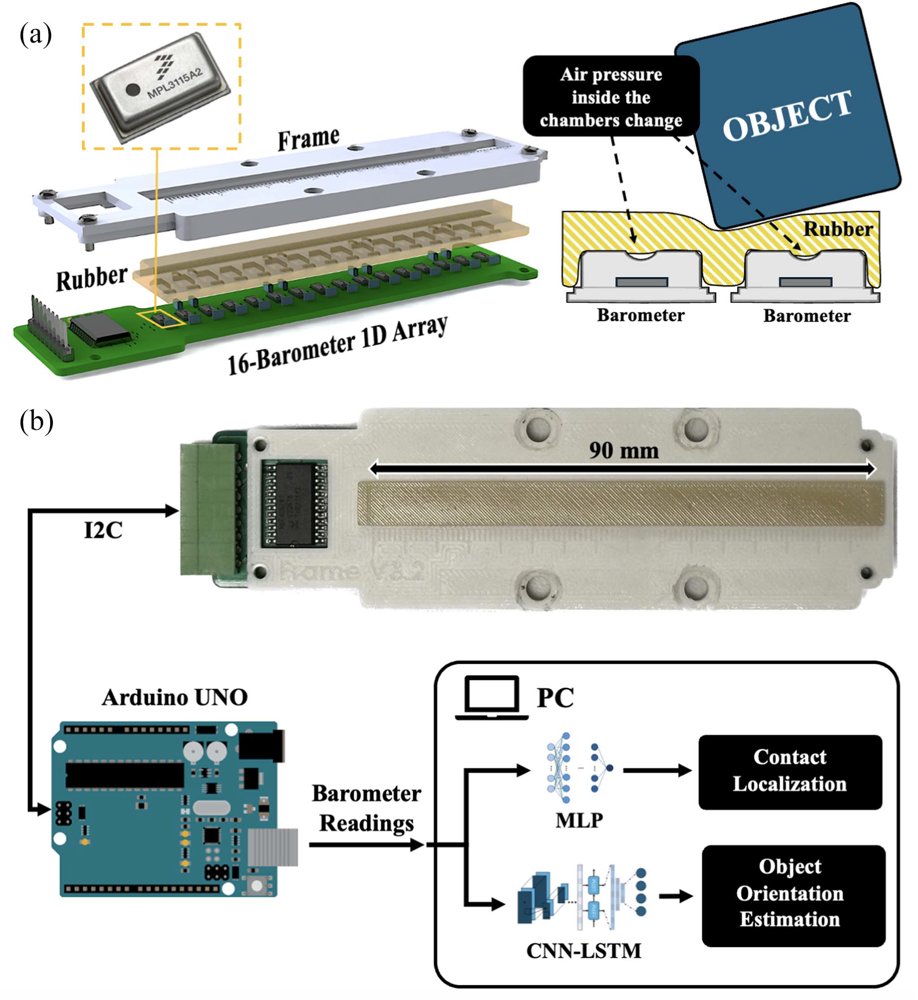

# Location and Orientation Super-Resolution Sensing With a Cost-Efficient and Repairable Barometric Tactile Sensor _ 2025 Transactions on Robotics

## Abstract

로봇공학에서 촉각 센서의 채택은 높은 비용과 취약성으로 인해 제한되고 있다. 우리는 재료 비용이 80달러 이하인 경제적이고 견고한 기압식 촉각 센서 배열을 설계하고 검증하였다. 기존 연구와 달리, 우리는 고무 표면을 기압 센서 위에 주조하지 않고 별도의 요소로 유지하여 제작 및 수리가 용이한 설계를 구현하였다. 머신러닝 기법을 적용하여 센서의 위치 추정 정밀도를 향상시켰으며, 인접 기압 센서 간 거리인 6mm의 물리적 해상도를 0.284mm의 효과적 해상도로 증대시켰다. 모델의 강건성을 평가하기 위해, 우리는 E-TRoll 로봇 그리퍼를 사용하여 다양한 프리즘 형태의 물체를 센서가 장착된 손가락 위에서 굴리는 실험을 수행하였다. 이와 같은 비정형 환경에서도 평균 2.66mm 수준의 실시간 위치 추정 정밀도를 달성하였다. 또한 실제 응용 사례로, E-TRoll이 단일 자유도 병렬 그리퍼처럼 작동하여 큐브의 방향을 센서에 대해 추정하는 기능을 시연하였다. 물체의 방향 범위는 네 개의 클래스(class)로 분류되었으며, 학습된 CNN-LSTM 모델은 이를 86.91%의 교차 검증 정확도로 예측하였다.

## I. Introduction

### **[문단 1]**

촉각 센서는 로봇이 물리적 자극을 인식하고 반응할 수 있도록 하여, 로봇과 환경 간 상호작용을 강화하는 데 핵심적인 역할을 한다. 수십 년에 걸쳐 다양한 연구가 촉각 센싱 기술의 개발 및 향상에 집중되었고, 이는 센서의 설계와 응용에 대한 의미 있는 통찰을 제공해왔다. 기능적으로는 압력, 힘-토크, 미끄러짐, 온도, 진동 감지 등 다양한 목적에 따라 촉각 센서를 분류할 수 있으며, 작동 원리에 따라 정전용량형, 광학형, 압저항형, 압전형으로 나뉜다. 전도 방식에는 차이가 있지만, 일반적으로 다수의 소형 센싱 유닛을 격자 형태로 배열하여 각 유닛이 근접한 힘을 감지하는 구조를 공유한다【9】.

---

### **[문단 2]**

**Tenzer 외 연구진은** **2014년 기압 기반 촉각 센서**에 대한 선구적 연구를 통해 이 분야의 기틀을 마련하였다【10】. 이들은 MPL3115A2 디지털 기압 센서를 **4~10mm 두께의 고무층 아래에 배치하여, 외부에서 가해지는 힘이 센서 내부의 MEMS 막으로 전달되도록 설계**하였다. 일반적인 기압식 촉각 센서는 고무로 밀폐되며, 고무가 변형되면 내부 공기 압력이 변화하고, 이 압력 변화는 MEMS 장치에 의해 감지되어 전기 신호로 전환된다. 이 방식은 **비용 효율적**이며, 다**른 설계에 비해 실용적인 대안이 되었고, 실험을 통해 이러한 센서가 선형적인 응답 특성과 낮은 노이즈를 보인다는 것이 입증**되었다. 그러나 **MPL3115A2 센서의 크기(5×3×1.2mm³)는 제한된 공간 내에서 센서 밀도를 높이는 데 장애가 되어 해상도 향상에 제약**이 있었다.

---

### **[문단 3]**

여러 연구진은 이 기압 기반 접근법을 변형하여 다양한 기압식 촉각 센서 배열을 개발해왔다. Kõiva 등의 연구에서는 **BMP388 센서**를 사용하면서 작은 **센서 케이지의 구멍 크기가 제한 요소로 작용**하였다. 이를 극복하기 위해 센서 캡을 분해하고 드릴로 구멍을 확장한 뒤 에폭시로 재조립하는 방식이 사용되었지만, 이러한 방법은 제작 공정을 복잡하게 만들어 널리 사용하기에는 비효율적이다【11】. 이 외에도 센서 배치 위치, PCB 소재【12】【13】, 미끄러짐 감지【14】【15】, 조작 중 힘 추정【12】, 형상 감지【16】【17】 등 다양한 응용 사례가 연구되어 왔다. 그러나 **기압 센서의 물리적 한계로 인해 해상도 향상에는 여전히 큰 제약이 존재**하며, **이는 정밀한 위치 추정 작업에의 활용을 어렵게 만든다**.

---

### **[문단 4]**

이러한 해상도 한계를 해결하기 위한 대안으로, 최근에는 비전 기반 촉각 센서가 급속히 주목받고 있다. GelSight, Meta의 DIGIT 센서【18】, TacTip【19】, Tac3D【20】 등은 고해상도 데이터를 제공하는 대표적인 예이다. 이러한 센서들은 카메라를 사용하여 동전의 양각 무늬나 질감 같은 미세한 특징들을 감지할 수 있으며, 고해상도 격자처럼 작동하는 픽셀 배열을 갖는다. 하지만 **DIGIT 센서의 경우 약 300달러의 높은 비용에도 불구하고, 감지 영역은 약 20×25mm로 매우 작다**. 또한 이들 센서는 **보호층, 반사층, 마커층 등 특수 구성 요소가 필요하며, 장착이 어렵고, 약 100ms의 지연 시간과 제한된 시야각으로 인해 빠르고 역동적인 로봇 조작에는 부적합하다**【21】.

---

### **[문단 5]**

이러한 이유로, 현재의 **비전 기반 촉각 센서는 비교적 느리고 접촉 범위가 제한된 준정적 조작에만 적합**하다. 이에 따라, 더 빠르고 확장 가능하며 저비용인 기압식 촉각 센서의 해상도를 '인위적으로' 향상시키기 위한 **슈퍼 해상도 기술이 주목받고 있다**(슈퍼 해상도 기술은 III장에서 자세히 설명됨). 본질적으로, 이 기술은 하나의 **접촉 자극이 인접한 여러 센서에 영향을 주는 원리를 기반으로 삼는다**. 이를 통해 **접촉 위치를 삼각 측량(triangulation) 방식으로 추정**할 수 있다. 예를 들어, Piacenza 외 연구는 5개의 기압 센서를 사용하여 접촉 위치를 1300mm²의 곡면 영역에서 1.1mm 정확도로 추정하였다【22】. Mohtasham 등의 연구는 객체 속성 추정을 위한 알고리즘을 도입하여, 8mm 간격의 센서 배열로도 78%의 형상 추정 정확도와 2mm 이하의 위치 추정 오차를 달성하였다【23】. 또한 Sun과 Martius는 머신러닝 기법을 이용해 '등고선 이론(isoline theory)'을 도입하여 6.5mm 간격의 센서에서도 0.0416mm의 정밀도로 접촉 위치를 추정하였다【24】.

---

## A. Main Contribution 1: A Repairable Barometric Tactile Sensor

**Fig. 1. Schematic of the barometric tactile sensor design and data processing
pipeline.** 
(a) Exploded view of the modular sensor architecture, illustrating the
separation of the PCB and rubber layer, and how the barometers experience the
external force 
(b) System flowchart of the dual-model approach for sensor data
interpretation: An MLP model for super-resolution contact localization, and a
CNN-LSTM network for object orientation estimation.

### **[문단 1]**

기존 연구들은 기압식 촉각 센서의 경제성과 유연성을 입증해왔고, 동시에 머신러닝 기법을 통해 슈퍼 해상도를 달성함으로써 해상도 한계를 극복할 수 있음을 보여주었다【22】【23】【24】【25】. 그러나 이러한 **센서들은 제작과 유지보수 측면에서 몇 가지 단점**을 가지고 있다. 예를 들어, Sun의 연구에서는 바로미터 위에 마이크로 와이어를 수작업으로 납땜한 후, 우레탄으로 바로미터를 “부유”시키는 방식으로 센서를 제작하였다【24】. 이는 매우 노동집약적이고, 실용적인 대량 제작에는 적합하지 않은 방식이다. 또한 촉각 센서는 외부 물체와 직접 접촉하기 때문에 손상 가능성이 높으며, 복잡하게 통합된 구조는 수리도 어렵게 만든다. 전통적인 기압식 촉각 센서는 일반적으로 고무층을 바로미터 위에 직접 주조하는데, 이 고무층이 손상될 경우 전체 센서 어레이가 무용지물이 된다. 손상된 고무를 제거하고 다시 주조하려는 시도는 초기 주조 시 고무가 바로미터 내부로 침투하기 때문에 성공하기 어렵다.

---

### **[문단 2]**

이 문제를 해결하기 위해, 우리는 **Fig. 1(a)**에 나타난 바와 같이, 고무와 바로미터를 분리한 새로운 촉각 센서 설계를 제안한다. 이 설계는 바로미터와 기타 회로 부품을 3D 형상으로 사전 모델링하고, 고무를 PCB 형태에 정밀하게 맞춰 성형한 후, 나사와 3D 프린팅된 프레임을 이용해 고정하는 방식이다. 이를 통해 고무 표면에 가해진 힘이 바로미터에 효과적으로 전달되면서도 모듈형 구조를 유지할 수 있다. 이 설계는 타 기압식 센서와 마찬가지로 저렴한 부품만으로 제작 가능하며, 16개의 바로미터(개당 $3.55), PCB ($1.17), Vytaflex 40 고무 ($23/kg 기준으로 약 $0.7 사용), 저항 및 커패시터 등의 소모품 포함 총 재료비가 80달러 이하로 구성된다.

---

### **[문단 3]**

전통적인 기압식 촉각 센서가 손상될 경우, 전체 센서를 교체해야 하며, 이는 재료비, 인건비, 시간 비용이 모두 증가한다. 반면, 우리의 모듈형 설계는 고무층에 물리적 손상이 발생했을 때 고무만 교체하면 되며, 이 고무는 1달러 이하의 재료비로 쉽게 다시 성형 가능하다. 실제 개발 과정에서도 고무층 손상이 여러 차례 발생했으나 빠르게 복구할 수 있었다. 또한 고무와 PCB가 분리된 구조이므로, PCB 부품 자체의 교체도 가능하다. 이로 인해 로봇공학자들은 유지보수 비용에 대한 부담 없이 촉각 센서를 시스템에 쉽게 통합할 수 있게 된다. 이러한 높은 수리 가능성은 센서가 반복적으로 큰 힘을 받거나 날카로운 가장자리, 거친 표면과 접촉할 수 있는 응용 환경(예: 촉각 조작 연구, 미지 환경 탐색 등)에 특히 유리하다.

---

### **[문단 4]**

우리의 센서 설계를 검증하기 위해, 먼저 슈퍼 해상도 기능을 실험하였다. **Fig. 1(b)**는 촉각 센서의 데이터 처리 파이프라인을 보여준다. **접촉 위치의 슈퍼 해상도 추정**을 위해, 우리는 MLP (다층 퍼셉트론) 회귀 모델을 사용하였다. **MLP는 여러 층의 뉴런으로 구성된 신경망으로, 각 층은 다음 층과 완전히 연결**되어 있다. 이 모델은 **각 센싱 유닛의 압력 데이터를 입력 피처**로, **해당 접촉 위치를 출력 타깃으로 학습**하였다. 이로써 바로미터 간 실제 간격보다 훨씬 높은 해상도로 접촉 위치를 예측할 수 있게 되며, 압력 패턴과 접촉 위치 사이의 관계를 학습함으로써 이를 실현하였다. 우리의 연구와 기존 기압식 촉각 센서 관련 최신 연구의 비교 내용은 Table I에 정리되어 있다.

---

### **[문단 5]**

센서의 슈퍼 해상도 성능을 동적인 작업 환경에서 검증하기 위해, 오픈소스 로봇 그리퍼인 E-TRoll【26】을 활용한 실험을 수행하였다. 센서를 E-TRoll의 한 손가락에 장착하고, 손가락 사이에서 서로 다른 형상의 물체(원기둥, 정육면체)를 회전시키는 인핸드 조작 실험을 수행하였다. 이 실험의 목적은, 공 **모양의 인덴터로 수직 압력을 가하는 방식으로만 훈련된 모델이, 다양한 접촉 형상을 실시간으로 일반화하고 정확하게 위치를 추정할 수 있는지를 확인하는 것**이었다.

## B. Main Contribution 2: Shape-Identification Capabilities Via a Simple Parallel Gripper

### **[문단 1]**

두 번째 주요 기여는, **단순한 병렬 그리퍼와 저해상도 기압식 촉각 센서만을 이용해 형상 식별이 가능함을 실증적으로 보여준 것이**다. 현재까지는 고해상도의 비전 기반 촉각 센서만이 형상 인식 기능과 연관되어 있었다. 기압식 촉각 센서 문맥에서 말하는 **‘슈퍼 해상도’는 단지 접촉 위치의 향상된 추정에만 국한되며, 접촉 형상 정보는 포함하지 않는다.** 기압식 촉각 센서를 이용한 물체 형상 인식에 대한 연구는 거의 없는 상태이다. 일부 연구에서는 서로 다른 물체 형상을 두 개의 단일 링크 손가락 사이에서 회전시키며 식별하는 방식을 제안했지만【17】【23】【26】, 이는 현재 로봇 핸드에 쉽게 구현되기 어려운 조작 방식이다. Spiers 외 연구진【16】은 ‘햅틱 글랜스(haptic glance)’라는 방식을 소개하였다. 이는 두 링크로 구성된 손가락을 가진 적응형 그리퍼의 네 개 촉각 센서가 물체의 넓은 표면을 동시에 감지하여 일상 물체를 최대 100% 정확도로 식별하는 방식이다. 그러나 이 방식은 다수의 센서가 넓은 접촉면적을 필요로 하며, 다자유도(심지어 언더액추에이티드) 로봇 핸드가 요구된다.

---

### **[문단 2]**

이에 반해, 본 연구에서는 단일 평면형 촉각 센서와 병렬 그리퍼만으로도 형상 인식이 가능함을 보인다. 두 번째 실험에서는 E-TRoll 그리퍼를 사용하여, 하나의 손가락에만 촉각 센서를 부착한 상태로 정육면체를 한 번 쥐는 동작을 수행하고 그 큐브의 방향을 추정하는 모델을 훈련시켰다. 이때 E-TRoll은 프리즘형 손바닥만을 움직여 병렬 그리퍼처럼 작동하였다. 모델은 CNN-LSTM 구조를 채택하였으며**, CNN**은 촉각 센서 데이터에서 공간적 특징을 추출하고, **LSTM**은 그 데이터를 시간 순서에 따라 처리하여 압착 동작 중의 시간적 의존성을 포착한다. 이 구조는 Donahue 외 연구진의 장기 순환 합성곱 네트워크(long-term recurrent convolutional networks)를 참고하여 설계되었으며, 시공간적 데이터 분석에 CNN과 LSTM을 결합하는 것이 효과적임을 입증한 바 있다【28】.

## II. TACTILE SENSOR

이 절에서는 센서 설계 및 제작 과정을 소개한다. MPL3115 MEMS 기압 센서는 외부 회로 구성이 간단하고 비용 효율성이 높기 때문에 기압식 촉각 센서 개발에 널리 사용되어 왔다. RightHand Labs에서 개발한 통합 솔루션인 TakkStrip【27】은 다양한 연구에서 사용된 바 있으나【16】【26】【29】【30】, 현재는 더 이상 생산되지 않고 있다. 따라서 우리는 16개의 MPL3115A2 센서로 구성된 새로운 기압식 촉각 센서 어레이를 개발하였다.

### **A. Circuit and Layout**

Fig. 2. Circuit and layout design of the barometric tactile sensor array. A
multiplexer selectively connects to the barometers.

MPL3115A2 바로미터는 **I2C 통신을 사용**하는데, 이는 데이터를 송수신하는 SDA(Serial Data) 라인에 의존한다. 하드웨어 측 제약으로, 공장 출하시 모든 바로미터가 동일한 I2C 주소를 가지고 있어 각각 개별 제어가 불가능하다. 이를 해결하기 위해 우리는 HEF4067BT 멀티플렉서를 사용하여 각 센서의 SDA 핀을 선택적으로 전환하도록 설계하였다. 이로 인해 I2C 주소 변경 없이도 각 바로미터를 순차적으로 제어할 수 있게 되었다. 4개의 인접 센서마다 10μF 및 100nF 디커플링 커패시터를 배치하여 납땜과 수리의 난이도를 낮췄다. 전체 16개의 바로미터는 2개의 4.7kΩ 풀업 저항을 공유하며, 세 번째 저항은 멀티플렉서의 활성화 핀에 연결된다. 각 바로미터에는 내부 레귤레이터를 우회하기 위해 데이터시트 권장에 따라 100nF 커패시터가 추가로 연결되어 있다. 최종적으로 이 PCB에는 3개의 저항, 24개의 커패시터, 16개의 바로미터, 1개의 멀티플렉서가 포함된다. 인접한 센서 간 간격은 6mm로, 기존 TakkStrip 1/2(8mm), Sun 외 연구의 6.5mm 디자인보다 더 촘촘한 구조이다【24】. 이 간격 축소는 하드웨어 해상도를 높이고, 고무 표면에 가해지는 모든 압력이 최소한 2개 이상의 센서에 감지되도록 보장한다.

### **B. Fabrication**

**Fig. 3. Fabrication flowchart.** 
(a) 3-D printed rubber molds and apply mold release spray. 
(b) Mix A and B parts of Smooth-On VytaFlex 40 in a container.
(c) Degas the mixture in the container. 
(d) Pour the rubber into the deeper half of the mold. 
(e) Close the mold and cure for at least 1 d. 
(f) Remove the cured rubber. 
(g) Solder all components on the PCB via a reflow oven. 
(h) Place the rubber on the sensor. 
(i) Place the 3-D printed frame onto the the PCB and fasten with bolts until the rubber is held in place securely

제작 과정은 Fig. 3에 나타나 있다. 본 설계에서는 고무를 센서 표면에 직접 주조하지 않고, 3D 프린팅된 전용 몰드를 사용한다. 이 몰드는 PCB의 부품 배치와 정확히 일치하도록 제작되었으며, 고무가 PCB를 정밀하게 덮도록 설계되었다. 고무는 별도의 프레임에 의해 나사로 고정되며, 이로 인해 고무층이 안정적으로 회로 기판에 밀착된다(Fig. 1(a) 참고).

---

**고무와 바로미터를 분리한 설계**는 **민감도 측면에서는 일체형 주조 방식보다 낮지만, 유지보수성과 실용성에서는 장점이 크다**. 우리는 VytaFlex 20, VytaFlex 40, Ecoflex 00-30 등 다양한 고무 재료에 대해 초기 평가를 실시하였다. 각각의 센서 유닛에 깊이 1~1.5mm로 공 모양 인덴터를 눌러서 압력 반응을 측정하였다. 실험 결과, 더 단단한 VytaFlex 고무는 Ecoflex 대비 약 50% 더 큰 압력 변화를 보여 민감도와 반응성이 우수함을 확인하였다. 초기에는 VytaFlex 20을 사용하였지만, 테스트 과정에서 마찰로 인한 먼지 발생과 표면 박리 문제가 나타났다. 이에 따라, 더 단단하면서도 마모에 강한 VytaFlex 40을 최종 재료로 채택하였다. 본 논문의 주요 실험 전반에 걸쳐 **VytaFlex 40 사용 중 표면 마모나 박리는 관찰되지 않았다.**

---

이 설계의 핵심 이점은 **유지보수가 매우 용이하다는 점**이다. 시간이 지남에 따라 고무는 날카로운 물체로 인한 손상, 회로 기판에서의 분리, 장기간 사용으로 인한 표면 마모 등 다양한 원인으로 손상될 수 있다. 전통적인 기압식 촉각 센서에서는 **고무 주조 시 미경화 고무가 바로미터 내부로 침투하여, 이후에 고무를 제거하거나 수리하는 것이 거의 불가능**하다. 게다가 **깊은 압착으로 인해 바로미터 내부의 MEMS 구조가 손상될 수 있다**. 이러한 설계에서는 단일 센서 고장 시 개별 교체가 불가능하다. 반면, 본 연구의 고무-센서 분리형 구조는 고무를 다시 성형하거나 **개별 바로미터를 히트건으로 교체할 수 있도록 하여, 유지보수성과 수리 가능성을 크게 향상시켰다.**

## **III. SUPER-RESOLUTION**

### **A. Physical Factors of Localization**
(슈퍼 해상도 위치 추정의 물리적 요인)

---

이 절의 목표는 **1차원 바로미터 배열 상에서 실제 물리적 간격(센서 간 거리)보다 훨씬 더 높은 정밀도로 접촉 위치를 추정하는 것**이다. 즉, 촉각 센서에서 말하는 '슈퍼 해상도'란 “위치 추정을 고해상도로 수행하는 것”에 더 가깝다. 고무 표면에 점 형태의 힘이 가해지면, 그 주변 영역에서 탄성 변형이 일어나고, 이로 인해 고무의 하부에서는 바로미터들에 하중이 분산된다. 몇 가지 이상화를 통해, 이 고무의 변형과 바로미터에 작용하는 하중 분포를 예측할 수 있다.

---

점 형태로 고무를 눌렀을 때의 변형은 다음의 가우시안 분포를 통해 모델링할 수 있다:

$$
f(x|μ, σ) = \frac{1}{σ\sqrt{2π}} · e^{- \frac{1}{2} \left( \frac{x-μ}{σ} \right)^2} \tag{1}
$$

$$
δ(x) = \frac{f(x|μ, σ) · d}{\max[f(x|μ, σ)]} \tag{2}
$$

여기서

1. δ(x): 특정 지점 x에서의 고무 변형량
2. d: 압입 깊이

---

위에서 설명한 바와 같이, 접촉 지점 x에서의 변형에 기반하여, 해당 위치에 작용하는 힘은 다음과 같이 표현할 수 있다:

$$
Force(x) = P · \frac{δ(x)}{∫_{−L}^{L} δ(ξ)dξ} \tag{3}
$$

여기서 P는 전체 외부 힘이고, L은 고무의 길이이다.

---

**단일 점에서의 압력은 두 개의 인접 센서에 모두 영향을 줄 수 있다. 거리가 멀수록 힘은 작아지고, 가까울수록 커진다**. 만약 접촉이 두 센서의 정중앙이라면 두 센서는 동일한 압력을 감지하고**(Fig. 4(a))**, 한쪽에 가까우면 그 쪽 센서가 더 큰 압력을 감지한다**(Fig. 4(b))**. 그러나 실제 환경에서는 위의 방정식만으로 물리적 모델을 만들기에 충분하지 않다. 주조나 납땜 오차, 고무와 PCB 간 밀착 차이, 3D 프레임의 고정 편차 등으로 인해 센서 응답은 예측 불가능하게 왜곡되기 때문이다. 따라서 우리는 **머신러닝 기반의 데이터 중심 접근법을 선택하여, 슈퍼 해상도 위치 추정을 실현**하였다. **실제로, Sun의 고정밀 하드웨어 설계에서도 머신러닝의 도움을 크게 받았다【24】.**

**Fig. 4. Estimating a point force applied onto the rubber surface between two
barometers. (μ = 0, σ = 1.5, d = 2).** 
(a) illustrates the force applied precisely at the midpoint of the two sensors, with (ii) showcasing the symmetry in both force distribution and deformation plot. 
(b) demonstrates the force applied closer to one of the sensors, with (ii) highlighting the increased force and deformation for the adjacent sensor.

### **B. Data Collection**

---

Fig. 5. Automated data collection rig for data collection. The sensor is attached
to a linear stage for lateral motion. An indenter with a 10-mm spherical tip is
attached to a linear actuator arranged perpendicular to the sensor surface.

머신러닝에는 많은 양의 데이터가 필요하지만, 수작업으로 데이터를 수집하는 것은 비효율적이고 오류 발생 가능성이 크다. 이를 개선하기 위해, 우리는 **Fig. 5**에 제시된 2자유도 자동화된 데이터 수집 장치를 설계하여 센서를 정밀하게 자극할 수 있도록 하였다. 이 장치는 x축 방향으로 0.001mm, z축 방향으로 0.002mm의 정밀도를 제공한다.

---

모션 제어 시스템은 서로 다른 전압에서 동작하는 스테퍼 모터 드라이버(DM542T – 20V, A4988 – 8V)를 사용하여 NEMA 17 스테퍼 모터와 Crouzet 리니어 액추에이터를 제어한다. 모든 제어는 하나의 Arduino Uno 마이크로컨트롤러로 수행된다.

---

나사 구멍이 있는 지름 10mm의 강철 볼 베어링이 인덴터 팁으로 선택되었으며, 이는 **국소적인 점 압력을 생성하여 슈퍼 해상도 학습을 위한 데이터 수집을 용이하게 하기 위함**이다. 데이터 수집 절차는 인덴터를 고무 표면에 **일정한 최대 깊이(1.5mm)로 반복적으로 눌러주는 방식**으로 이루어졌다. 압력이 증가하고 감소하는 모든 구간의 압력 변화가 기록되었다. 인덴터는 **먼저 센서 배열의 가장 바깥쪽 바로미터 바로 위에 위치한 후, 고무 표면을 향해 천천히 눌려 최대 깊이까지 도달**한다. 이 **상태에서 1초간 유지**한 뒤, **인덴터는 고무와의 접촉이 완전히 사라질 때까지 다시 들어 올려진다**. 이후 인덴터는 배열을 따라 **수평 방향으로 0.25mm 이동한 후, 다시 누르기 전까지 9초 동안 떠 있는 상태를 유지**한다. **이 대기 시간은 테스트 장치가 다음 위치로 정확하게 이동할 수 있도록 하며, 동시에 고무가 충분히 복원될 시간을 확보해준다**. 이 과정은 인덴터가 마지막 바로미터에 도달할 때까지 반복된다. 그 결과, 총 361회의 압입 데이터를 확보하였다 **(인접한 바로미터 쌍 사이 6mm 간격마다 24회 압입 × 15쌍 + 마지막 센서 위 1회 압입)**. 데이터 수집 과정 전반에 걸쳐 압력 값, 인덴터의 수평 위치(센서 배열을 따라), 인덴터의 압입 깊이가 모두 기록되었다.

---

### **C. Data Analysis and Preprocessing**

---

**Fig. 6. Sensor response to controlled indentations.** 

(a) Heatmap depicting variations in sensor pressure corresponding to changes in indentation position with a constant depth of 1.5 mm. 
(b) Single barometer (S2) response to slow (0.4 mm/s) indentation and release cycles with 16-s hold periods.

분석과 시각화를 용이하게 하기 위해, 우리는 네 개의 바로미터로 구성된 센서 구간 하나만을 추려서 관찰 범위를 축소하였다. 이 구간에 대해, 우리는 Min-Max 정규화를 적용하였다. 여기서 **Min**은 각 압입 전에 측정된 안정 상태의 바로미터 값이고, **Max**는 고정된 깊이 1.5mm로 눌렀을 때의 최대 압력 값을 의미한다. **Fig. 6(a)**는 최대 깊이에서의 압입 위치 변화에 따른 네 개 바로미터의 정규화된 압력 반응 히트맵을 보여준다. 이 결과는 두 가지 측면에서 우리의 센서 설계를 검증한다. **첫째**, *충분한 압력이 가해지면 어느 위치에서든 인접한 두 센서 이상에서 반응이 나타나므로, 센서 전체 길이에 걸쳐 감지 사각지대가 없음을 보여준다.* **둘째**, *압력-위치 그래프의 형태가 앞서 (3)번 식에서 설명된 역비례 관계와 대체로 일치하며, 이는 머신러닝 모델이 접촉 위치를 단일한 방식으로 추정할 수 있게 해준다.*

---

**Fig. 6(b)**는 단일 바로미터(S2)가 **약 0.4mm/s의 속도로 천천히 눌렸다가 16초 동안 유지되고, 동일 속도로 해제되는 과정을 보여준다**. 이 데이터를 통해 센서의 동작 특성이 안정적임을 확인하였다. 이후 우리는 **전체 데이터셋에 대해 동일한 방식의 정규화를 적용**하였다. 이 전체 데이터셋에는 **다양한 깊이에서의 압입이 포함**되어 있어, 다양한 압력 조건에서도 모델이 학습할 수 있도록 하였다. **각 위치 간 9초의 대기 시간 동안 센서에 접촉이 없는 상태의 데이터는 대량 제거**하였다. 또한 **센서의 가장자리(처음과 끝의 바로미터 두 개)는 경계 효과로 인해 불안정한 반응을 보였기 때문에 제외**하였다. 최종적으로 **14개 바로미터에 대한 총 4468개의 샘플을 확보**하였으며, 각 샘플은 **14채널 압력 데이터를 입력 피처로, 해당 위치를 예측 타깃으로 사용**하였다.

### **D. Model Training and Results**

---

다항 회귀(Polynomial Regression), MLP(Multilayer Perceptron) 네트워크, 랜덤 포레스트(Random Forest) 알고리즘이 모델 학습을 위해 사용되었고, 서로 비교되었다. 시**간 효율적인 초기 비교를 위해 총 4개의 인접한 바로미터 구간에서 1,022개의 입력 샘플로 구성된 축소 학습 데이터셋이 사용**되었으며, 이 중 **20%는 테스트 데이터로 할**당되었다. 세 모델 모두에 대해 **하이퍼파라미터 튜닝을 수행한 결과, 가장 좋은 성능을 보인 모델 구성은 다음과 같았다:**

- **다항 회귀**: 2차 회귀 모델
- **MLP**: ReLU 활성화 함수와 Adam 옵티마이저(학습률 10⁻⁵)를 적용한 200개의 뉴런으로 구성된 4개의 은닉층
- **랜덤 포레스트**: 최대 깊이 5로 설정

---

**Fig. 7. Distribution plots of deviations (in mm) for Polynomial Regression, MLP, and Random Forest models, visualizing their accuracy in position estimation from pressure readings.** The MLP distribution plot exhibits a narrow distribution centered around 0, signifying minimal deviation. This indicates that the predictions closely align with the actual values.

세 가지 회귀 모델의 테스트 결과는 **Table II**에 비교되어 있다. **Fig. 7**에서는 세 모델에서 예측한 위치값과 실제 값 간의 오차 분포를 나타내는 분포 그래프가 제시된다. **그래프의 x축은 오차(x − xₚᵣₑ𝑑)를 mm 단위**로 나타내며, **y축은 해당 오차가 발생한 빈도를 의미**한다. 세 모델을 비교해 보면, MLP 모델의 분포는 0을 중심으로 한 정규 분포 형태를 보이며, 편차가 가장 작다. 이는 예측 값이 실제 값과 거의 일치함을 의미한다. MLP 모델은 가장 높은 정확도를 보여주었으며, 예측 정밀도는 **0.284mm**로 나타났다. 따라서 최종 모델로 MLP를 선택하였다.

---

다양한 모델의 슈퍼 해상도 성능을 평가한 결과, 우리는 이 저비용 촉각 센서 배열에 머신러닝 접근법을 충분히 적용할 수 있음을 확인하였다. 이후, 전체 14개의 바로미터를 활용한 전체 데이터셋을 이용하여 최종 선택된 MLP 모델을 재학습시켰다. 데이터가 증가함에 따라 모델 구성을 다시 조정하였고, 최종적으로 **8개의 은닉층**, 각 층당 **200개의 뉴런**으로 구성된 MLP 모델이 사용되었다.

---

최종 학습 결과, 테스트 세트에서의 위치 추정 정확도는 약 **0.284mm**로 나타났다. 이는 물리적 하드웨어 해상도(센서 간 거리 6mm) 대비 **21배 향상된 슈퍼 해상도**를 달성한 결과이다. 이 수치는 앞서 국소 범위 테스트에서 얻은 결과와도 일치한다. 비록 Sun의 연구【24】에서처럼 100배에 달하는 슈퍼 해상도에는 미치지 못하지만, 우리 센서 설계는 훨씬 더 **제작 및 유지보수가 용이**하다는 큰 장점을 가진다. 또한, 우리가 달성한 **서브밀리미터 해상도(0.284mm)**는 대다수의 로봇 조작 작업에 충분히 사용될 수 있는 수준이다.

---

### **E. Rolling Experiment**

앞선 하위 절들에서는 제안한 센서 설계와 슈퍼 해상도 모델의 성능을 **정제된 환경**에서 성공적으로 검증하였다. 데이터 수집 장치는 모든 힘이 **센서 표면에 수직으로** 작용하게 보장하였고, 학습 및 실험 모두에서 **동일한 10mm 구형 인덴터**가 사용되었으며, 압입 위치 또한 **선형 스테이지의 0.001mm 정밀도**에 의해 **0.25mm 간격**으로 일정하게 유지되었다.

---

이제부터는 제안된 센서를 **더 현실적인 환경에서의 실용적 작업**에 적용한 실험이 진행된다. 우리는 다음과 같이 제한이 적은 상황들을 설정하였다:

- **비구형의 물체 형상**
- **센서 표면에 수직이 아닌 다양한 방향에서의 접촉력**
- **압입 위치가 0.25mm 간격이 아닌, 임의의 위치에서 발생**
- **센서의 동적 거동 고려**: 예컨대, 고무의 복원력이 제한되어 있고 응답 시간 또한 0이 아니기 때문에, 정적 조건에서 수집된 데이터와는 성질이 다르다.

---

이러한 다양한 조건 하에서 **두 가지 주요 질문에 대한 답을 얻고자 했다**:

1. **우리의 모듈형 센서 설계가 실질적인 응용에 적합한가?**
2. **정제된 환경에서 수집한 데이터로 학습된 슈퍼 해상도 모델이 실제 조작 조건에서도 강건한가?**

---

**Fig. 8. Rolling experiment setup featuring an E-Troll robotic gripper with the barometric tactile sensor on one finger.** 
An overhead camera is used to track ArUco markers on the objects (cylinder and cube) and sensorized finger. The contact position is defined as a distance (along the 1-D barometer array) to the center of the barometer second closest to the palm (S1).

Fig. 8은 본 실험을 위한 세팅을 보여준다. 이 실험에는 오픈소스 로봇 그리퍼인 **E-TRoll**【26】이 사용되었으며, 해당 그리퍼는 두 개의 회전 관절 손가락과 손바닥 거리 조절을 위한 **프리즘 구동 손바닥**으로 구성된다.

세 개의 **Robotis Dynamixel XM430 서보 모터**가 손가락 2개 및 손바닥을 구동한다. 촉각 센서는 왼쪽 손가락(이하 '센서 손가락')에 장착되었고, 반대쪽 손가락에는 고마찰 성형 VytaFlex 40 고무가 부착되었다.

---

E-TRoll 그리퍼는 두 가지 물체(**지름 40mm 원기둥** 및 **한 변 28mm의 정육면체**)를 고무 표면 위에서 굴리는 작업을 수행하였다. 이때, **슈퍼 해상도 위치 추정 모델**은 실시간으로 접촉 위치를 추정하였다.

처리 속도는 다음과 같다:

- **촉각 기반 위치 추정만 단독 수행 시**: 40Hz
- **시각 기반 추적과 병렬 수행 시**: 6Hz

---

기계 학습 알고리즘은 **Apple M1 칩이 탑재된 맥북**에서 실행되었고, **위치 추정 한 건당 추론 시간은 0.3ms**였다.

각 물체에는 ArUco 마커가 부착되었으며, 센서 손가락 기저에도 하나의 마커가 추가되었다.

일반 RGB 웹캠이 로봇을 **상단에서 촬영하며**, 이 마커들을 추적해 물체의 자세를 측정하였다.

---

시각적 추정 위치의 평균 절대 오차는, 조작 공간의 양 끝과 중앙의 총 9개 기준 위치를 기준으로 계산한 결과 **0.48mm**였다.

접촉 위치는 센서 배열 상에서 **손가락 기저로부터 두 번째 바로미터(S1)**의 중심으로부터의 거리로 정의되었다. (가장자리 바로미터는 경계 효과로 인해 비활성화됨)

---

**Fig. 9. Manipulation procedures for the rolling experiment**. 
(a) Both fingers are perpendicular to the palm, holding the object. The left finger starts rotating counterclockwise at a constant velocity, while the right fingermaintains constant torque to press the object against the left finger. 
(b) The rolling direction is reversed after the left finger reaches 26.4◦. The right finger now moves at a constant velocity, while the left finger presses the object against the right finger. 
(c) The fingers are back to perpendicular with the base, but keep rotating clockwise. (d) At −26.4◦ rotation of the right finger, roles and directions are reversed again 
(e) The fingers rotate back to the starting position, completing the procedure.

---

물체 롤링 절차는 [17]에서의 실험 방식과 유사하며, **Fig. 9**에 제시되어 있다. 초기 위치 A에서는 두 손가락이 손바닥에 대해 수직 상태이며, 물체는 그 사이에 고정되어 있다.

왼쪽 손가락은 **0.23 r/min의 일정한 속도로 반시계 방향 회전**을 시작하고, 오른쪽 손가락은 **상대적으로 일정한 토크(269mA의 목표 전류)를 유지**하도록 설정되어 물체를 왼쪽 손가락에 **단단히 밀착**시키게 된다.

이와 동시에, 프리즘형 손바닥이 두 손가락 사이의 간격을 **실시간으로 조정**하여, 손가락이 서로 평행한 상태를 유지하게 된다.

이러한 조작에 따라, 물체는 **시계 방향으로 회전**하며 센서 표면을 따라 손바닥 방향으로 **천천히 이동**하게 된다.

---

왼쪽 손가락이 **26.4° 회전**에 도달하면 (그림 B와 같은 상태), 좌우 손가락의 역할과 회전 방향이 **역전**되며, 물체는 반대 방향으로 굴려지기 시작한다.

오른쪽 손가락이 **–26.4° 회전**에 도달하면 (그림 D 상태), 다시 역할과 회전 방향이 역전되고, 손가락이 수직 상태로 돌아오면서 전체 롤링 절차가 **완료**된다.

---

각 물체에 대해 이 롤링 절차는 **3회 반복 수행**되었으며, **시작 위치는 매회 다르게 설정**되었다.

Fig. 10과 Fig. 11은 각각 **원기둥**과 **정육면체**를 굴린 실험 결과를 보여준다.

**시각 기반 위치 추정**과 **촉각 기반 슈퍼 해상도 추정** 간의 차이를 비교하였다.

---

**Fig. 10. Real-time localization results for a 40-mm cylinder during in-hand rolling, comparing estimations from visual and tactile-based methods.**

### ▶ Cylinder Rolling (Fig. 10)

원기둥을 굴리는 실험에서(Fig. 10), 접촉 위치는 센서 표면을 따라 **연속적으로 이동**하였다.

롤링 방향이 바뀔 때(약 10초 직전 및 40초 직후), 위치에 급격한 변화(스텝 변화)가 발생하는데, 이는 시각 추적 상에서 특히 뚜렷하게 나타난다. 이 현상은 서보 모터가 **회전 속도 제어 모드에서 토크 제어 모드로 전환**될 때 **일시적으로 토크가 꺼지기 때문**이다. 그 결과, **물체와의 그립력이 일시적으로 상실**되며 위치가 순간적으로 튄다.

---

전반적으로, 촉각 기반 위치 추정은 시각 기반 추정과 **전반적으로 일치**하였지만, 두 가지 주요 현상이 발견되었다:

1. **정의되지 않은 압력** → 모델 혼동 유발:
    
    예를 들어 Trial 1에서는 약 10초 지점에서 **예측값이 큰 오차를 보인다.**
    
    이는 위치가 0 이하로 떨어져, **모델이 학습한 범위를 초과**했기 때문이며, 위치가 다시 0 이상으로 돌아오자 곧바로 정확도가 회복되었다.
    
2. **접촉력이 너무 약함** → 접촉이 없다고 판단됨:
    
    예를 들어 Trial 3에서는 약 40초 지점에서 **예측 결과가 아예 출력되지 않는다.**
    
    이는 물체가 손가락 기저로부터 너무 멀리 떨어져 있어, **센서에 충분한 압력이 전달되지 않았기 때문**이다.
    

이러한 한계에도 불구하고, 제안된 **모듈형 센서**와 **슈퍼 해상도 모델** 조합은 **원기둥 롤링 시 평균 절대 오차 2.64mm**를 달성하였다.

---

**Fig. 11. Real-time localization results for a 28 mm-sided cube during in-hand rolling, comparing estimations from visual and tactile-based methods.**

### ▶ Cube Rolling (Fig. 11)

두 번째 실험에서는 **한 변이 28mm인 정육면체**를 굴렸다(Fig. 11).

이번 실험에서는 접촉 위치가 **대부분 일정하게 유지**되다가, 간헐적으로 **급격히 변화**하였다.

이는 원기둥과는 달리, **정육면체는 주로 한 모서리를 기준으로 피벗하며 회전**하고, 다음 모서리로 **단속적으로 전이**되기 때문이다.

시각적 추정에서는, 접촉 위치를 **ArUco 마커의 네 모서리 중 센서에 가장 가까운 점**으로 정의하였다. 이 때문에, 시각 추적 결과에는 **스텝 함수 형태의 갑작스러운 변화**가 나타난다.

그러나 실제로는 물체가 **매우 천천히 회전**하고, 센서를 따라 **약 1~2mm 정도 압입**되므로, **고무 표면 상의 실제 접촉 위치**는 한 모서리에서 다른 모서리로 **천천히 연속적으로 이동**한다.

---

실험 중 촬영된 영상에 따르면, 하나의 모서리에서 다음 모서리로 전이되는 데에는 약 **5초**가 소요된다. 이 동작은 시각 추정보다 **촉각 기반 위치 추정 결과와 훨씬 더 일치**한다.

이 점은 **촉각 기반 위치 추정이 비전 시스템보다 복잡한 접촉 형태를 훨씬 더 잘 처리한다는 장점**을 보여준다.

예를 들어, 컴퓨터 비전 시스템에서는 물체가 고무 표면에 얼마나 깊게 파고들었는지를 정확히 파악해 **실제 접촉 위치**를 계산하는 것이 매우 어렵다. 반면, 촉각 센서는 이러한 **접촉 형상의 정밀한 파악이 가능**하다.

---

결과적으로, 정육면체를 굴린 실험에서도 **시각 기반 위치와 촉각 기반 위치 간 평균 오차는 2.68mm**로, 원기둥 실험과 유사한 수준의 만족스러운 정확도를 달성하였다.

---

비록 학습 시에는 **공 모양의 인덴터만 사용**되었지만, 모델은 **날카로운 모서리와 평면을 포함한 다양한 접촉 형상**에서도 강인한 위치 추정 성능을 보였다. 특히 **모서리 전이 과정에서는 그 성능이 두드러졌다.**

## **IV. ORIENTATION DETECTION (자세 추정)**

### **A. Physical Factors of Orientation Detection**
**(자세 추정의 물리적 요인)**

기존의 기압식 촉각 센서용 슈퍼 해상도 기술은 **단일 지점 위치 추정의 정확도 향상**에 주로 초점을 맞춰왔다. 하지만 **복잡한 접촉 형상 및 물체 자세(orientation)를 인식할 수 있게 된다면**, 이러한 센서의 **기능성과 응용 가능성은 크게 확장될 수 있다**.

---

우리는 **단순한 지점 위치 추정을 넘어서**, **기압식 센서 배열을 사용하여 정육면체의 자세를 분산된 압력 패턴으로부터 추정**하는 기술을 입증한다. 그러나, **단일 시점의 촉각 데이터만으로는 물체 파지를 수행하는 중에 물체의 자세를 추출하는 데 불충분하다.** 많은 경우, 날카로운 모서리가 센서 표면에 접촉할 때 **두 개의 인접 바로미터만 활성화되며**, 이 두 개의 바로미터에서 읽힌 압력값은 **접촉 위치와 모서리의 방향에 따라 다양한 조합으로 나타날 수 있다.**

---

**Fig. 12.** 
(a) A cube with its sharp edge pointing straight into the rubber surface at the center of two barometers causes identical pressure readings. 
(b) A cube tilted at an arbitrary angle always has a contact location at which the two barometers have identical pressure readings as well. Hence the angle of the cube cannot be determined from pressure readings taken at a single time-instance.

**Fig. 12**는 이와 같은 물체 자세의 불확실성을 예시를 통해 보여준다:

- **(a)(i)**: 정육면체의 날카로운 90도 모서리가 **두 개의 바로미터 사이 중심부에 위치한 센서 표면을 압입**하고 있다. 이 경우, 두 바로미터가 감지하는 힘은 같으며(F₀ = F₁), 
(a)(ii)에서 보이는 바와 같이 압입 힘의 크기에 따라 크기(진폭)는 달라질 수 있다.
- **(b)(i)**: 날카로운 모서리의 위치는 동일하지만, **정육면체가 반시계 방향으로 약간 기울어진 경우**이다.
    
    이때는 F₀ > F₁가 된다. 그러나 이 상태에서 **정육면체를 센서 표면을 따라 오른쪽 방향으로 이동**시키면, F₀는 지속적으로 감소하고 F₁은 지속적으로 증가하게 된다.
    
    이 이동 중 어느 지점에서는 **F₀와 F₁가 다시 같아지는 지점이 반드시 존재하며**, 이것이 (b)(ii)에 나타난 상황이다.
    

따라서, **두 가지 자세 중 어느 쪽이든 단일 시점의 촉각 데이터만 보면 동일한 압력 패턴을 생성할 수 있다.** 즉, **추가적인 정보 없이는 구분이 불가능하다.**

결과적으로, **기존의 단일 시점 기반 접근 방식—특히 저해상도 촉각 센서를 위한 슈퍼 해상도 알고리즘—은 접촉 형상을 추론할 수 없으며 단지 위치 추정에만 국한된다.**

---

반면, **시공간적(spatio-temporal) 촉각 데이터**와 **제어된 동적 물체 조작을 결합하면**, 촉각 기반 조작 시스템은 **형상 정보까지 추론할 수 있게 된다.**

예를 들어, **[17] 및 [26]**에서는, **E-Troll**을 사용하여 두 로봇 손가락 사이에서 물체를 굴려가며 한 손가락에 부착된 **기압식 촉각 센서**를 통해 **서로 다른 물체 형상을 구별**한 바 있다.

우리는 이 새로운 연구에서, **알려진 물체의 자세를 사전에 정의된 조작 절차를 통해 추론하는 것**에 관심을 둔다. 구체적으로, **정육면체 시험 물체를 병렬 손가락으로 쥔 뒤**, **그 자세를 추론하는 것**이다.

[17], [26]에서의 굴리는 실험에 비해, **물체를 쥐는 동작은 촉각 센서에 노출되는 물체의 표면 영역이 훨씬 작아져 형상 구별이 어려워진다.** 그러나 쥐는 동작은 **간단한 병렬 그리퍼로도 쉽게 수행 가능**하며, **저비용·간편 장착·수리 가능한 우리의 촉각 센서를 기존 그리퍼에 통합하기만 하면 손쉽게 적용할 수 있다.**

### B. Experiment Setup and Data Collection

정육면체를 쥐는 조작(squeezing manipulation)은 **III-E절의 롤링 기반 위치 추정 실험에서 사용한 것과 동일한 하드웨어 구성**을 이용해 수행되었다. 측정 대상은 **한 변이 28mm인 정육면체**이며, 이 물체는 **E-TRoll** 그리퍼의 두 손가락 사이에 배치되었다. 이 중 **한쪽 손가락에는 기압식 촉각 센서가 장착**되어 있다.

이전의 롤링 실험과 마찬가지로, **E-TRoll의 센서 손가락**에는 **하나의 ArUco 마커**가 부착되었고, 정육면체 물체에도 **또 하나의 마커**가 부착되어, 물체의 위치 및 자세(orientation)를 시각적으로 추적할 수 있도록 구성되었다. 이 시각 기반 자세 추정의 평균 절대 오차(MAE)는 **0.41도**로 측정되었다.

---

Fig. 13. Squeezing procedure with fingers kept perpendicular to the base. The palm slowly closes in on the object until the palm servo crosses a given torque threshold. The object is slowly released again after tightly holding the object for 3 s.

Fig. 13에 나타난 것처럼, 정육면체는 촉각 센서 기준점(두 번째 바로미터)으로부터 약 **25mm 떨어진 위치**에 수동으로 배치되었으며, 매 실험마다 서로 다른 초기 각도(orientation)를 갖도록 조정되었다.

프리즘형 손바닥(prismatic palm)이 구동되며, 두 손가락은 **기저부에 대해 수직 상태로 고정된 채 비활성화된 상태**로 유지되었다. 프리즘형 손바닥은 약 **4mm/s의 일정한 속도**로 천천히 닫히며, **서보 모터의 전류가 269mA에 도달할 때까지 계속 작동**되었다.

이 위치에 도달한 후, **프리즘 손바닥은 3초 동안 닫힌 상태로 유지**되며, 그 다음에는 **같은 속도로 다시 열려 초기 상태로 복귀**된다. 

---

이러한 조작 조건 하에서, 정육면체의 orientation을 매번 달리하며 총 228회의 쥐는 실험(squeeze trials)이 수행되었다. 각 실험에서는 **16개의 바로미터 전체에 걸친 압력 분포 패턴**과, **시각 시스템이 추정한 정육면체의 orientation**이 모두 기록되었다.

### **C. Data Preprocessing**

---

정육면체 바닥 면은 **4차 회전 대칭성**을 갖기 때문에, 우리는 물체의 orientation(자세)을 **0도에서 90도 사이 범위로만 추정**하도록 설정하였다. 즉, 예를 들어 **91도의 orientation은 1도로 간주**된다.

이 연구에서는 해당 orientation 범위를 **접촉 형상(contact geometry)**에 기반하여 **4개의 고유한 클래스**로 나누었다.

**Fig. 14. Distribution of cube orientations relative the sensor during squeezing
experiments.** 
The classes are categorized based on orientations ranges. A–D present examples in each class. A: the flat side of the cube is in contact. B and D: The sharp edge is pressed into the sensor surface with a tilt. C: The sharp edge presses straight into the sensor.

각 클래스의 예시는 **Fig. 14**에 제시되어 있다:

1. **클래스 0**: 0°–5° 또는 85°–90°
    - **평평한 면이 센서에 접촉** (예시 A)
2. **클래스 1**: 5°–35°
    - **날카로운 모서리가 센서에 접촉**, 반시계 방향으로 기울어짐 (예시 B)
3. **클래스 2**: 35°–55°
    - **날카로운 모서리가 센서에 접촉**, 대칭에 가까운 상태 (예시 C)
4. **클래스 3**: 55°–85°
    - **날카로운 모서리가 센서에 접촉**, 시계 방향으로 기울어짐 (예시 D)

---

이전의 롤링 실험과 동일하게, 접촉 위치는 **1차원 바로미터 배열 상에서 그리퍼 기저부에서 두 번째로 가까운 바로미터 중심으로부터의 거리**로 정의하였다.

이후 이상치(outlier)를 제거하였는데, 구체적으로는 **20mm~30mm 범위를 벗어난 데이터**를 제거하였다. 최종적으로 전체 228개의 시공간 샘플 중 **185개**를 남기게 되었다(Fig. 14 참조).

- **Class 0**: 18개
- **Class 1**: 62개
- **Class 2**: 46개
- **Class 3**: 59개

---

이러한 클래스 간 샘플 수 불균형은 **orientation 범위 크기의 차이**로 인한 것이다.

예를 들어, **클래스 0**은 평면이 센서에 접촉한 상태를 나타내며, 범위가 오직 10도(0–5도 및 85–90도)에 불과하다.

반면, **클래스 1과 클래스 3**은 각각 **30도 범위**를 포함하고 있어, 결과적으로 약 **3배 많은 샘플**을 포함하게 되었다.

---

접촉 위치도 Fig. 14에 함께 표시되어 있는데, 이는 우리가 선택한 **20~30mm 접촉 위치 범위 내에서 훈련 데이터가 균일하게 분포되도록 수집되었는지**를 확인하기 위함이다.

한편, **클래스 0**에서의 평면 접촉에 대해서는, **접촉 지점을 정육면체 평면의 중심**으로 정의하였다. 이 위치 정보는 **모델 학습의 입력으로는 사용되지 않는다.**

---

선택된 위치 범위 내에서는 **총 8개의 바로미터만 반응을 보였기 때문에**, 이들에 대한 압력 데이터만을 **모델 입력 피처로 사용**하였다. 이는 모델 복잡도를 불필요하게 증가시키지 않기 위한 조치다. 최종적으로, 위에서 정의한 **클래스 레이블들이 분류 학습의 타깃(label)**으로 사용되었다.

### **D. Model Training and Evaluation**

---

우리는 **CNN-LSTM(합성곱 신경망 + 장단기 기억 네트워크)** 아키텍처를 사용하여, **쥐는 상호작용(squeeze interaction)** 중에 수집된 **8채널 시계열 촉각 데이터**를 기반으로 정육면체의 orientation(자세)을 분류하도록 하였다(Fig. 15 참조).

**Fig. 15. Architecture of the CNN-LSTM model for orientation detection.** 
The convolutional layers employ “same” padding, and both convolution and fully connected layers utilize “ReLU” activation, except for the final dense layer, which employs softmax activation.

CNN-LSTM은 **공간적 특징을 자동으로 추출할 수 있는 CNN의 장점**과 **시간적 역학(temporal dynamics)을 모델링할 수 있는 LSTM의 장점**을 결합하기 때문에 선택되었다【31】.

이러한 하이브리드 방식은, **여러 바로미터(공인된 센서 채널)에서의 공간적 패턴**과 **쥐는 과정 중 나타나는 시간적 상관관계**를 모두 포함하는 촉각 데이터의 특성과 잘 부합된다.

---

우리는 CNN-LSTM의 성능을, **동일한 합성곱 및 밀집층 구조를 가지되 LSTM 구성요소는 없는 베이스라인 CNN 모델**과 비교하였다.

두 네트워크 모두 **categorical cross-entropy loss**를 사용하였으며, **Adam(Adaptive Moment Estimation) 최적화 알고리즘**을 통해 학습되었다.

모델 성능 평가는 **5-폴드 교차 검증(five-fold cross-validation)** 방식으로 수행되었으며, 각 fold는 **학습-테스트 데이터셋을 80:20으로 분할**하여 사용하였다.

---

분류 정확도는 다음과 같았다:

- **기본 CNN 모델**: 평균 테스트 정확도 **79.30%**
- **CNN-LSTM 모델**: 평균 테스트 정확도 **86.91%**

각 fold에 대한 **혼동 행렬(confusion matrix)**은 **Fig. 16**에 제시되어 있다.

Fig. 16. Confusion matrices of the CNN-LSTM orientation detection model across five folds in K-fold cross-validation

---

또한, 우수한 성능을 보인 **CNN-LSTM 모델의 오분류 사례들**은 대부분 **인접 클래스 간에 발생**하였다. 이는 모델이 **대부분의 경우 올바른 특징을 학습했음을 시사**하며, 클래스 간 경계가 물리적으로도 애매한 경우가 많다는 점을 반영한다.

이 결과는, **표준적인 머신러닝 기법(CNN 등)조차도 저해상도 기압식 촉각 센서**에서 수집된 시공간 데이터(spatio-temporal data)를 이용하여 **형상 정보(geometric signature)를 효과적으로 추출할 수 있음을 보여준다.** 또한, **CNN-LSTM과 같은 복합적이고 정밀한 모델 구조**를 활용하면, 이러한 성능을 더욱 향상시킬 여지가 있다는 가능성도 시사한다.

## V. CONCLUSION

---

본 논문에서는 **총 비용이 80달러 이하인 경제적인 기압식 촉각 센서 배열**을 설계하였다. 

이 센서 배열은 **전통적으로 일체형으로 구성되던 고무 표면과 센서 PCB를 분리한 수리 가능한 모듈형 구조**를 특징으로 한다. 

경제적 이점 외에도, 이 센서는 **손상 발생 시 신속한 복구가 가능**하며, 마모되기 쉬운 고무 층이나 **개별 바로미터의 교체 또한 용이**하다.

또한, 고무를 쉽게 교체할 수 있는 구조 덕분에 **하나의 센서 PCB만으로도 다양한 고무 재질을 빠르게 교체/개발하고 시제품 제작을 반복할 수 있는 프로토타이핑 환경**이 가능해진다.

기타 기존의 기압식 촉각 센서와 마찬가지로, 본 센서 설계는 **얇고 확장 가능한 형태이며 지연 시간이 짧아**, **로봇 그리퍼에 실시간 조작 용도로 장착하기에 적합하다**.

이 센서 구조는 특히 **예기치 못한 환경이나 미지의 물체 탐색**, 혹은 **날카로운 모서리 또는 마찰이 큰 표면이 포함된 조작 상황**처럼 **마모가 예상되는 응용 분야에서 매우 유리**하다.

---

센서의 물리적 해상도가 낮다는 한계를 극복하기 위해, 우리는 **센서 표면을 정확한 깊이와 위치로 반복적으로 눌러주는 자동화 장치**를 설계하여 **슈퍼 해상도 위치 추정 모델을 학습**하였다.

MLP 회귀 모델은 **21배의 해상도 향상**, 즉 **6mm에서 0.284mm로의 위치 추정 정밀도 향상**을 달성하였다.

이 위치 추정 모델의 강건성을 검증하기 위해, **한 손가락에 센서를 장착한 로봇 그리퍼**를 사용하여 **원기둥 및 정육면체를 굴리며(contact point localization)** **실시간 접촉점 추정** 작업을 수행하였다.

이 조작 작업은 자동화 장치에서의 통제된 실험 조건과 비교해 **여러 가지 차이점**을 가진다:

- 접촉 형상이 학습 시 사용된 구형 인덴터와 다르다.
- 접촉 힘이 동적으로 변하고 일반적으로 센서 표면에 수직이 아니다.
- 압입 위치는 학습 장치에서 지정한 0.25mm 간격을 따르지 않는다.
- 센서의 동적 거동(예: 비영(非零) 응답 시간, 고무의 복원력 한계)은 테스트 장치에서와 달리 훨씬 큰 영향을 준다. (테스트 장치에서는 위치 간 압입 사이에 긴 대기 시간이 존재했음)

그럼에도 불구하고, 우리는 **평균 2.66mm의 만족할 만한 위치 추정 정확도**를 달성하였다.

이는, **모듈형 기압식 센서와 학습된 모델의 조합이 다양한 접촉 형상과 동적 조건에서도 강건하게 슈퍼 해상도 위치 추정을 수행할 수 있음**을 보여준다.

그러나 이러한 결과는 **본 설계 및 위치 추정 기법이 밀리미터 정밀도의 작업에는 적합하지 않으며**, **대신 물체 분류(object sorting)와 같은 낮은 정밀도가 요구되는 작업에 적합함**을 시사한다.

---

마지막으로, 우리는 센서의 **시공간 패턴 인식 능력**에 대해 더 깊이 탐구하였다.

간단한 병렬 그리퍼로 수행한 **짧은 시간의 쥐는 상호작용**으로부터, **알려진 물체의 미지의 자세(orientation)를 추론하는 실제 응용 사례**를 제시하였다.

**5-폴드 교차검증된 CNN-LSTM 아키텍처를 사용하여 4개의 각도 클래스를 86.91% 정확도로 분류**하였다.

하지만 현재 단계에서 이 쥐는 실험은 어디까지나 **저해상도 촉각 센서가 전통적 위치 추정 이상으로 어떤 가능성을 지니는지를 탐색하기 위한 시도**이다.

슈퍼 해상도 모델과는 달리, 이 방식은 아직 **완성된 오프더쉘프(off-the-shelf) 모델이 아니며**

- 정밀한 orientation 값이 아닌 **클래스 단위 범위만 분류**할 수 있고,
- 오직 **90도 모서리 형태의 orientation만을 추정**할 수 있다.

이러한 개선 가능성이 있음에도 불구하고, 본 실험이 전달하는 메시지는 명확하다:

**단 한 개의 저해상도 촉각 센서**, 그리고 **단순한 병렬 그리퍼의 매우 간단한 쥐는 동작**만으로도 **점 접촉(point contact)을 넘어선 기하학적 접촉 특성(geometric contact characteristics)을 추론할 수 있으며**, 그에 따라 **알려진 물체의 자세를 예측할 수 있다.**

---

끝으로, 본 연구에서는 아직 **센서의 감도(sensitivity), 동적 응답(dynamic response), 고무의 복원력(restoration force), 히스테리시스(hysteresis)** 등 몇몇 성능 측면을 평가하지 않았다.

이러한 항목들은 **고속 액추에이터 및 고정밀 힘 센서를 갖춘 고급 테스트 장치**가 필요하며, 이는 향후 연구로 계획 중이다.

또한, 고무를 교체하거나 구성 요소를 수리한 후의 **센서 재보정(recalibration)** 또한 이번 실험의 범위에서는 다루지 않았으나, 이는 **센서 유지보수를 복잡하게 만들 수 있는 요인**이므로 별도의 연구가 필요하다.

---

이 연구는 다양한 방향으로 확장 가능하다:

- 먼저, 이번 쥐는 실험에서 얻은 신뢰성을 바탕으로, **알려진 물체 형상을 입력으로 받아 위치와 자세를 정확히 추정하는 알고리즘**을 개발할 수 있다.
- 둘째, **미지의 물체에 대해 쥐는 동작이나 기타 제어된 조작을 통해 접촉 형상(contact shapes)을 추론하는 가능성**도 탐색할 수 있다.
- 마지막으로, **고무 층을 센서 본체와 분리하는 개념**은 다양한 레이아웃과 크기로 확장하여
    
    **다양한 형태의 로봇 손에 맞게 적용**하고, **높은 수리성과 재사용성의 이점을 극대화**할 수 있다.
    

---

## Reference

---

[1] **IEEE Robotics and Automation Letters (RA-L)** / 2020 / A Low-Cost Modular Tactile Sensor Using Barometric Pressure Sensors

[2] **IEEE Sensors Journal** / 2019 / A Modular Tactile Sensor Using Barometers With Control Board Integration

[3] **IEEE ICRA** / 2020 / Making Intuitive Robotic Manipulation More Accessible Using a Modular Barometric Tactile Sensor

[4] **IEEE RA-L** / 2021 / Real-Time Object Pose Estimation Using a Modular Barometric Tactile Sensor

[5] **IEEE/RSJ IROS** / 2022 / Tactile Object Identification Using Pressure Pattern Matching and Synthetic Data

[6] **arXiv** / 2022 / Efficient Tactile Learning Using Pressure Pattern Matching and Synthetic Data

[7] **IEEE Transactions on Haptics** / 2022 / High-Resolution Tactile Sensing With a Barometric Tactile Array

[8] **Science Robotics** / 2019 / Vision-Based Tactile Sensing for Grasping and Manipulation: From Human to Robot

[9] **Advanced Materials Technologies** / 2020 / Soft Skin-Like Tactile Sensors for Robotic Grasping: A Review

[10] **IEEE/RSJ IROS** / 2022 / GelSight Svelte: Compact, High-Resolution, Tactile-Sensing Finger

[11] **Nature Reviews Materials** / 2022 / Tactile Sensing—From Humans to Humanoids

[12] **Nature Electronics** / 2022 / Low-Cost, Modular Tactile Sensors for Everyday Robotic Manipulation

[13] **Nature Electronics** / 2021 / A Modular Tactile Sensor for Everyday Object Manipulation

[14] **IEEE RA-L** / 2017 / Tactile Sensing With Deep Learning: A Review

[15] **IEEE/RSJ IROS** / 2016 / Tactile-Based Object Pose Estimation Using Convolutional Neural Networks

[16] **IEEE/RSJ IROS** / 2013 / Vision-Based Tactile Sensor for Object Pose Estimation

[17] **IEEE ICRA** / 2021 / Online Super-Resolution Contact Localization Using Barometric Tactile Sensing

[18] **IEEE ICRA** / 2022 / Towards Real-Time Super-Resolution Contact Localization During Robotic Manipulation

[19] **IEEE/RSJ IROS** / 2023 / Real-Time Tactile Shape Estimation Using Barometric Sensors and Dynamic Grasping

[20] **IEEE ICRA** / 2023 / Accurate Tactile Pose Estimation of Known Objects Using CNN-LSTM Architectures

[21] **Frontiers in Robotics and AI** / 2023 / Advances in Barometric Tactile Sensing: Hardware and Applications

[22] **IEEE ICRA** / 2022 / Robust Tactile Learning With Modular Sensor Arrays

[23] **IEEE RA-L** / 2022 / Real-Time Tactile Pose Estimation With Modular Barometric Sensors

[24] **ACM TOG (SIGGRAPH)** / 2020 / Digit: A Compact Soft Tactile Sensor for High-Resolution Touch Sensing

[25] **IEEE ICRA** / 2015 / Recognizing Manipulation Actions Through Contact Force/Torque Measurements

[26] **IEEE ICRA** / 2022 / Online Contact Geometry Estimation Using a Modular Tactile Sensor Array

[27] **IEEE ICRA** / 2022 / Super-Resolution Contact Localization With Modular Tactile Sensors

[28] **IEEE ICRA** / 2022 / Real-Time Tactile Tracking During In-Hand Object Manipulation

[29] **IEEE/RSJ IROS** / 2022 / Tactile Super-Resolution With Data-Efficient Learning Using Pressure Patterns

[30] **IEEE ICRA** / 2023 / Spatio-Temporal Tactile Pose Estimation Using Dynamic Gripper Control

[31] **IEEE ICRA** / 2023 / Toward Robust Tactile Shape Discrimination With Low-Cost Sensor Arrays