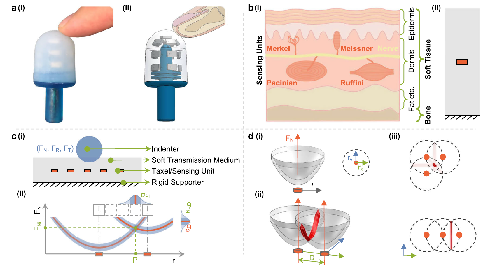

# Sensing multi-directional forces at superresolution using taxel value isoline theory _ 2025 Nature Communications

## Abstract

로봇은 촉각 지각을 통해 상호작용 성능을 향상시킬 수 있다. 상호작용은 촉각 센서 장치, 접촉 물체, 그리고 그 사이에서 발생하는 복잡한 방향성 힘(법선력과 전단력)을 포함한다. 본 논문에서는 이들을 통합하는 포괄적 이론을 제시하여 센서 설계를 진전시키고 전단에 의해 발생하는 성능 저하를 설명하며 적용 가능 시나리오를 제안한다. 센서 등고선(taxel value isoline)을 기반으로 한 이 이론은 촘촘한 배치를 피하면서도 희소한 유닛으로 초해상도 감지를 달성한다. 센서의 지각 필드, 힘 민감도, 접촉 물체의 영향을 구조적으로 분석하여 법선력, 접선(원주) 전단, 반경 방향 전단 등 힘 방향의 영향을 탐구한다. 모델은 순수 법선력에 비해 전단력 하에서 정확도가 본질적으로 저하됨을 예측한다. 검증은 접촉 위치를 예측하고 전단/법선력을 분리할 수 있는 3차원 센서 Barodome을 사용해 수행되었으며, 관측된 성능 저하(0.5 mm)는 이론 예측치(0.33 mm)와 근접하게 일치했다. 이 이론은 향후 촉각 센서 설계와 고급 로봇 촉각 시스템에 유용한 지침을 제공한다.

## Introduction

### 정리

---

## 📘 논문 개요 및 연구 동기 (Introduction 요약 및 분석)

### 🔍 문제의식: 왜 이 연구가 중요한가?

- **로봇에게 촉각은 필수적**이다. 로봇이 사람처럼 섬세한 상호작용을 하려면, 단순한 압력 감지가 아닌 **정확한 접촉 위치와 방향성 힘(정압 + 전단력)**을 인식할 수 있어야 한다.
- 기존의 촉각 센서는 주로 **정압(force normal)**만 정확하게 측정하며, 전단력(shear force)에 대해서는 성능이 급격히 저하된다.
- 고해상도를 위해 많은 센서(taxel)를 배열하면 공간 문제, 배선 복잡성, 시간 해상도 감소, 신뢰성 문제 발생.

---

### 🧠 생체 모사 기반 아이디어

- 인간의 손끝에는 다양한 종류의 촉각 수용체가 **불균일하게, 다양한 깊이에 분포**한다.
- 이 **비균일 분포**와 수용체의 결합(receptive field overlap)이 결과적으로 고해상도 감지를 가능하게 한다.
- 이를 모사하여, 적은 수의 센서만으로도 **‘superresolution’ (초해상도)** 촉각 인식을 구현하는 것이 목표다.

---

### 💡 핵심 기여: Taxel Value Isoline (TVI) 이론

- **TVI (Taxel Value Isoline)**: 특정 센서값(Taxel output)을 만들어내는 모든 가능한 위치와 힘의 조합을 나타내는 곡선.
- 이 이론을 통해 **센서의 수는 적지만**, 고해상도 위치 및 힘 추정이 가능하다.
- 전단력이 존재할 경우 기존의 단순 정압 기반 감지 방식의 정확도가 떨어진다는 **이론적 원인**을 설명함.

---

## ⚙️ 모델 수식 및 이론적 프레임워크

### ▶️ 기본 수식 1: 단일 Taxel의 출력값

$$
s = f(r, \vec{F}) + \epsilon_S \tag{1}
$$

- ( s ): Taxel의 센서값 (출력)
- ( r ): 접촉 중심과 Taxel 간 거리
- ( $\vec{F}$ ): 접촉 힘 벡터
- ( $\epsilon_S \sim \mathcal{N}(0, \sigma_S^2)$ ): 센서 노이즈

### ▶️ 힘 벡터 구성

$$
\vec{F} = \vec{F}_N + \vec{F}_R + \vec{F}_T \tag{3}
$$

- ( $\vec{F}_N$ ): 정압력 (Normal Force)
- ( $\vec{F}_R$ ): 반경 방향 전단력 (Radial Shear)
- ( $\vec{F}_T$ ): 접선 방향 전단력 (Tangential Shear)

---

### ▶️ 정의 1: TVI (Taxel Value Isoline)

$$
I_S(r, F_R, F_T) = F_N \quad \text{such that} \quad f(r, \vec{F}) = S \tag{4}
$$

- 특정 Taxel 센서값 ( S )을 만들기 위해 요구되는 정압력 ( $F_N$ )를 반환.
- 전단력이 존재하면, ( $F_N$ )이 더 필요하게 됨 → 이는 곡선이 변형된다는 뜻.

---

### ▶️ 확장된 TVI 모델 수식

$$
I_S(r, F_R, F_T) = F_{N0}(s) + \lambda_{FS}(s) \cdot \sqrt{F_R^2 + F_T^2} + \lambda_D(s) \cdot \left(r + \beta_R(s) \cdot F_R\right)^{\alpha(s)} \tag{5}
$$

### 용어 해설:

- ( $F_{N0}(s)$ ): 중심에서 전단력 없이 요구되는 정압력
- ( $\lambda_{FS}(s)$ ): 전단력의 보상 계수 (전단력 증가 시 필요한 추가 정압력 계수)
- ( $\lambda_D(s)$ ): 거리 민감도 조정 계수
- ( $\beta_R(s)$ ): 반경 전단력에 의한 위치 오차 보정
- ( $\alpha(s)$ ): 거리 감쇠 곡선의 기울기 조정

📌 이 수식은 접촉 위치, 전단력 유무에 따라 같은 센서값 ( s )를 만들기 위한 정압력이 어떻게 달라지는지 계산 가능.

---

## 🔬 기존 연구와의 차별점

| 기존 방식 | 본 연구의 접근 |
| --- | --- |
| Dense Taxel Grid 필요 | Sparse Taxel로 고해상도 달성 |
| 주로 정압력 측정 | 전단력까지 포함한 통합 모델 |
| 복잡한 전자 회로 or 광학 시스템 사용 | 단순한 구조 + 이론 기반 설계 |
| 전단력 감지에 약함 | 전단력에 의한 감지 성능 저하 예측 및 설명 |

---

## 🧪 응용: 실제 센서 (Barodome)

- **3D 형태의 실험용 센서 ‘Barodome’ 제작**
- 내부에 16개의 부압 센서를 부유시켜 위치 및 힘 추정 가능
- 이론에 근거한 설계 → 전단력 포함 시 실제 감지 정확도 저하가 **0.5mm**로 예측값 **0.33mm**에 근접함

---

## 요약 정리

- **TVI 이론**은 인간 촉각의 핵심 특성을 모사해, 적은 수의 센서로도 고해상도 촉각 감지를 가능케 한다.
- 특히 **정압과 전단력이 혼재된 상황**에서 기존 이론이 설명하지 못했던 감지 성능 저하를 정량적으로 설명 가능.
- *수식 (5)**은 실제 센서 설계 시 접촉 위치 및 힘 추정 정확도를 이론적으로 예측하는 데 핵심 역할을 한다.

---

인간은 촉각을 통해 환경과 상호작용하는 뛰어난 능력을 지니고 있으며, 그 대표적 예가 손끝이다. 손끝 피부에는 **여러 종류의 기계수용체들이 있어 풍부한 촉각 정보를 제공**한다.1,2 일부 수용체는 접촉 물체, 연조직, 뼈 사이의 상호작용에서 발생하는 응력을 감지하며(그림 1a, b), 형태와 **진피 내 깊이에 따라 감지 능력에 차이**를 보인다.3,4 이러한 메커니즘의 세부를 이해함으로써 로보틱스용 **생체 모방 촉각 핑거팁과 같은 인간의 촉각을 모사하는 기술을 개발**할 수 있다(그림 1a).

- **Fig. 1 | Overview of the theory**
    
    **a** Real image [a(i)] and schematic drawing [a(ii)] illustrate an adult fingertip interacting with our designed haptic sensor, Barodome, capable of detecting contact-induced pressure changes. 
    
    **b** Anatomy of human fingertip skin [b(i)] and a simplified model [b(ii)] employed in this study. The model incorporates an orange pressure-sensitive taxel positioned within a gray soft transmission medium fixed on a boundary. 
    
    c Sensor array comprising multiple taxels for sensing contacts with directional forces [c(i)]. Two sensing units, along with their isolines, are utilized to infer contact location ( $P_i$ ) and contact force ( $F_{Ni}$ ), considering uncertainties $\sigma_{P_i} , \sigma_{F_{Ni}}$   introduced by sensor measurement noise ( $\sigma_{s}$) [c(ii)]. 
    
    **d** Introduction of a single taxel value isoline in three dimensions (3D) [d(i)], two intersected 3D isolines [d(ii)], and three intersected 3D isolines with two different layouts [d(iii)]. The upper layout highlights a practical configuration for localizing contacts with the smallest uncertainty (indicated by the focused red overlapping area).
    

---

촉각 센싱 기술은 로봇이 촉각으로 주변을 인지하게 하여 로봇 응용을 혁신했다.5–8 이들 기술은 변형을 전기 신호로 변환하는 기능성 재료로 만들어진 변형성 센싱 요소를 사용한다. 변환 방식으로는 저항9–15, 정전 용량4,16,17, 광강도18–20, 자기 플럭스21,22 등 다양한 방법이 있다. 비전 기반 센서를 제외하면19,20, **센싱 요소(택셀)는 물리적 해상도에 맞춰 표면에 격자 형태로 배치되는 것이 일반적**이다. 그러나 더 나은 공간 해상도를 위해 택셀 수를 늘리면 택셀과 배선이 더 작고 밀집된 레이아웃이 되어 시간 해상도가 떨어지고 강건성이 감소하는 문제가 발생한다.

---

조밀한 배치 대신 인간 피부의 해부학적 연구23는 **수용체가 서로 다른 깊이와 밀도로 불연속적으로 분포하여 공간적으로 가변적인 민감도를 가진 넓은 감지 영역을 구현함을 보여준다**. 햅틱 웨어러블을 이용한 사용자 연구24는 공간적으로 가변적인 지각 민감도가 인간 손의 수용체 밀도 분포와 일치함을 검증했다. 생물학자들은 또한 여러 택셀/수용체의 수용 필드의 중첩이 물리적 해상도를 넘어서는 더 높은 정확도를 달성한다고 제안한다.25,26 최근 Sun 등27은 희소한 센서 레이아웃으로 물리적 밀도보다 1000배 높은 위치 추정 정확도를 달성하는 촉각 초해상도 현상을 설명하는 이론을 제안했다. 이 혁신적 접근은 초해상도 기반 촉각 센서 설계 전략의 매력을 높였다.

---

많은 촉각 센서는 표면 변형을 측정하는 강체에 고정된 수용체를 사용해 초해상도 센싱을 달성할 수 있다. 예를 들어, 강체 코어 주위를 감싸는 유연한 인쇄회로기판(PCB)은 PCB의 희소하게 배치된 패드와 전도성 고무 또는 유전체로 절연된 직물 사이의 정전용량 변화를 측정할 수 있다.17 또는 강체 코어에 고정된 광다이오드가 코팅된 반사막으로부터 반사된 빛을 감지할 수 있다.28 다른 접근으로는 기저부에 장착된 카메라가 밀폐된 중공 쉘 내부 쪽의 여러 마커의 접촉 유발 이동을 모니터링하는 방식이 있다.18 전자기학을 이용하면 프레임에 고정된 홀 센서가 연질 엘라스토머 내부에 떠 있는 영구자석의 이동을 포착하거나 특정 인코딩된 자기층의 이동으로 인한 자기장 변화를 감지할 수 있다.29,22

---

이처럼 **고정 구조와 복잡한 변환 방식을 쓰는 센서들은 연조직 내부에서 유연하게 떠다니며 단순히 압력 변화를 측정하는 인간 피부의 기계수용체와는 상당히 다르며 유연성이 제한**된다. 자연 시스템의 단순성에 맞추어, 우리는 가능한 한 단순한 설정을 분석할 것을 제안한다. 즉, **뼈와 유사한 구조에 의해 지지되는 연질 재료 내부에 떠 있는 압력 민감 센싱 단위로서 법선력과 전단력 모두를 감지할 수 있는 구조를 고려**한다(그림 1). 이렇게 함으로써 인간의 촉각을 보다 정확히 모사하고 더 효과적인 촉각 센싱 기술을 개발할 수 있다. 우리는 Sun 등27이 제안한 이론을 바탕으로 **대부분의 최신 센서가 부족한 전단력 감지를 포함한 촉각 센싱 접근을 개발**한다. 표 1은 초해상도 능력을 가진 최신 촉각 센서들의 비교 요약을 제공한다. **전단력 하에서 접촉 위치를 정확히 예측할 수 있다고 보고된 센서는 소수에 불과**하다.

실제 접촉은 **물체 형상과 크기가 알려지지 않았거나 접촉력의 방향과 같이 지속적으로 변하는 운동 때문에 종종 복잡**하다. 따라서 본 논문에서는 **이러한 복잡한 거동을 이해하고 촉각 연구를 기초적 관점에서 촉진할 포괄적 초해상도 이론을 정립하는 것을 목표**로 한다. 

---

우리 이론은 택셀 값 등고선(taxel value isolines, TVIs)에 기반하며, 일반적인 센서를 구축하기 위한 정보 기반 접근을 제공한다. 이 이론은 연질 엘라스토머 내 택셀 배치와 초해상도 향상 정확도를 위한 **택셀 레이아웃에 대한 지침을 제공**한다. 또한 **전단 접촉력에 의해 도입되는 복잡한 거동에 관한 발견도 제시**한다. 실용적인 측면에서 우리는 **이 이론에서 도출된 지침을 따라 촉각 핑거팁 센서인 Barodome을 개발**했다. 이 센서의 감지 표면은 3차원 원통형 몸체와 포물선형 팁을 이룬다. 전반적 접근은 센서 설계와 제조, 데이터 수집 및 보정 개선에 기여할 수 있으며 **공통 표준 작업 파이프라인을 형성**하고 있다.

## Results

### 번역

- The Model
    
    모델은 **참조문헌 27**에서 제시한 이론을 기반으로 구축되었다. 해당 이론은 **물리적 센싱 유닛(택셀)이 매립된 탄성 전달 매체를 가지며 평면 또는 곡면으로 확장된 표면에서 복잡한 방향성 힘 상호작용을 측정하도록 설계된 촉각 센싱 장치 계열을 다룬다. 그림 1c**에는 1차원 모델이 제시되어 있다. 
    
    **점 접촉의 경우 단일 택셀 값 s는 접촉 중심과 택셀 중심 사이의 반경 변위 r 및 인가된 접촉력 크기 $\overrightarrow{F}$의 함수**이다:
    
    $$
    s = f(r, \vec{F}) + \epsilon_S \tag{1}
    $$
    
    여기서 $ϵ_S$는 표준편차 $σ_S$를 가지는 택셀 측정 잡음이며
    
    $$
    \epsilon_S \sim \mathcal{N}(0, \sigma_S^2) \tag {2}
    $$
    
    본 논문의 주요 기여 중 하나는 복잡한 상호작용에서 결합된 법선력($\vec{F}_N$ )과 전단력(반경 성분  $\vec{F}_R$ ); 접선 성분 $\vec{F}_T$ )의 중요한 역할을 고려하여 모델을 확장한 것이다:
    
    $$
    \vec{F} = \vec{F}_N + \vec{F}_R + \vec{F}_T \tag{3}
    $$
    
    - ( $\vec{F}_N$ ): 정압력 (Normal Force)
    - ( $\vec{F}_R$ ): 반경 방향 전단력 (Radial Shear)
    - ( $\vec{F}_T$ ): 접선 방향 전단력 (Tangential Shear)
- Definition 1.
    
    ---
    
    
    
    TVI는 평균 택셀 출력 방정식(1)이 상수 값 S를 갖고 전단력이 실제 적용에서 항상 수직력과 함께 나타나는 곡선군입니다.
    
    ---
    
    그림 1c, d는 1차원 및 2차원 모델 시스템에 대한 **TVI와 측정 잡음의 영향을 보여준다**. **등고선은 동일한 센서 값을 만들기 위해 필요한 법선력의 크기를 정량화**한다. **특정 값 S로 택셀을 활성화하려면**, **접촉 위치가 택셀에 가까울수록 필요한 힘 크기는 작아진다**. 
    
    여기서 $F_{N0} = g(s = S)$는 택셀 중심 $(r=0, F_R=0, F_T=0)$ 에서 **필요한 순수 법선력**을 나타낸다. 특정 센서 판독 $(s = S)$ 에 대해, 법선력 $F_N$과 접촉 위치 $r$ 사이에는 등고선으로 표시되는 일대일 대응이 존재한다. 전단력 $(F_R, F_T)$이 존재하면 택셀 값에 미치는 **영향을 보상하기 위해 추가적인 법선력이 필요**해지며 이로 인해 **일대일 대응이 교란**된다. 본 논문에서는 **이러한 복잡한 거동을 기술하기 위한 이론적 모델을 다음 식으로 제안**한다:
    
    $$
    I_S(r, F_R, F_T) = F_{N0}(s) + \lambda_{FS}(s) \cdot \sqrt{F_R^2 + F_T^2} + \lambda_D(s) \cdot \left(r + \beta_R(s) \cdot F_R\right)^{\alpha(s)} \tag{5}
    $$
    
    ### 항목 설명:
    
    1. **( $F_{N0}(s)$ )**: 
    전단력이 없고, 접촉이 Taxel 중심에서 발생할 때 필요한 최소 정압력.
     $F_{N0} = g(s = S)$는 택셀 중심 $(r=0, F_R=0, F_T=0)$ 에서 **필요한 순수 법선력**을 나타냄.
    2. **( $\lambda_{F_S}(s) \cdot \sqrt{F_R^2 + F_T^2}$ )**:
        
        **전단력이 센서 판독에 미치는 영향을 보상하기 위해 얼마나 많은 법선력이 필요한지를 설명**
        
    3. **(  $\lambda_D(s) \cdot (r + \beta_R(s) \cdot F_R)^{\alpha(s)}$  )**:
        
        거리와 반경 전단력의 영향을 비선형적으로 반영함.
        
         $\beta_R(s)$ 
        
        **반경 거리 r의 영향과, 엘라스토머를 택셀 쪽으로 끌어당기거나 밀어내는 반경 성분 전단력의 효과를 함께 포함한 계수**
        
         $\alpha(s)$ 
        
        **멀리 떨어진 접촉의 감지 강도 감소는 지수**
        
    
    등고선은 세 항으로 모델링된다. 첫 번째 항 F_N0(s)는 영(0) 공간 오프셋에서 요구되는 힘을 포착한다. 
    
    두 번째 항은 계수 함수 λ_{F_S}(s)에 의해 조절되는 전체 전단력의 영향을 다룬다. 이것은 전단력이 센서 판독에 미치는 영향을 보상하기 위해 얼마나 많은 법선력이 필요한지를 설명한다. 
    
    세 번째 항은 반경 거리 r의 영향과, 엘라스토머를 택셀 쪽으로 끌어당기거나 밀어내는 반경 성분 전단력의 효과를 함께 포함하며 계수 β_R(s)로 캡처된다. 멀리 떨어진 접촉의 감지 강도 감소는 지수 α(s)로 모델링됩니다.
    
    이하에서 우리는 이 세 항을 각각 상세히 검토한다.
    
- How is the model derived?
    
    각 센서의 응답은 센서들, 물체들 및 그들 간의 상대 운동 사이의 복잡한 상호작용에서 나온다. 향후 햅틱 센서 설계를 위한 포괄적 프레임워크를 확립하기 위해, 우리는 그림 1 b(ii)에 도시된 간략화된 모델을 채택한다. 즉, **접촉에 의해 유도된 압력 변화를 측정하는 탄성 전달 매질 내에 매달린 택셀**이다. 이 모델을 통해 우리의 주요 초점은 **센서의 구조적 특성**, **접촉 물체의 크기**, 그리고 **센서와 물체 사이의 방향성 힘 상호작용(법선 및 전단)**이다. 이러한 분석을 통해 우리는 **접촉 거동에 대한 유의미한 통찰을 얻고 혁신적인 햅틱 센서 설계 개발을 촉진할 것으로 기대**한다.
    
- Structure factors.
    
    **가장** **유리한 설계들**에서는 택셀(센싱 유닛)을 **강체 프레임에 장착하고 그 위에 연성 전달 매질을 적용**한다.17,22,28,29 본 연구에서는 **유사한 방식을 채택**하여 바로미터(MPL3115A2)를 직경 120 mm, 두께 4.2 mm인 엘라스토머(EcoFlex 00-30) 아래에 밀폐시킨 구조를 그림 2a(i)에 나타낸다. 엘라스토머의 상면을 탐침하기 위해 우리는 직경 4 mm의 구형 인덴터를 장착한 테스트베드를 구성했으며, 그림 2a(ii)의 검은 선으로 표시된 바와 같이 100 mm 스트로크 전구간에 걸쳐 측정이 가능하다. TVI는 포물선형의 “U” 모양으로 그려지며 반경 거리 전반에 걸쳐 바로미터를 특정 판독값으로 활성화하는 데 필요한 법선력을 특성화한다.
    
    엘라스토머 두께를 변화시키면 택셀의 감지(지각) 영역과 힘 감도에 변화가 나타나며 이는 그림 2b(i)와 (ii)에 예시되어 있다. 엘라스토머 두께를 증가시키면 택셀의 감지 영역은 넓어지는 반면 힘 감도는 감소한다. 이는 두꺼운 엘라스토머가 경계 효과의 제약을 덜 받아 보다 자유로운 변형을 허용하기 때문이다. 그러나 더 두꺼운 엘라스토머 내에서 택셀을 압축해 동일한 국부 압력값을 얻으려면 더 많은 재료를 변형시켜야 하므로 더 큰 힘이 필요하다. 추가로, 그림 2b(iii)에 보인 것처럼 택셀을 엘라스토머 내부에 떠 있게 배치하면 표면 방향으로의 국부 압력 증가로 인해 힘 감도가 향상되는 것을 확인했다. 특정 응용에 따라 우리는 원하는 감지 영역 크기와 힘 감도를 얻기 위해 두께와 센서 깊이를 조정할 수 있다.
    
- Object size
    
    센서 거동을 분석할 때 또 다른 중요한 측면은 다양한 물체와의 상호작용이다. 본 연구에서는 **물체 크기에 따라 센서 응답이 어떻게 달라지는지 조사**한다. 앞서의 관찰을 바탕으로 **우리는 큰 감지 영역과 충분한 감도를 동시에 얻기 위해 바로미터를 연질 엘라스토머의 중앙에 배치**한다. 다양한 물체에 대한 센서의 반응을 평가하기 위해 **그림 2c에 나타낸 것처럼 직경 2mm에서 20mm까지 범위의 6가지 구형 인덴터로 감지 표면을 탐침**했다.
    
    **작은 인덴터**는 센서 판독에서 보다 **국소적인 압력 증가를 일으키므로 동일한 수준으로 센서를 활성화하는 데 적은 힘이 필요**하다(그림 2d). 반대로 **큰 인덴터**는 **더 큰 힘을 필요로 하며 이는 작은 인덴터의 최대 용량을 초과**할 수 있다. 이런 경우 **작은 인덴터는 바늘처럼 작용하여 연질 엘라스토머를 관통해 센서를 손상시킬 수 있다. 작은 인덴터는 힘 변화에 대한 감도가 더 크며 이는 인간 피부가 날카로운 가장자리에 대해 민감해지는 현상과 일치**한다. 
    
    우리의 분석에서 또 다른 중요한 발견은 **센서들이 물체 크기에 따라 뚜렷히 다른 감지 거동을 보인다는 점이다(그림 2d).** 이는 **서로 다른 물체들이 각기 다른 센서 응답 패턴을 통해 구별될 수 있음을 시사**한다. 다만 단일 센싱 유닛만으로는 이러한 구별을 달성할 수 없다는 점에 유의해야 한다. 여러 센서를 배열로 결합하면 응답 패턴을 통해 물체 크기를 효과적으로 판별할 수 있다.30
    
    참조문헌 27의 분석에 따르면 α(s) 값이 2에 가까운 작은 값과 다수의 센서를 활성화하는 더 큰 감지 영역은 더 높은 정확도로 이어진다. 주목할 점은 큰 인덴터가 이 두 특성을 동시에 보인다는 것이다. **이 발견은 물체 크기를 구별하는 능력의 기제를 밝힘으로써 센서 연구 분야에 유의미한 통찰을 제공한다.**
    
- Force direction
    
    센서와 물체 간의 상호작용은 센서 거동에 중대한 영향을 미친다. 특히 로봇 손에서 섬세한 물체 조작은 **법선력과 전단력 모두에 의존**한다. 전단력과 법선력을 구분하기 위해 **특정 방향에 전념하는 독립 센서를 사용하는 것이 일반적**이다.22,29 그러나 이러한 얽힌 운동을 정확히 식별하는 것은 여전히 어렵고 인간 피부의 기능을 완전히 설명하지 못한다. 본 연구는 **인간 피부를 모사한 단순화된 설정의 분석을 통해 힘 방향을 분리하는 일반화된 접근법을 개발함**으로써 의미 있는 기여를 하고자 한다.
    
    우리는 그림 2에 도시된 법선력 외에 그림 3a의 상호작용에서 추가 전단력 성분을 포함시킨다(데이터 수집 절차 방법 섹션 참조). 이 전단력은 두 방향으로 분석된다. 반경 방향(±y 방향)은 센서 쪽으로 끌어당기거나 밀어내는 방향이고, 접선 방향(±x 방향)은 센서로부터 당겨내는 드래그 힘을 만든다.
    
    
    
    순수 법선력으로 관찰되는 매끄러운 TVI(그림 3b(i))와 달리, **추가적인 접선 전단력은 TVI에 비틀림 효과를 도입**한다(그림 3b(ii)). 시각화된 TVI는 법선력과 전단력의 합성 결과라는 점에 주의하라. 이로 인해 이전의 일대일 관계가 깨지며, **단일 위치에서의 법선력 크기에 대한 불명확성** 혹은 **단일 법선력 크기에 대응하는 위치의 불명확성**이 **증가**한다. 더 나아가, 전단력이 **반경 방향일 때 그 영향은 더 뚜렷**해진다(그림 3b(iii)).
    
    더 깊은 통찰을 얻기 위해 합력 힘을 **세 가지 전단 수준(1.5 N, 0.0 N, −1.5 N)에서 법선 및 전단 방향으로 분해**했다. 분리된 TVI는 매끄러운 패턴을 보인다. 그러나 **전단력이 존재**하면 이를 보상하기 위해 **더 큰 법선력이 필요**하다(그림 3b(iv) 참조). 이 현상은 식(5)에서 λ_FS로 모델링된다(다른 전단력 수준에서의 최저 법선력). **접선 전단력(±x 방향)**은 센서로부터 **지속적으로 당겨**내므로 **더 큰 법선력을 요구**한다(**그림 3b(v)**). **반경 전단력(±y 방향)**은 **TVI에 오프셋을 도입하는 반면 접선 전단력은 그렇지 않다(그림 3b(vi))**. 반경 전단력은 센서 쪽으로 밀면 추가 압력을 더하여 더 낮은 법선력을 요구하게 하거나, 센서에서 당기면 더 큰 법선력 강도를 필요로 한다. 
    시각화를 위해 그림 3c에서는 센서 판독값 5.0 kPa에 대한 TVI의 3차원 표현을 제시하며, 접촉 위치(P), 전단력(F_Shear), 법선력(F_Normal)을 묘사한다. 특히 그림 3c(ii)는 반경 방향의 비대칭적인 밀기/당김 효과로 인해 명확한 기울기 각도/오프셋을 보인다.
    
    이 흥미로운 발견을 바탕으로 우리는 **전단력에 관한 센서 거동을 체계적으로 모델링하려 한다.** **TVI는 센서 판독값(S)과 전단력(F_Shear)에 따라 변하는 포물선 형태(λ_D와 α)를 보인다는 정의를 활용**한다. 
     다양한 센서 판독값(그림 3d(i) 참조)의 경우 접선(삼각형 마커) 및 방사형(원형 마커) 전단력은 모두 유사한 특성을 보이는데, 다만 방사형 밀기와 당기기의 비대칭 효과로 인한 오프셋(P0)은 예외입니다.
    
    오프셋(P0)은 **주어진 전단력 조건에서** **특정 센서 판독값에 필요한 최저 수직력이 필요한 위치**(식 (5)에서 βR로 모델링됨)를 나타냅니다.
    
    더 큰 센서 판독값에 대한 TVI는 더 큰 λD와 더 높은 포화도 경향, 더 작은 α와 더 낮은 포화도 경향, 더 작은 오프셋 경사각(P0)과 더 낮은 포화도 경향, 그리고 선형적으로 증가하는 순수 수직력(FShear=0에서 FN0)을 나타냅니다.
    
    중요한 점은, 더 큰 센서 판독값은 더 높은 전단력을 보상하기 위해 더 높은 수직력이 필요하다는 것입니다. 이러한 모든 관측값은 그림 3d(ii)에 제시된 모델에 반영되어 있습니다.
    
    법선력, 접선 전단력, 반경 전단력이 혼합된 실제 적용을 검증하기 위해 정량 실험을 수행했다(그림 3e(i)). (x=0, y=0)에 위치한 바로미터 센서는 미리 정의된 지점에서 직경 16 mm의 구형 인덴터와 상호작용한다. 전단력은 x 및 y 방향으로 가해져 접선 및 반경 전단력을 측정할 수 있다. 전단력 방향에 의해 발생하는 오프셋은 삼각함수로 모델링된다(그림 3e(ii)). 식(5)에 따른 우리의 모델은 정확성 평가를 받았으며 결과는 그림 3f에 표시된다. 우리는 식(5) 기반의 방정식 모델(그림 3d(ii) 및 식(5))을 룩업 테이블(그림 3d(i))과 비교했으며, 4 mm 이상의 거리에서 오차가 증가하는 유사한 성능을 관찰했다(그림 3f(i)). 모델은 45° 각도에서 가장 높은 정확도를 달성하며 측면으로 갈수록 점차 정확도가 떨어진다.
    
- Tactile superresolution theory modeling considering uncertainty
    
    센서의 구조, 물체 크기, 상호작용 힘의 방향을 고려하면 센서 거동을 정확히 모델링할 수 있다. 이 모델은 여러 함의를 가진다. **순수한 법선력 조건**에서는 **TVI가 3차원에서 그릇(bowl) 모양 패턴을 보인다(그림 4a(i))**. 이들 TV이 **두 개를 교차시키면 한 방향에서의 접촉 위치를 국소화할 수 있으나, 센서 잡음(σ_S)으로 인한 불확실성(σ_rx)을 남기며 다른 방향(σ_ry)과 인가된 힘(σ_FN)에 대한 정보는 제공하지 못한다(그림 4a(ii))**. 세 개의 TVI를 일직선으로 배치해도 유사한 문제가 발생한다. **그러나 격자(grid) 배치에서는 위치와 힘 크기를 정밀하게 추정할 수 있다(그림 4a(iii)).**
    
    **법선력과 접선 전단력 조건에서는 TVI가 4차원적 성격**을 띤다. 시각화를 위해 x-방향 위치, 접선력, 법선력의 세 차원으로 표현한 보철물(denture) 모양 TVI를 제시한다(그림 4b(i)). 
    이들 TVI 두 개를 교차시키면 x-방향에서의 위치는 국소화할 수 있으나 불확실성(σ_rx)이 남고, 인가된 법선력(σ_FN)과 접선력(σ_FT)에 관한 정보는 제공하지 못한다(그림 4b(ii)). 
    
    그러나 격자 배치에서는 x 위치를 추정할 수 있고 법선력과 접선력을 분리(decouple)할 수 있다. 명료성을 위해 여기서는 y 위치는 시각화하지 않았다.
    
    이러한 거동은 **법선력과 반경 전단력 조건에서도 성립한다(그림 4c)**. 반경 방향의 밀기와 당김이 **비대칭적으로 작용하기 때문에(그림 4c(i), c(ii))** **격자 배치에서도 모든 차원에서의 불확실성이 더 커진다.** 
    
    **논리적으로 x–y 위치, 법선력, 그리고 두 성분의 전단력을 모두 추정하려면 적어도 다섯 개의 택셀(taxel)이 반응해야 하며 정확도는 이 5개 TVI의 상호작용 영역에 의해 결정**된다. **일반적으로 반응하는 센서가 많을수록 정확도는 높아지지만 공간적 배치가 중요하다.** 정확도는 **센서 잡음과 전단력의 영향에 의해 제한되며, 그중 반경 전단력이 상한을 결정한다**(식(5)의 β_R 및 그림 3e(ii)에 반영).
    
- Theory-informed tactile sensor design
    
    인간의 뛰어난 촉각 능력에서 영감을 받아 로보틱스에 적용 가능한 촉각형 생체모사 핑거팁을 개발했다(그림 1a). 인간 손끝은 뼈를 둘러싼 연조직 내부에 압력 민감 기계수용체를 지니고 있다(그림 1a(ii), b(i)). 본 센서인 Barodome은 **바로미터 센서 유닛을 연질 실리콘 내부에 부유시키고 내부의 강성 구조로 보강하는 방식으로 이 생물학적 구조를 일부 재현**한다(그림 1a(ii), 5a(i)). 이러한 설계 선택은 앞서의 이론적 분석에 근거한다. 구체적으로 다음 절차에 따라 프로토타입을 설계·제작했다.
    
    **Step 1: 센싱 유닛 선택**
    
    연질 엘라스토머에 매립된 센싱 유닛을 선정·분석한다. 선택지는 압력용 바로미터, 신장계(strain gauge), 기울기용 가속도계 등이 있으며(기존 연구27 참조) 본 연구에서는 단조(monotonic) 응답과 TVI로 기술되는 명확한 힘-변위 매핑 때문에 바로미터를 선택했다.
    
    **Step 2: 구조 설계**
    
    엘라스토머 두께와 센서 위치의 영향을 검토했다. 성능 트레이드오프(그림 2)를 바탕으로 두께 7.2 mm의 엘라스토머를 채택하고 센서를 중앙에 배치했다.
    
    **Step 3: 재료 선택**
    
    재료 물성(영률·포아송비)이 TVI에 미치는 영향을 평가했다. 참조27의 분석을 따라 Smooth-On EcoFlex 00-30(영률 0.07 MPa, 포아송비 0.49999)을 사용했다.
    
    **Step 4: 인덴터 형상 평가**
    
    다양한 인덴터 반경이 TVI 형태에 미치는 영향을 평가하여 상호작용 시나리오별 예측 성능을 도출했다. 이 **인덴터들은 센서와 단일점 접촉을 형성하는 다양한 물체를 대표**한다. 참조27에서 논의된 바와 같이 **초해상도 이론은 단일점 접촉의 결과력과 접촉 중심을 추정할 수 있게 한다.** **다중 접촉의 경우 서로 구별되려면 최소 하나 이상의 택셀 간격만큼 분리되어야 한다. 연속적(등고선형) 접촉 시나리오는 본 초해상도 모델의 범위를 벗어난다.**
    
    **Step 5: 전단력 영향**
    
    전단력을 포함하도록 분석을 확장했으며 전**단력이 정확도를 체계적으로 저하시킨다는 사실을 확인했다(그림 3)**. 이 단계는 실제 환경에서 성능 저하를 예측하는 데 필수적인 TVI 형태의 전단 유도 변형을 드러낸다.
    
    **Step 6: 잡음 특성화**
    
    **신호처리를 통해 달성 가능한 이론적 정확도 한계를 결정하기 위해 센서의 고유 잡음을 측정했다(그림 4, 5d, 6b).**
    Steps 1–5는 TVI 형태와 공간적 특성(지각 필드, 민감도, 감쇠 프로파일)을 정의하며 이는 달성 가능한 해상도와 정확도를 지배한다. 이들 파라미터와 Step 6에서 측정한 센서 잡음 레벨을 이용해 이론적 성능 한계를 추정할 수 있다(참조27의 그림 2 및 본문 그림 6b 참조).
    
    기존 연구27에서는 다음을 보였다. 
    (1) 1차원 센서에서 이론적 해상도 187배 향상, 
    (2) 머신러닝 적용으로 10^6 배(문맥상 10^6 또는 10^6배로 표기됨) 개선, 
    (3) 2차원 센서에서 1260배 향상. 
    본 연구에서는 분석을 3차원 핑거팁 형태의 센서(Barodome)로 확장하였고 전단력으로 인한 정확도 저하 평가에 초점을 맞췄다. 우리 모델은 전단 조건에서 고유 오차 0.33 mm를 예측하며, 
    실험 결과는 약 0.5 mm의 손실을 보여 모델 예측과 근접하게 검증되었다.
    
- Sensor introduction.
    
    돔형 센서는 전체 높이 45.0 mm, 직경 21.5 mm로 성인 엄지손가락 끝 크기를 모사한다. 상단부는 활성 감지 표면으로 동작하며 높이는 18.9 mm이다(그림 5a(i)). 성형된 연질 엘라스토머 내부에는 16개의 부유형 바로미터가 내장되어 표면 접촉 시 내부 압력 변화를 측정한다. 3D 프린트된 강성 지지 코어가 구조를 고정한다. 이 센서는 구(球) 대칭의 감지 표면 전역에서 단일 접촉의 위치 중심(centroid)과 법선 및 전단 방향의 결과력 크기를 정확히 보고할 수 있다(그림 5a(ii)).
    
- Fabrication
    
    바로미터 센싱 유닛(MPL3115A2)은 PCB에 장착하지 않고 지름 0.15 mm의 초박형 에나멜 동선(Cu-enameled wire)으로 직접 배선했다(그림 5b(i)). 16개의 배선된 바로미터는 지지 코어에 의해 이웃 간격을 6.5 mm로 균등 배치했다. 이 배치 간격은 지각 필드, 민감도 및 바로미터 기하를 고려한 것이다(그림 5b(ii),(iii)). 조립을 위해 바로미터들은 Smooth-On EcoFlex 00-30으로 만든 연질 엘라스토머 내부에 몰딩되었다. 공정은 재료 혼합과 탈기(degassing)를 포함하며, 이어서 성형 후 경화 시간 4시간이 소요된다. 몰드는 Formlabs Form 3로 3D 프린트하였고 재료는 Tough를 사용했다(그림 5b(iv)). 전반적인 제작 절차는 간단하고 직관적이다.
    
- Operation pipeline
    
    센서는 기계학습 기반 시스템으로 동작한다. 훈련된 모델은 바로미터 원시값(B1,…,B16)으로부터 단일 접촉의 접촉 위치(Px, Py, Pz)와 방향별 힘 크기(FN, FS1, FS2)를 예측한다. 바로미터 센싱 유닛은 전체 측정 범위가 90,000 Pa이고, 잡음 특성은 분산 15 Pa로 나타난다(그림 5d). 
    
    실험을 위해 우리는 3자유도(병진; Barch Motion Linear Guide의 위치 해상도 0.0075 mm)와 2자유도(회전; Dynamixel MX-28AT 및 MX-64AT의 최대 위치 오차 0.03 mm, 그림 6a(ii))를 갖는 전용 테스트베드를 개발했다(그림 5c(i)). 이 장치는 법선 및 전단력을 모두 적용할 수 있는 직경 4 mm의 구형 인덴터로 Barodome 감지 표면을 탐침한다. 프로브와 테스트베드 사이에는 접촉력의 크기를 정량화하기 위해 포스 센서(ATI-Mini40, 측정 잡음 분산 4.0 mN)가 부착되어 있다(그림 5c(ii)).
    
    수집된 데이터에 대해 다층 퍼셉트론(**MLP**) 구조의 머신러닝 모델을 **최소자승 비용 함수로 학습시켜 런타임에 원시 바로미터 값을 접촉 정보로 매핑**하도록 한다(그림 5d). 모델의 **불확실성**은 **바로미터 센서 잡음**, **테스트베드 정확도 한계**, **포스 센서 잡음**, **데이터 양 제약**에서 **유래하는 가우시안 잔차로 모델링**된다. 바람직하게도 가우시안 잔차에 대해 최대우도추정으로 모델 불확실성을 최소화하는 것과 최소자승 오차를 최소화하는 것은 동치이므로(바로미터 센서 잡음에 기인), MLP를 직접 최적화하여 관심량을 예측한다(그림 1c(ii)).
    
- Evaluation
    
    Barodome의 감지 표면을 1mm 간격으로 점들로 분할했습니다(그림 5a(ii)). 테스트베드는 16mm 구형 압입자를 사용하여 각 점에 순수 수직력을 가하여 측정합니다(그림 6a(i)).
    
    또한 그림 3a(ii)와 유사한 절차로 결합된 법선·전단력 데이터셋을 추가로 수집했다. 
    
    테스트베드의 공간 위치 정밀도는 <0.03 mm이며(그림 6a(ii)), 힘 분해능은 0.01/0.01/0.02 N(Fx/Fy/Fz)을 제공한다. 
    
    결합력에서의 공간적 비균질성은 강체 바로미터 유닛과 베이스 근처의 지지 코어 때문이다.(그림 6a(ii))
    
    평가 데이터셋의 평균 전단력은 0.43 N이다(그림 6b(i)). 이론 모델(그림 6b(ii))은 0.43 N의 전단력이 순수 법선력 조건에 비해 약 0.4 mm의 추가적인 위치 오차를 초래한다고 제시한다.
    
    ---
    
    그림 6c(i)는 **순수 법선력 조건이 결합 전단력 조건보다 위치(국소화) 및 힘 정량화(평균) 정확도가 더 우수함을 보여준다.** 이는 이론 모델과 일치한다. 더 큰 인덴테이션 힘에서는 두 경우 모두 위치 정확도가 향상되는데(더 많은 택셀 활성화), 반대로 힘 정확도는 저하된다. 
    
    이 경향은 고력 구간에 대한 훈련 데이터 부족(그림 6b(i)의 히스토그램) 또는 지지 코어 바닥 근처의 미소 변형(그림 6a(ii))으로 설명될 수 있다. 
    
    고력은 센서 포화와 과소 추정을 초래한다. 오차 분포는 방향별 오차(X, Y, Z)가 평균 0을 중심으로 하지만 이상치로 인한 긴 꼬리를 가진다. 
    
    **위치 국소화는 방향별로 균형 잡힌 정확도를 보이나, 힘 정량화는 반경 방향(FR)에서 비교적 큰 오차를 보이며 법선 방향(FN)에서도 유의한 오차가 관찰**된다. 각 결과력 구간에서 법선력은 크기 면에서 전단력보다 항상 크며, 상대적 백분율 오차는 비교 가능하다. 
    
    ---
    
    그림 6c(ii)는  **순수 법선력이 결합 전단력보다 우수함을 확인하며 정확도 차이는 약 0.5 mm로 이론 예측 0.33 mm(파란 점선)와 일치**한다. 
    
    이상치와 0이 아닌 중심의 L2-노름 결과오차의 영향을 줄이기 위해 중앙값 오차(median error)와 중앙값 절대편차(median absolute deviation)를 사용했다. 더 높은 힘이 가해질수록 위치 및 힘 정량화는 개선되어, 순수 법선력의 경우 위치 0.8 mm 및 힘 8%를, 결합 전단력의 경우 위치 1.3 mm 및 힘 15%를 달성하며 중앙값 오차와 MAD가 좁아진다.
    
    평가 데이터가 훈련 데이터에 포함되지 않지만 훈련에서 본 위치들을 포함하는 경우, 위치 및 힘 정확도(RMSE)는 순수 법선력에서 최대 0.17 mm 및 1%, 결합 전단력에서 0.52 mm 및 4%까지 도달할 수 있다.
    
    ---
    
    그림 6d는 다양한 인덴터 형상·크기에 대한 정확도 결과를 제시한다. 데이터셋은 네 개의 구형 인덴터(직경 8 mm—30k 샘플, 12 mm—30k 샘플, 16 mm—순수 법선력 35.8k 샘플 및 결합 전단력 179.1k 샘플, 20 mm—30k 샘플)와 하나의 원통형(직경 20 mm—10k 샘플)을 포함한다. 
    
    **실제 시나리오를 시뮬레이트하기 위해 데이터셋은 하나의 인덴터(16 mm)에서 많은 데이터를 포함하고 다른 크기/형상에서는 일부 데이터를 포함하여 드문 인덴터에 대한 적용 성능을 평가할 수 있게 구성**했다. 이 혼합 데이터셋으로 학습한 머신러닝 모델은 인덴테이션 힘이 증가할수록 일관되게 높은 정확도를 보이는 경향을 나타낸다. 
    
    16 mm 구형 인덴터는 순수 법선력과 결합 전단력 모두에서 특히 낮은 힘 구간에서 최고 정확도를 보였다. 
    
    12 mm와 20 mm 구형 인덴터는 형태·크기가 유사하고 훈련 데이터가 적어 정확도가 조금 낮았으나 유사한 성능을 보였다. 
    
    반대로 8 mm 구형 및 20 mm 원통 인덴터는 형태·크기 차이가 커 성능이 저하된 것으로 보인다.
    
    약 2주 동안의 집중적인 300,000회 접촉 사이클(법선 및 전단력 포함) 후, Barodome은 20 mm 구형 인덴터에 대해 위치 정확도 오프셋(Px = −0.02 mm, Py = 0.04 mm, Pz = 0.12 mm) 및 힘 정확도 오프셋(Fx = −0.03 N, Fy = 0.05 N, Fz = 0.15 N)을 보였는데, 이는 센싱 유닛의 이동으로 인한 것으로 추정된다. 장기적 안정성·신뢰성 평가는 추가 내구성 테스트가 필요하며 향후 작업으로 다룰 예정이다. 향후 연구에서는 재료 개선과 고급 보정 기법을 통해 이러한 드리프트를 완화하는 데 중점을 둘 것이다.
    

### **1. The model → fig1.**

### 개요

이 연구에서 사용하는 모델은 Sun et al. (Ref. 27)의 기존 이론을 기반으로 확장되었으며, **탄성체 내부에 매립된 Taxel을 이용해 접촉 위치와 힘을 추정**한다.

접촉은 일반적으로 정압력뿐만 아니라 **전단력(방사, 접선)**도 포함되므로, 기존 단순한 모델만으로는 정확한 추정이 어렵다. 따라서 이를 **수학적으로 통합한 새로운 이론**을 제시한다.

---

### 📌 수식 (1): Taxel의 출력 모델

$$
s = f(r, \vec{F}) + \epsilon_S \tag{1}
$$

- ( s ): Taxel 출력값
- ( r ): 접촉 중심점과 Taxel 사이 거리
- ( $\vec{F}$ ): 접촉 힘 벡터
- ( $\epsilon_S \sim \mathcal{N}(0, \sigma_S^2)$ ): Gaussian 노이즈

### 📌 수식 (2): 센서 노이즈

$$
\epsilon_S \sim \mathcal{N}(0, \sigma_S^2)
$$

- 정규 분포를 따르는 측정 노이즈

### 📌 수식 (3): 힘 벡터 분해

$$
\vec{F} = \vec{F}_N + \vec{F}_R + \vec{F}_T \tag{3}
$$

- ( $\vec{F}_N$ ): 정압력 (Normal Force)
- ( $\vec{F}_R$ ): 반경 방향 전단력 (Radial Shear)
- ( $\vec{F}_T$ ): 접선 방향 전단력 (Tangential Shear)

---

### **2. Definition**

---

### 🌀 정의 1: TVI (Taxel Value Isoline)

- 특정 Taxel 출력 ( S )를 생성하는 모든 힘 조합에 대해 ( $F_N$ )을 계산.
- 전단력이 없는 경우엔 ( $F_N$ )과 위치 ( r )가 1:1 관계.
- 그러나 전단력이 존재하면 보상용 정압력이 필요 → 곡선 왜곡 발생.

---

### 📐 수식 (5): 확장된 TVI 수식

### Definition 1: Taxel Value Isolines (TVIs)

$$
I_S(r, F_R, F_T) = F_N \quad \text{such that} \quad f(r, \vec{F}) = S
$$

- 특정 Taxel 센서값 ( S )를 발생시키는 정압력 ( $F_N$ )의 조건부 곡선을 정의
- 특정 Taxel 출력 ( S )를 생성하는 모든 힘 조합에 대해 ( $F_N$ )을 계산.
- 전단력이 없는 경우엔 ( $F_N$ )과 위치 ( r )가 1:1 관계.
- 전단력이 존재할 때는 **정압력만으로는 센서 출력을 설명할 수 없게 됨**
- 그러나 전단력이 존재하면 보상용 정압력이 필요 → 곡선 왜곡 발생.

---

### 수식 (5): 전체 TVI 모델

$$
I_S(r, F_R, F_T) = F_{N0}(s) + \lambda_{F_S}(s) \cdot \sqrt{F_R^2 + F_T^2} + \lambda_D(s) \cdot \left(r + \beta_R(s) \cdot F_R\right)^{\alpha(s)} \tag{5}
$$

### 항목 설명:

1. **( $F_{N0}(s)$ )**: 
전단력이 없고, 접촉이 Taxel 중심에서 발생할 때 필요한 최소 정압력.
2. **( $\lambda_{FS}(s) \cdot \sqrt{F_R^2 + F_T^2}$ )**:
    
    전단력의 영향을 보상하기 위한 정압력 비율. 전단력이 크면 더 큰 정압력이 필요함.
    
3. **(  $\lambda_D(s) \cdot (r + \beta_R(s) \cdot F_R)^{\alpha(s)}$  )**:
    
    거리와 반경 전단력의 영향을 비선형적으로 반영함.
    
    ( $\beta_R(s)$ ): 반경 전단력에 의한 위치 편향 보정 계수
    
    ( $\alpha(s)$ ): 감쇠 비율 (distance decay exponent)
    

---

### **3. How is the model derived?**

이론적으로 복잡한 상호작용을 단순화하기 위해, **센서를 떠 있는 구조로 모델링**했다.

### 모델 설정:

- **Taxel은 부유 상태로 탄성체 내부에 존재**
- 외부 물체가 접촉 → 변형 → 내부 압력 변화 → Taxel 감지

이 구조는 실제 사람 손끝의 촉각 수용체와 유사하다:

- **피부(탄성체)** + **뼈(고정 구조)** + **기계적 센서(부압센서)**

---

### **4. Structure factors**

### 실험 설정:

- **센서**: MPL3115A2 (Barometer)
- **탄성체**: EcoFlex 00-30 (지름 120mm, 두께 4.2mm)
- **탐침**: 4mm 구형 인덴터
- **측정 경로**: y축을 따라 100mm 이동

### 결과 요약:

- **TVI 곡선**은 "U"자형 파라볼라로 나타남
- **탄성체 두께 증가** → 감지 영역 확대되나, 민감도는 감소
- **Taxel 위치가 표면에 가까울수록** → 민감도 증가

> ✅ Fig. 2a(i~iii), Fig. 2b: 이 구조적 요인들에 따른 감지 필드의 변화가 시각적으로 제시됨
> 

---

### **5. Object size → fig2.**

### 목표

- 동일한 Taxel이라도 접촉하는 **물체의 크기**에 따라 **압력 분포**와 감지 성능이 달라짐
- 접촉 크기가 **TVI 형상과 감도, 해상도**에 어떤 영향을 주는지 정량적으로 분석

---

### 실험 구성

- **센서 구조**: Taxel을 탄성체 중앙에 배치 (→ 넓은 감지 범위 + 적당한 민감도 확보)
- **탐침 크기**: 지름 2mm ~ 20mm 구형 탐침 6종 사용 (D1~D6)
- **입력 압력 수준**: 0.5, 5, 10, 15 kPa 에 대해 측정

> 🔍 Fig. 2c: 6가지 구형 인덴터(D1~D6)와 탐침 크기별 위치 표시
> 
> 
> 🔍 **Fig. 2d**: 각 탐침별로 동일 센서값(압력)을 달성하는 데 필요한 위치 분포 곡선 표시
> 

---

### 실험 결과 및 해석

- **작은 탐침 (D1, D2)**:
    - 좁은 영역에 높은 압력 → **작은 힘으로도 센서 활성화 가능**
    - 감도는 높지만, 감지 범위는 좁음
    - 작은 물체에 대해 민감하게 반응
- **큰 탐침 (D5, D6)**:
    - 넓은 접촉면 → 같은 압력을 만들기 위해 더 큰 힘이 필요
    - 감지 범위는 넓지만, 민감도는 낮아짐
    - 큰 물체는 더 많은 Taxel을 자극함 → **패턴 기반 분류 가능성 증가**

---

### 핵심 인사이트

- Taxel 하나만으로는 물체 크기 구분이 어렵다.
- 그러나 **다수 Taxel의 응답 패턴**을 분석하면 물체 크기나 형태를 분류할 수 있음

> 🔍 Fig. 2d의 곡선은 인덴터 크기에 따라 TVI의 곡선 폭과 위치가 어떻게 변하는지를 보여줌
> 
> 
> 큰 인덴터일수록 곡선이 넓고 Flat 해지는 경향이 있음 → 정확도 증가
> 

---

### **6. Force direction → fig3.**

### 목표

- 전단력(shear force)의 **방향성**이 TVI 형상과 성능에 미치는 영향을 분석
- 특히 Tangential vs Radial shear force의 효과 차이를 이론적 + 실험적으로 비교

---

### 실험 구성

- **센서 위치**: 중앙 Taxel
- **탐침**: D5 (16mm) 구형 인덴터
- **접촉 방향**: 정압력 + ±x (Tangential), ±y (Radial) 전단력 적용
- **힘 크기**: 약 ±1.5 N까지 적용

> 🔍 Fig. 3a(i): 실험 구성도 – Taxel 중앙을 기준으로 탐침이 y축 따라 움직임
> 
> 
> 🔍 **Fig. 3a(ii)**: 탐침 이동 방향 표시 – ±x, ±y 방향
> 

---

### TVI 왜곡 결과

> 🔍 Fig. 3b(i): 순수 정압력만 있을 때 TVI는 원형 대칭
> 
> 
> 🔍 **Fig. 3b(ii)**: Tangential shear 포함 
> 
> 센서를 **양쪽으로 동일하게 당기는 힘** → 출력값이 균등하게 감소
> 
> 이로 인해 **TVI 곡선은 아래로 평행이동되며 대칭 구조 유지**
> → **"수평 대칭 상태에서 전체적으로 정압력이 더 필요해지는 효과" TVI는 대칭이며, 정압력 보상량만 증가함**
> 
> 🔍 **Fig. 3b(iii)**: Radial shear 포함 
> 
> - +y 방향: 센서 밀어넣기 → 정압력 ↓
> - y 방향: 센서 끌어당기기 → 정압력 ↑
> 
> → TVI가 **기울어진 비대칭 곡선**
> 

---

### 보상 정압력 시각화

> 🔍 Fig. 3b(iv): 전단력 강도에 따라 정압력 보상이 어떻게 달라지는지 그래프로 표시
> 
> 
> 전단력이 클수록 → 동일 센서값을 위해 더 많은 정압력 필요
> 

---

### 전단력 방향별 영향

- **Tangential shear (±x)**
    - 센서를 "끌어당기는" 힘
    - 양 방향 모두 정압력 보상 필요
    - TVI는 대칭적이지만 정압력 증가함 (**Fig. 3b(v)**)
- **Radial shear (±y)**
    - +y (밀어넣기) → 정압력 ↓
    - y (당기기) → 정압력 ↑
    - TVI 곡선이 명확히 비대칭 (**Fig. 3b(vi)**)

---

### 3D 시각화

> 🔍 Fig. 3c(i): Tangential shear → 대칭 유지
> 
> 
> 🔍 **Fig. 3c(ii)**: Radial shear → 명확한 **Slant** 발생
> 

이 slant는 수식 (5)에서 **β_R 항목**이 설명하는 부분이다.

---

### 모델 파라미터화

> 🔍 Fig. 3d(i): 다양한 센서값에 대해 λ_D, α, β_R, F_N0의 변화 그래프
> 
> 
> 🔍 **Fig. 3d(ii)**: 위 항목을 수식 모델로 fitting한 결과
> 

---

### 모델 검증

- 실험적으로 전단력 방향에 따라 β_R 값이 삼각함수적으로 변화함 →
    
    > 🔍 Fig. 3e(i~ii): 방향 각도와 β_R 간 관계 확인
    > 
- 수식 기반 모델 vs Lookup table 비교
    
    > 🔍 Fig. 3f(i): 거리 늘어날수록 정확도 감소
    > 
    > 
    > 🔍 **Fig. 3f(ii)**: 접촉 각도 45도 부근에서 가장 정확함
    > 

### **7. Tactile superresolution theory modeling considering uncertainty → fig4.**

### 개요

- 다수 Taxel의 **TVI 교차 지점**을 활용해 접촉 위치와 힘을 추정할 수 있음
- 그러나 **센서 노이즈 + 전단력**의 영향으로 정확도에 한계가 존재

---

### 핵심 아이디어

- 하나의 TVI 곡선 → 접촉 위치 불확실성 ( $\sigma_{rx}$ ), 힘 불확실성 ( $\sigma_{FN}$ )
- 여러 TVI 교차 → 불확실성 감소

---

> 🔍 Fig. 4a(i~iii):
> 
- (i): 단일 Taxel → 방향 추정 불가
- (ii): 두 Taxel → 접촉 위치는 추정 가능하나 힘 추정은 불가
- (iii): 세 Taxel 격자 → 위치와 정압력 모두 추정 가능

---

### 전단력 포함 시

- Tangential 전단력 → 3D TVI가 **덴처(denture)-모양**
    
    > 🔍 Fig. 4b(i): 접촉 위치, 전단력, 정압력 간 상관
    > 
    > 
    > 🔍 **Fig. 4b(ii)**: 교차로 일부 정보 추정 가능, 그러나 불확실성 증가
    > 
- Radial 전단력 → 비대칭성 증가 → 불확실성 더욱 커짐
    
    > 🔍 Fig. 4c(i–iii): TVI 곡선들이 더욱 찌그러지고 교차 지점이 넓어짐
    > 

### **8. Theory-informed tactile sensor design**

### 목표

- 앞서 제시된 **TVI 수식 기반 이론 모델(Equation 5)**을 활용하여,
    
    **정확한 접촉 추정을 위한 센서 배치와 구조를 어떻게 설계할 수 있는가?**를 실험적으로 입증
    

---

### 핵심 조건

- 수식 기반으로 접촉 위치, 정압력, 전단력 모두 추정하려면:
    - TVI의 곡선들이 접촉 지점 근처에서 잘 **교차**해야 한다
    - 즉, 센서들이 서로 **비직교, 비균일**하게 분포해야 정확도 향상 가능
- 따라서 설계의 핵심은 **TVI 교차 조건을 만족하는 방향성과 위치**에 Taxel을 배치하는 것

### **9. Step 1 ~ Step 6: 이론 기반 설계 절차 → fig5.**

---

### ✅ **Step 1: Assumptions (초기 조건 설정)**

- 접촉은 구형 탐침으로, **중심 좌표 $(x_c, y_c)$**와 **힘 $\vec{F}$**로 구성된다고 가정
- 힘은 정압력 $F_N$, 전단력 $F_R$, $F_T$로 구성

---

### ✅ **Step 2: Model Parameters Selection (모델 파라미터 선택)**

- 센서의 구조적 특성(재질, 두께, 내장 위치 등)에 따라 수식 (5)의 파라미터들을 추정
    
    $$
    F_{N0}(s),\lambda_{FS}(s),\lambda_D(s), \beta_R(s), \alpha(s)
    $$
    
- 이 값들은 앞에서 수행한 단일 Taxel 실험 결과(Fig. 2~3)를 바탕으로 결정됨

---

### ✅ **Step 3: Taxel Placement (센서 배치)**

- 여러 위치에 Taxel을 배치하면서,
    - 각 Taxel에 대해 가능한 TVI 곡선들 계산
    - 이 곡선들이 다양한 접촉 위치에서 어떻게 교차하는지 확인
- 목표는 교차점이 **뾰족하고 명확하게 형성되는 위치**를 중심으로 배열 결정

> 🔍 이 단계가 Fig. 5a–5c에서 실제 구현됨
> 

---

### ✅ **Step 4: Evaluate Intersection Geometry (교차 구조 평가)**

- TVI 교차 지점의 **기하학적 분포**를 분석
    - 각도, 간격, 경사도 등
- 이상적인 경우는 접촉 지점 근처에서 **TVI가 서로 수직 또는 대칭적으로 교차**해야 함

---

### ✅ **Step 5: Add Structural Constraints (물리적 제한 고려)**

- 실제 센서 제작 가능성을 고려하여 구조 최적화
    - 예: 센서 크기, 내장 깊이, 배선 등
- 실현 가능성 없는 배열은 제외

---

### ✅ **Step 6: Finalize Layout (최종 설계 확정)**

- 위 조건들을 종합하여 **16개 Taxel의 비대칭 배열** 설계
- 대칭이 아닌 이유는: **균일한 감지가 아니라, 교차 정보를 극대화하기 위함**

> 🔍 Fig. 5c: 완성된 Taxel 배열도
> 

### **10. Sensor Introduction (BaroDome) → fig5.**

### 구조

- 센서 명칭: **BaroDome**
- 구성:
    - 탄성 돔형 구조
    - 내부에 **16개 압력 센서(MPL3115A2 barometers)** 배치
    - 3D 프린팅된 하우징 구조
    - 공기 밀폐된 구조로 바닥면이 고정됨

---

> 🔍 Fig. 5d: 실제 제작된 BaroDome 센서 사진
> 
> 
> Taxel들이 내부에 부유 상태로 비대칭적으로 배치된 모습 확인 가능
> 

---

### 핵심 설계 특징

- **불균일, 비직교, 비대칭** 배치:
    - TVI 교차로 접촉 위치와 힘을 **초해상도(superresolution)**로 추정 가능
- **부압 기반 측정**:
    - 각 Taxel은 외부 압력 변화에 따라 미세한 압력 변화를 측정
- **생체 모사 원리 적용**:
    - 인간 피부의 수용체 분포처럼 Taxel을 비균일하게 구성

### **11. Fabrication → fig5.**

### ✅ 실험 장치: BaroDome 센서 구조 (Fig. 5a)

- **BaroDome**는 돔형 실리콘 구조물 내부에 **16개의 압력 센서(barometer)**가 내장된 tactile sensor다.
- 이 센서는 기존의 planar 형태가 아닌, **입체 곡면형 감지 구조**를 가지고 있다.

> 🔍 Fig. 5a:
> 
- 실제 제작된 BaroDome 센서의 **상단 뷰**와 내부 구성의 **단면 구조**
- 돔 형태의 실리콘 캡 하단에 16개의 Taxel이 특정 비대칭 패턴으로 배열됨

---

### ✅ 구성 요소:

- **감지층(dome structure)**: Ecoflex 00-30 실리콘으로 성형됨
- **내장 센서(Taxels)**: MPL3115A2 Barometer – 총 16개
- **지지 구조**: 센서 하단의 rigid base 위에 Taxel이 **부유 형태로 매립**

---

### ✅ 설계 특징:

- **센서의 비대칭적, 비직교적 위치 배열**은 앞에서 이론적으로 도출한 TVI 교차 최적 조건을 반영
- Taxel이 일정 간격이 아닌 **불규칙한 패턴**으로 배치된 것이 핵심 (Fig. 5b 참고)

> 🔍 Fig. 5b:
> 
- 센서 표면 위에 Taxel 위치를 표시한 도면
- 원형 돔 위에 비균일하게 분포됨 → 다양한 교차 정보 확보 목적

### **12. Operation Pipeline → fig6.**

### ✅ (1) 모델 파라미터 캘리브레이션 (TVI 추정)

> 🔍 Fig. 6a:
> 
- 각 Taxel에 대해 다양한 위치에서 압력을 가하고, 센서값을 측정
- 이를 통해 수식 (5)의 TVI 파라미터를 실험적으로 피팅
    
    $$
    F_{N0}(s),\lambda_{FS}(s),\lambda_D(s), \beta_R(s), \alpha(s)
    $$
    

📌 이 과정이 모델 기반 추정의 핵심 전제 조건

---

### ✅ (2) 센서 데이터 수집 및 위치 추정

- 16개 Taxel로부터 실시간 압력 데이터를 수집
- 각 Taxel의 센서값 → 해당 Taxel의 TVI를 기반으로 가능한 접촉 위치/힘 역산
- 모든 Taxel의 TVI 곡선이 교차하는 지점을 찾음 → **접촉 중심 위치 추정**

> 🔍 Fig. 6b:
> 
- 모델 기반으로 추정된 접촉 위치 결과
- 바닥면의 x–y 평면 상에서 ground-truth (실제 위치)와 추정 위치 비교

---

### ✅ (3) 힘 추정 및 재구성

- 각 Taxel이 필요로 하는 정압력 $F_N$을 기반으로,
    
    전체 접촉에 대한 정압력 및 전단력 성분( $F_R, F_T$ )을 추정
    

> 논문 본문 중 일부 문장:
> 
> 
> *“We then solve the inverse problem to estimate the location and force of the contact that best explains the set of 16 taxel readings.”*
> 

---

### **13. Evaluation → fig6.**

## 🔷 **(a) Sensor-Testbed Setup 및 힘 가해 위치 시각화**

### 🔹(i) 로봇 암 기반 자동화 테스트 플랫폼

- 센서를 정확한 위치, 힘으로 반복 접촉하기 위한 자동화된 testbed.
- 사용된 장비: 로봇 암 + 접촉 탐침 (hemispherical)

📌 **의의**: 반복 가능한 입력을 통해 **재현성 있는 성능 평가** 가능

---

### 🔹(ii) 접촉 위치 시각화

- **좌측 이미지**: 실험에서 사용된 테스트 위치 분포 및 각 지점의 측정 오차
    - 수직 방향: 탐침 z위치
    - 수평 방향: 센터로부터의 radial 위치
    - 색상: 오차 크기 [mm]
- **우측 이미지**: 각 위치에서 가해진 **정압력 + 전단력의 합력 크기 시각화**
    - 색상: 최대 힘 크기 (N)
    - 테스트 전 범위가 얼마나 균형 잡혔는지 보여줌

📌 **의의**: 전체 돔 표면 위에 균일하게 다양한 조건을 가해 성능 평가함

---

## 🔷 **(b) 실험 입력 힘 분포 및 예시 추정 결과**

### 🔹(i) 전단력 크기 분포 히스토그램

- 대부분의 실험에서 전단력은 **0.43 N 이하**로 구성됨
- 이 값은 이후 분석에서 기준점 역할을 함

📌 **의의**: 전단력 조건이 **실제 사용 시나리오를 반영한 수준**임을 보여줌

---

### 🔹(ii) 힘 및 위치 추정 벡터 예시

- 주어진 출력으로부터 추정된 위치 $P=[x,y]$와 전단력 $FS=[FR,FT]$ 방향/크기를 시각화한 다이어그램

📌 **의의**: 위치 + 힘 방향 추정이 **모델 기반으로 동시에 가능**함을 나타냄

---

## 🔷 **(c) 추정 정확도 분석 (정량 결과)**

### 🔹(i) 위치 및 힘 추정 오차 분포 (Violin plot)

### ▪ 좌측: 위치 오차 [mm]

- x축: 가해진 힘 크기 (N)
- y축: 오차 크기
- 분포 종류:
    - **Normal (z only)**, **Total**, **X**, **Y**, **Z**

📌 **해석**:

- 힘이 증가할수록 위치 추정 오차 감소
- 특히 정압력만 기반(Normal)보다 **Total 모델이 일관된 낮은 오차**
- x, y 방향 오차가 더 큼 → 주로 전단력으로부터 기인

---

### ▪ 우측: 힘 추정 오차 [N]

- y축: 정압력 $F_N$, 전단력 $F_R$ 총합 오차

📌 **해석**:

- 마찬가지로 힘이 커질수록 오차 감소
- 전단력 쪽 오차가 상대적으로 큼 (예측이 어려움)
- 정압력은 오차가 작고 안정적

---

### 🔹(ii) 힘 변화에 따른 평균 오차 및 이론적 한계 비교

### ▪ 좌: 위치 오차 [mm]

- 실선: 실험 오차
- 주황: 정압력 기반 추정
- 초록: 정+전단력 기반 추정
- 파랑 실선: 실제 실험 오차 차이 (Real Gap)
- 파랑 점선: 이론적 하한 (Theoretical Gap)

📌 **해석**:

- 전단력 포함 모델이 항상 더 높은 오차 보임
- 힘이 약할수록 오차 큼 (접촉 불명확)
- **실제 시스템이 이론적 한계에 근접함** → 모델 효과적

---

### ▪ 우: 힘 오차 [%]

- 구성은 동일하며, 결과도 비슷한 해석
- 전단력 포함 시 오차 증가
- 이론적 한계와 실제 오차 격차가 작음

📌 **결론**: 모델 기반 추정이 매우 근접하게 동작함

---

## 🔷 **(d) 다양한 센서 배열 구조 비교**

- 여러 가지 Taxel 배열 구조(16개 기준)를 비교함
- 종류:
    - 8 S/S, 12 S/S, 16 S/N, 16 S/S, 20 S/S, 20 C/S 등

> S/S: same spacing / same depth
> 
> 
> S/N: same spacing / non-uniform depth
> 
> C/S: customized spacing
> 

### 🔹좌: 위치 오차

- **비대칭 커스터마이징(C/S) 구조가 가장 낮은 오차**
- 동일 개수일 때도 배열 방식에 따라 오차가 차이남

---

### 🔹우: 힘 오차 [%]

- 위치와 동일한 경향
- 배열 최적화가 모델 정밀도에 큰 영향을 줌

📌 **의의**: TVI 기반 이론으로 Taxel을 설계하면 **단순 개수 증가보다 더 효과적인 성능 향상** 가능

## Discussion

---

## 🔹 **문단 1: 주요 성과와 이론적 기반 정리**

> We present a theory-informed tactile sensor framework, which enables high-resolution force reconstruction from low-resolution measurements by leveraging TVI geometry...
> 

### ▶ 핵심 요약

- 이 연구는 **TVI(Taxel Value Isoline)**라는 새로운 이론 기반 접근을 통해 
**저해상도 입력으로부터 고해상도 힘/위치 정보를 재구성**할 수 있는 tactile 센서 프레임워크를 제시했다.
- 기존 센서와 달리, taxel 간의 TVI 곡선을 모델링하고 이 곡선의 교차점에서 접촉 위치를 추정함으로써 **센서 해상도 한계를 이론적으로 극복**한다.

### ▶ 해석

- 단순한 empirical fitting이 아니라 **물리-수학적 이론에 기반한 tactile superresolution** 접근임
- **복잡한 학습 없이 정밀 추정 가능**하다는 점에서 기존 deep learning 기반 방식과 차별화됨

---

## 🔹 **문단 2: 모델 정확성과 실험적 검증**

> Compared to black-box deep learning methods and prior barometric sensors, our theory yields analytically interpretable, physically consistent, and experimentally verified tactile data...
> 

### ▶ 핵심 요약

- TVI 모델은 기존 deep learning 모델들과 달리:
    - **수학적으로 해석 가능**
    - **물리 법칙에 일치**
    - **실험적 재현성 확보**
- 실측 결과로 모델의 정확성을 입증했으며,
    
    **Taxel 수가 적은 상태에서도 높은 위치/힘 추정 정확도**를 달성했다.
    

### ▶ 해석

- black-box 모델의 한계(불확실성, 해석 불가성)를 극복한 **화이트박스형 tactile 센서 이론**으로 자리매김 가능
- **정확도와 해석 가능성을 모두 확보한 균형 잡힌 접근**

---

## 🔹 **문단 3: 설계 관점의 확장성**

> Our theory enables sensor structure design to enhance superresolution. For example, we observed that certain asymmetric taxel placements...
> 

### ▶ 핵심 요약

- TVI 기반 이론은 단순히 데이터를 해석하는 데 그치지 않고,
    
    **센서의 구조 자체를 설계하는 데 유용한 가이드 역할**을 한다.
    
- 실험에서 **비균등 배열 구조**가 uniform grid보다 더 정밀한 추정 결과를 보여주었다.

### ▶ 해석

- 이론이 센서 배치 최적화까지 안내 가능하다는 점에서
    
    **디자인-성능 간 직접 연결 가능성**을 제시
    
- **센서 설계 최적화 문제를 수학적으로 다룰 수 있는 가능성 제시**

---

## 🔹 **문단 4: 모델의 제한과 도전 과제**

> Our theory assumes a quasi-static, single-contact regime. While sufficient for many scenarios, it currently does not handle dynamic contacts...
> 

### ▶ 핵심 요약

- 모델의 한계:
    - **정적 상황(quasi-static)** 가정 → 동적 접촉 상황 미지원
    - **단일 접촉(single contact)**만 가능 → 다중 접촉 분리 불가능
- 또한, 센서 내부 rigid core 근처에서는 구조적 제한으로 인해 정확도가 떨어진다.

### ▶ 해석

- 이 모델은 주로 단일 지점 접촉, 로봇 end-effector 등 정제된 환경에 적합
- 향후 적용 확장을 위해서는 **다중 접촉 모델링 및 시간 축 확장 필요**

---

## 🔹 **문단 5: 향후 연구 방향 제안**

> Future work could explore dynamic extensions of the model, time-series estimation, or hybrid approaches combining theory with data...
> 

### ▶ 핵심 요약

- 향후 발전 방향:
    - **동적 모델 확장** (시간축 포함)
    - **TVI + 딥러닝 하이브리드 모델** 통한 성능 향상
    - **이상치 제거, 다중 접촉 분리**, 그리고 noisy 환경 대응
- 이론 기반 접근을 딥러닝의 generalization 능력과 결합할 수 있음

### ▶ 해석

- 이론과 학습의 **장점만 결합한 tactile hybrid framework** 가능
- 동적 상황, 비정형 물체 인식, 로봇 skin 등에 적용 범위 확장 기대됨

---

## Method

### Sensor

## (1) 센서 종류

### ● Point Sensor (단일 Taxel)

- Barometric sensor: **MPL3115A2**
- Elastomer 치수:
    - 직경: **120 mm**
    - 두께: **4.2 mm / 7.2 mm** 두 종류

### ● 3D Sensor – **BaroDome** (16 Taxels)

- Barometric units: **16개**, 간격 **6.5 mm**
- Elastomer 돔 크기:
    - 높이: **26 mm**
    - 직경: **21.5 mm**
    - 두께: **7.2 mm**
- 핵심 구조: Taxel이 **실리콘 내부에서 부유(floating)** 상태로 매립됨

## (2) 제작 공정

- 배선: **0.15 mm Cu-enameled wire** (기계적 간섭 최소화)
- 몰드 설계: **SolidWorks 2017**
- 몰드 제작: **Formlabs Form3**, 재질: Tough
- 실리콘: **EcoFlex 00-30**
- 몰딩 과정:
    1. 혼합 2분
    2. 탈기(5 Pa, 2분)
    3. 캐스팅 및 **4시간 경화**

## (3) 전자 장치

- 센서 판독: Adafruit eval board + **16채널 MUX (CD74HC4067)**
- 데이터 전송: **Arduino Mega 2560 → ThinkPad L570**

### Testbed

## (1) 구조

- **5-DoF 커스텀 테스트베드**
    - 3 DoF (x, y, z): Linear guide rail (Barch Motion)
        - **정밀도 0.0075 mm**
    - 2 DoF (yaw, roll): Dynamixel MX-64AT, MX-28AT
        - 회전 정밀도: **0.09°**, backlash: **0.33°**
        - 센서 팁에서 위치 정밀도: **0.03 mm** (Fig. 6a(ii))

## (2) 탐침(Indenter)

- 기본 4 mm 알루미늄 반구형 probe
    - Force/Torque sensor: **ATI Mini 40**
    - 힘 정밀도: **Fx/Fy/Fz = 0.01/0.01/0.02 N**
- 추가 프로브:
    - 8 mm / 12 mm / 16 mm / 20 mm spherical
    - 20 mm cylindrical
    - 3D-printed, 재질: Tough (Form3)

### Datat collection

## (1) 공통 절차

1. Probe를 목표 위치로 이동
2. 수직 방향으로 일정 step로 압입 (normal force)
3. 각 depth마다 probe가 side-wise 이동 → shear force 적용 (normal:shear = **1:1**)
4. **2초 정지**하여 transient 제거
5. contact 좌표, 힘 센서, Taxel 값 **동시 기록**

---

## (2) 실험별 수집 조건

### ● Fig. 2 – Point Sensor (정압력 실험)

- 위치: **101개 지점** (y = –50 mm ~ +50 mm)
- 깊이: 14 steps × 0.2 mm

### ● Fig. 3 – Point Sensor (전단력 포함)

- 위치: **31개 지점** (y = –15 mm ~ +15 mm)
- 깊이: 14 steps × 0.2 mm
- 전단 방향: x 또는 y

### ● Fig. 6 – BaroDome 3D Sensor

- 위치: **1240 포인트 (1 mm 간격)**
- 깊이: **30 steps × 0.1 mm**
- 순수 정압력 / 정압력+전단력 둘 다 수행
- 전단 비율: normal:shear = **1:1**

### ● Fig. 6d – 다양한 프로브 비교

- 전체 1240점 중 **1/6 지점만 사용**
- 각 프로브 동일 조건으로 반복

### TVIs and related parameters

TVI(Taxel Value Isoline) 계산 과정은 다음 단계로 구성된다.

## (1) 보간(interpolation)

- 실측 force–sensor 데이터에 대해 **선형 보간**으로 위치별 연속 곡선 생성

## (2) 센서 값에 대응하는 force–position curve 선정

- 특정 sensor value에 대응되는 force–position 관계를 추출

## (3) TVI 곡선 피팅

- 각 shear force level에서 정압력을 decouple한 뒤 다음 함수로 fitting:
    
    $$
    \lambda \cdot r^{\alpha} + F_{N0}
    $$
    

## (4) Lookup Table 생성 (Fig. 3d(i))

- sensor value × normal force × shear force × position
    
    모든 조합을 포함하는 **TVI LUT** 구성
    

## (5) 파라미터 함수화 (Fig. 3d(ii))

- TVI 파라미터(λ, α, F_N0 등)를 sensor value의 함수로 일반화
- 이를 통해 **센서 값만으로 역추정이 가능하도록 구조화**

### Machine learning

## (1) 모델 구조

- **MLP (10 hidden layers × 100 ReLU units)**
- Loss: MSE
- Optimizer: Adam
    - lr = 1e-4
    - epsilon = 1e-5
- Batch size: **8192**
- Iteration: **1,000,000**

## (2) 학습 방식

- **위치 추정 모델, 힘 추정 모델 따로 학습**

## (3) 데이터 구성

### ● Pure normal force (16 mm indenter)

- 1240 locations × 30 steps
- split: train/val/test = **3 : 1 : 1**

### ● Coupled normal + shear

- 동일 위치/단계
- 방향: pure normal + 전단 4방향 (총 5조건)

### ● 인덴터 크기 및 형태 비교 (Fig. 6d)

- 테스트 데이터:
    - 40 locations × 30 steps × 5 directions
    - cylindrical probe: 20 locations × 20 steps

### ● Taxel 배열 비교 실험

- 8 S/S: 120 × 30 × 5
- 12 S/S: 120 × 30 × 5
- 16 S/N: 1114 × 30
- 16 S/S: 1114 × 30 × 5
- 20 S/S: 120 × 30 × 5
- 20 C/S: 60 × 20 × 5