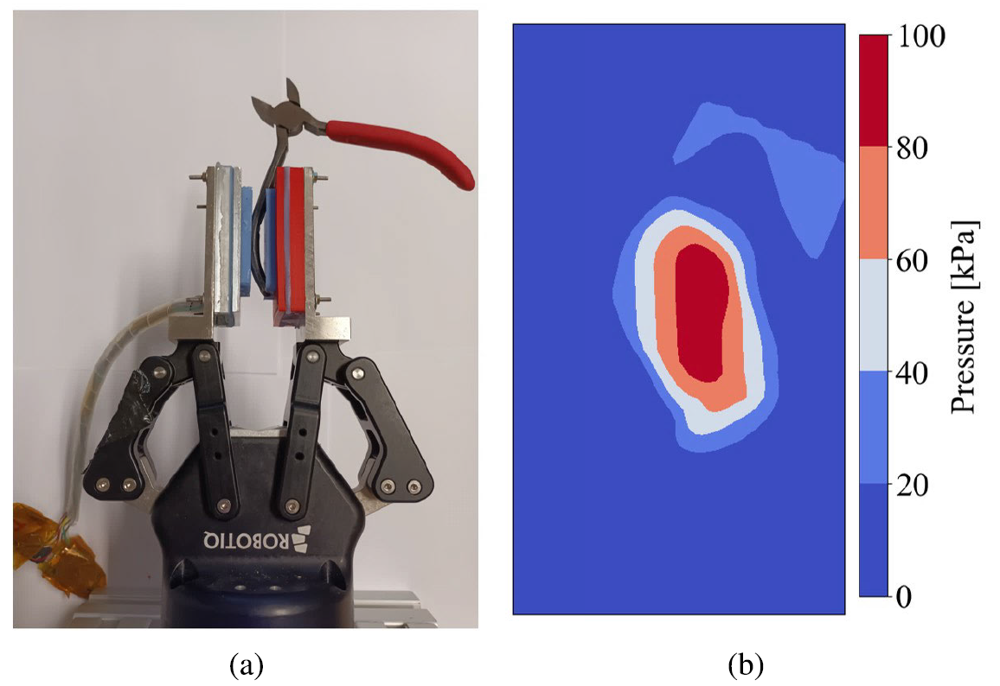

# Soft Barometric Tactile Sensor Utilizing Iterative Pressure Reconstruction _ 2024 IEEE Access

## Abstract

촉각 센서는 로봇 그리핑 시스템의 정밀도와 적응성을 향상시키는 데 핵심적 역할을 하며, 본 연구에서는 접촉 패드 아래의 엘라스토머층 내부 압력 데이터를 포착하도록 설계된 새로운 소프트 기압식 촉각 센서를 제안한다. 본 센서는 **매개변수화된 압력 분포에 대한 반복적 피팅 과정을 적용하여 대규모 보정이나 복잡한 학습 절차를 불필요**하게 한다. 압력 재구성 정확도를 평가하기 위한 **새로운 지표를 도입하고 이에 대한 정량적 검증**을 수행했다. 또한 **다중 접촉 검출의 정밀도와 힘 추정 능력을 조사**했다. 실용적 적용을 위해 손안에서의 **물체 자세 측정 실험을 수행**했으며, 본 센서는 다양한 인덴터에 대해 압력 분포를 정확히 재구성했고**, 두 접촉 사이 거리가 5 mm를 초과할 경우 두 접촉을 신뢰성 있게 구분**했으며, **힘 추정에**서 **평균 절대 오차(MAE)는 1.83 N**을 보였다. 또한 손안 재배치(in-hand reorientation)에서 평균 절대 회전 오차(MARE)는 6.81°로 나타나 실용적 적용 가능성을 입증했다.

## I. INTRODUCTION

로봇 그리핑 시스템은 제조에서 의료에 이르기까지 다양한 산업에서 핵심적 역할을 하며, 정교함과 정밀성이 필수적이다. 이 맥락에서 촉각 센서는 로봇이 환경과 상호작용하고 표면 특성을 인식하며 민감하고 적응적인 섬세한 그립 동작을 수행하도록 하는 기본 구성요소다. 인간의 경험에서 촉각 피드백은 시각에 의존하지 않고도 복잡한 작업을 무리 없이 수행하게 해준다. 이러한 촉각 센서를 로봇 그리퍼에 통합하면 이전에는 불가능했던 섬세한 작업 수행과 지능형 제어가 가능해진다. 즉, 촉각 통합은 로봇이 ‘촉감’을 통해 환경과 상호작용하게 하여 복잡하고 정밀한 기동 능력을 크게 향상시킨다.

---

여러 종류의 촉각 센서가 존재하며 각기 다른 감지 원리를 사용한다. 비전 기반 촉각 센서[1–5], 자기 기반 촉각 센서[6,7], 기압(바로메트릭) 촉각 센서[8–11] 등이 일반적으로 사용된다. 또한 정전용량식 또는 압전식 촉각 센서도 다양한 응용에서 연구되고 있다. 이들 센서는 고밀도 박스 포장[12], 펙-인-홀(peg-in-hole) 삽입 작업[13], 능동 윤곽 추적[14], 복잡한 인핸드 조작[15] 등 광범위한 작업에 적용된다. 의료 분야에서는 최소 침습 수술[16], 의수·의족과 같은 보철 응용에서 필수적이며, 그 밖에도 생의학 분야의 여러 응용[18]과 촉각을 통합한 지능형 시스템[19]에 활용된다.

---

기존 연구의 대부분은 촉각 센서를 머신러닝 기법과 결합하여 사용한다. 반면 바로메트릭 센서를 사용하면 촉각 특징을 직접 측정할 수 있어 해석이 용이하고 대규모 보정이나 복잡한 학습 과정이 필요 없다. 이는 산업 현장에서의 빠르고 간단한 배치를 가능하게 한다. 본 연구는 선행연구[9]를 기반으로 센서 설계를 크게 개선했다. 이번 개선으로 점 접촉(point contact) 가정을 제거하고 임의 형상의 압력 분포 재구성이 가능해짐에 따라 더 미세한 정보 캡처가 가능해졌다.

---

본 연구에서는 엘라스토머층 내 접촉 패드 아래의 압력 데이터를 포착하도록 설계된 연성 기압식 촉각 센서를 제안한다. 그림 1은 해당 센서가 로봇 그리퍼의 손끝에 장착된 모습을 보여준다. **매개변수화된 압력 분포에 기반한 반복적 절차를 적용하여 임의 형상과 다중 접촉점을 포함하는 복잡한 압력 분포를 재구성할 수 있다.** 센서 성능을 **정량적으로 평가하기 위해 새로운 지표를 도입**했다. 또한 본 연구는 압력 재구성 정확도의 정성적 분석, 다중 접촉 검출 정밀도 평가, 힘 추정 성능 평가를 포함한다. 마지막으로 본 접근법의 성능을 손안에서의 물체 자세 측정을 통해 시연했다.

FIGURE 1. Tactile sensor mounted at the fingertips of a robotic gripper grasping pliers (a). Reconstructed pressure distribution (b).

## II. RELATED WORK

### A. TACTILE SENSORS

촉각 센서 주제는 최근 수년간 광범위하게 연구되었다. 이들 센서는 서로 다른 감지 원리를 사용한다. 최근에는 비전 기반 촉각 센서가 큰 인기를 얻었다. 이러한 센서는 카메라 이미지를 통해 기계학습을 적용하여 고해상도 촉각 정보(힘과 변형 등)를 추론한다. 잘 알려진 예로 GelSight 센서[1]가 있다. 이 설계는 Gelsight360[2], GelSight Baby Fin Ray[3] 등 다양한 응용으로 변형되었다. 또 다른 유망한 비전 기반 센서는 Insight[4]이며, 소형화한 Minsight[5]로도 개발되었다.

두 번째 분류는 자기(마그네틱) 기반 촉각 센서다. 이들은 자화된 표면의 변형이 일으키는 자기장 변화를 측정하여 촉각 정보를 얻는다. 해상도는 높게[6]부터 낮게[7]까지 다양하다.

마지막으로 주요한 센싱 원리는 기압(바로메트릭) 촉각 센싱이다. 이 방법은 MEMS 센서를 이용해 엘라스토머 층 내 압력을 직접 측정한다. 이러한 센서는 주로 접촉 위치 추정[8],[9] 및 슬립 검출[9],[10],[11]에 사용된다. 압력이라는 촉각 특성을 직접 측정하므로 기계학습이나 대규모 보정 과정 없이도 해석이 비교적 직관적이다[9].

그 밖에도 정전용량식, 압력저항식(피조저항) 및 압전식 등 다른 감지 원리들이 촉각 센서에 활용된다. 전반적 개요는 [20]을 참조하라.

### B. TACTILE LOCALIZATION

촉각 센서는 그리핑 중 물체의 위치를 추정하는 데 유용하다. 이를 통해 슬립 검출, 제어, 인-핸드 조작 등 기능이 가능해진다.

[21]에서는 비전 기반 촉각 센서를 사용해 국소 패치 맵(촉각 센서 멤브레인의 변형)을 재구성하여 국소 형상을 복원했다. 촉각 이미지에서 3D 재구성을 생성하는 매핑을 학습시키는 방식이다. 이 접근은 병진 추적 오차 2 mm 및 회전 추적 오차 10deg를 달성했다.

[22]는 교란된(tactile) 이미지와 비교하여 임계값 처리를 적용함으로써 그립 중 물체의 윤곽 위치와 방향을 결정했다. 또한 법선력 분포와 전체 전단력도 추정할 수 있었다. 이들의 결과는 위치 RMSE 약 20 px, 방향 RMSE 약 6deg이다.

인-핸드 회전 중 물체를 위치추정하기 위해 [23]은 비전 기반 촉각 센서를 활용했다. 촉각 이미지에서의 그래디언트를 통합하여 깊이(depth) 영상을 재구성한다. 다만 이 과정은 보정 절차를 필요로 한다.

### C. SLIP DETECTION AND IN-HAND REPOSITIONING

슬립 검출과 제어는 촉각 센서의 주요 응용 분야다. 주로 물체의 미끄러짐을 방지하는 데 사용된다. 촉각 센서에 보조적인 비전 시스템을 결합하면 성능이 향상된다. [24],[25] 

다른 접근법은 그립에서 의도적으로 슬립을 허용하여 물체를 인-핸드로 재배치하는 것이다.

[26]에서는 물체를 중력만을 이용해 인-핸드로 회전시켰다. 광학식 촉각 센서와 장단기기억(LSTM) 신경망을 결합해 목표 자세로의 회전을 달성했다. 목표 오차는 12.67°로 보고되었다.

[27]은 멤브레인 동역학 모델(Membrane Dynamics Model)을 사용해 환경만으로도 그립된 물체를 원하는 인-핸드 구성으로 유도할 수 있음을 보여준다. 모델 학습 후 피벗(pivoting) 오차는 5.41°였다.

[28]에서는 두 단계 방법을 개발했다. 먼저 촉각 이미지에서 접촉 영역을 촉각 분할 신경망으로 분할한다. 분할된 접촉 영역에 타원을 적합(fit)시키고, 타원의 주축 방향을 추적하여 평균 절대 회전 오차(MARE) 1.85°를 달성했다. 다만 허용된 슬립 각도는 최대 30°로 제한되었다.

## III. METHODS

### A. SENSOR DESIGN

**FIGURE 2. Sensor design. (a) PCB: top view. (b) PCB: bottom view. (c) Assembled tactile sensor.**

우리 **센서 설계는 [9]를 참고하였으나 상당한 개선**을 가했다. 구체적으로 디지털 마이크로 고도계(MS5840 [29])를 4×8 배열로 확대했다. **센서 간 중심간격은 4.5 mm로 줄여 압력 분포의 세부를 더 잘 포착**하도록 했다. 
센서들은 그림 2a에 보이는 것처럼 4층 PCB 위에 납땜되었다. PCB 하부에는 개별 센서의 압력 데이터를 읽는 4개의 멀티플렉서(TCA9548A)가 배치되어 있어(그림 2b) 외부로 빠져나가는 배선 수를 크게 줄인다. 

엘라스토머층은 Resion Resin Technology의 2성분 액상 엘라스토머 혼합물을 사용해 제작한다. 진공 펌프로 탈기한 뒤 3D 프린트 몰드에 부어주고, 조립된 촉각 센서와 액상 엘라스토머를 함께 다시 탈기한 후 24시간 동안 경화시킨다. 이 과정은 재료를 쇼어 경도 15A의 실리콘 고무로 고정화한다. 특히 탈기는 보호된 MEMS 트랜스듀서와 엘라스토머 사이의 신뢰성 있는 접합을 확보하는 데 필수적이다[30].

마지막으로 접촉 패드 주변에 금속 림을 통합했다(그림 2c). 이 림은 압력 센서와 엘라스토머 간 접합의 견고성을 크게 향상시켜 접촉 패드에 인장력이 가해질 때 엘라스토머가 박리되는 것을 방지한다.

### B. PRESSURE RECONSTRUCTION

본 연구는 선행연구[9]를 바탕으로 **점 접촉, 선 접촉, 면 접촉을 포함한 다양한 접촉 유형을 하나의 통일된 압력 분포 모델로 재구성할 수 있는 방법론을 제안하는 것을 목표**로 한다. 이를 위해 **직사각형 압력 분포를 선택하고 엘라스토머층에서의 압력 확산을 모사하기 위해 가우시안 감쇠(gaussian drop-off)를 추가**했다. 이 접근은 다음과 같이 수학적으로 표현된다.

$$
\begin{equation}\tag{1}p(x,y) =\begin{cases}p_{0}, & \text{if } |x| < \dfrac{l_{x}}{2} \ \text{and}\ |y| < \dfrac{l_{y}}{2},\\[6pt]p_{0}\exp\!\left(-\dfrac{1}{2}\dfrac{d^{2}}{\sigma^{2}}\right), & \text{otherwise.}\end{cases}\end{equation}
$$

여기서 $p(\cdot)$는 압력이고 $p_{0}$는 직사각형 분포 중심에서의 압력(최대 압력), $l_x$와 $l_y$는 각각 직사각형 압력 분포의 주·부축 길이이며, $d$는 직사각형 분포 경계까지의 최소 카르테시안 거리, $\sigma$는 가우시안 감쇠의 폭을 나타낸다.

---

곡선형 압력 분포를 재구성하기 위해 (1)에 추가 매개변수 $\kappa_{\text{curve}}$를 도입했다. 이 확장은 극좌표계를 이용하여 y-축 상의 좌표 $y = 10/\kappa_{\text{curve}}$를 중심으로 직사각형 분포를 곡선화하는 방식으로 구현된다. 

**FIGURE 3. Curving of the rectangular pressure distribution.**

여기서 상수 10은 파라미터 피팅을 용이하게 하기 위해 도입되었다. 그림 3은 x축을 따라 놓인 선 접촉이 반경 $10/\kappa_{\text{curve}}$인 원으로 곡선화되는 단순화된 사례를 보여준다.

$\kappa_{\text{curve}} = 0$이면 반지름이 무한대가 되어 곡률이 생기지 않는다. $\kappa_{\text{curve}}$가 증가하면 곡률 중심까지의 거리가 감소하고 그에 따라 곡률이 커진다(그림 3 참조).

---

최종적으로 이 압력 분포는 아래의 좌표 변환을 통해 접촉 패드 상의 임의 위치와 방향으로 배치될 수 있다.

$$
\begin{equation}\tag{2}\begin{bmatrix} x' \\[4pt] y' \end{bmatrix}=\begin{bmatrix}\cos\alpha & -\sin\alpha \\[6pt]\sin\alpha & \phantom{-}\cos\alpha\end{bmatrix}\begin{bmatrix} x - x_{0} \\[4pt] y - y_{0} \end{bmatrix}\end{equation}
$$

여기서 (x')와 (y')는 변환된 좌표이고, $\alpha$는 직사각형 압력 분포의 주축(주요 축)과 카르테시안 좌표계의 (x)축 사이에 이루어지는 각도이며, $x_{0}$는 직사각형 압력 분포 중심의 카르테시안 (x)좌표를 의미하고, $y_{0}$는 직사각형 압력 분포 중심의 카르테시안 (y)좌표를 의미한다.

---

결과적으로 얻어지는 압력 분포는 가우시안 감쇠를 갖는 곡선형 직사각형 형태로 정의되며, 다음 8개의 매개변수로 표현된다.

• $p_{0}$ [Pa]: 압력 분포 중심의 압력(최대 압력)

• $\sigma$ [mm]: 가우시안 감쇠의 폭

• $l_{x}$ [mm]: 직사각형 분포의 주축 길이

• $l_{y}$ [mm]: 직사각형 분포의 부축 길이

• $\kappa_{\text{curve}}$ [ $mm^{-1}$ ]: 곡률 계수

• α [°]: 직사각형 분포의 주축과 카르테시안 x축 사이의 각도

• $x_{0}$ [mm]: 직사각형 분포 중심의 x 좌표

• $y_{0}$ [mm]: 직사각형 분포 중심의 y 좌표

---

이러한 매개변수가 압력 분포에 미치는 영향을 보여주기 위해 **그림 4**는 인위적으로 생성된 압력 분포를 보여줍니다. 이제부터 이러한 모든 매개변수는 
단일 변수  $\theta=[p_{0},\ \sigma,\ l_{x},\ l_{y},\ \kappa_{\text{curve}},\ \alpha,\ x_{0},\ y_{0}]$로 표현한다.

FIGURE 4. Parameterised pressure distribution.

---

압력 재구성은 관측된 압력 데이터에 가장 잘 맞는 압력 분포의 최적 파라미터를 찾는 최적화 문제로 다시 정식화할 수 있다. 이 목적은 다음 오차 함수에 대한 최소제곱(least-squares) 최소화로 달성된다:

$$
\mathrm{Err}(\theta)=\sum_{i=1}^{n}\bigl[p(x_i,y_i,\theta)-\hat{p_i}]^2 \tag{3}
$$

여기서 $p(\cdot)$는 추정된 압력이고 $(x_i)$와 $(y_i)$는 센서 (i)의 x 및 y 좌표이며 $\theta$는 압력 분포의 파라미터들이다. $\hat{p_i}$는 센서 (i)에서 측정된 압력 값이다. 최적화 기법으로는 Powell의 dog-leg 방법(Powell’s dog-leg method)을 선택하였다.

---

최적화 성능을 향상시키기 위해 초기 추정값은 결정적 역할을 한다. 각 시간 스텝 간 변화가 제한적이라고 가정하면, 이전 시간 스텝의 결과를 현재 시간 스텝의 초기 추정값으로 사용한다. 이전 시간 스텝에 접촉이 없었다면 원시 압력 데이터(raw pressure data)를 기반으로 파라미터를 대략 추정한다.

---

최적 파라미터  $\theta^{*}$ *가 찾아진 후에는 각 센서 위치에서의 잔여 압력(residual pressure)을 다음과 같이 계산할 수 있다:*

$$
p_{\text{res},i} = p(x_i, y_i, \theta^{*}) - \hat{p_i} \tag{4}
$$

여기서 $p_{\text{res},i}$는 센서 (i)의 잔여 압력이고, $p(\cdot)$는 센서 (i)에 대한 추정 압력이며, $\hat{p_i}$는 센서 (i)에서 측정된 압력 값이다.

---

**잔여 압력 값은 현재의 압력 분포 추정치와 실제 측정치 간의 정렬 정도를 나타내는 지표로 사용**된다. 특정 센서에서 높은 잔여 압력이 존재한다는 것은 현재의 파라미터 집합 $\theta^{*}$로는 정확히 표현되지 않는 압력 분포가 존재함을 시사한다. 복잡하거나 다중 접촉 기하를 재구성할 때는 이러한 높은 잔여가 기대된다. 단일 파라미터 집합으로는 이들 기하학적 복잡성을 충분히 포착하지 못할 수 있기 때문이다.

이 문제를 해결하기 위해 우리는 반복적 방법을 적용한다. 즉, 파라미터 피팅 과정(식 (3))을 **측정된 압력 값 대신, 잔여 압력 값(식 (4))으로 반복적으로 수행**한다. 이 반복적 방법론은 기존 파라미터로 설명되지 않는 압력 분포를 포착하고 임의 형상을 재구성하는 데 필수적이다. 이 과정을 통해 ( $\theta^{*}$ )는 단일 파라미터 세트가 아니라 복수의 파라미터 세트들의 리스트가 된다.

최종 압력 분포는 각각의 압력 분포를 모두 합산하여 얻어지며, 각 압력 분포는 $\theta^{*}$ 에 나열된 해당 매개변수로 특징지어진다.

---

이 반복 과정은 원하는 정확도에 도달하거나 최대 반복 횟수에 도달할 때까지 계속된다. 반복당 계산 시간이 증가하므로 미리 정해진 주파수에서 실시간으로 동작시키려면 최대 반복 횟수를 설정하는 것이 필수적이다. 현재 설정에서는 시스템이 20 Hz로 동작하도록 최대 반복 횟수를 5로 설정하였다.

또한 $p_{0}$에 음수를 허용한다는 점이 중요하다. 이 기능은 압력 분포를 단순히 더하는 것뿐 아니라 서로 빼는 것도 가능하게 한다.

최종 압력 분포를 접촉 패드 위에서 적분하면 접촉 중의 법선력을 얻을 수 있다. 이 적분은 수치적으로 수행된다.

$$
F_{z}=\iint p(x,y,\theta^{*}),dx,dy \tag{5}
$$

---

## IV. PRESSURE RECONSTRUCTION FIT

---

**압력 재구성의 정확도 평가(참조 Sec. V-B)**는 촉각 센서 연구에서 근본적인 도전 과제다. **접촉 패드 아래의 실제 연속 압력 분포는 본질적으로 알려져 있지 않으며 오직 이산화된 센서 위치에서만 측정 가능**하다. 이 일반적인 문제에 대한 보편적 해법은 존재하지 않으며 문헌에서는 여러 가지 전략이 제시되어 있다.

---

한 가지 전략은 센서가 추정한 전체 힘(total estimated force)을 실제 측정된 전체 힘과 비교하는 것이다. 이는 압력 재구성 정확도에 대한 전역적 정량 척도를 제공한다[22]. 그러나 이 방법은 접촉 패드 아래의 압력 분포의 국소적 세부를 포착하지 못한다. 그럼에도 불구하고 본 논문의 Sec. V-D에서는 식(5)에 따른 힘 추정의 정확도를 평가하기 위해 이러한 상세한 검토를 수행한다.

---

대안으로는 압력 재구성에 대해 **정성적 분석을 수행하는 방법**이 있다. 여러 기준을 적용하고 국소적 세부를 검토함으로써 정확도에 대한 통찰을 제공한다[2],[31]. 그러나 이 방법은 서로 다른 방법론 간의 객관적 비교를 허용하지 않는다.

세 번째 방법으로는 **센서의 유한요소법(Finite Element Method, FEM) 모델을 구성하는 접근이 있다**[32],[33]. 그러나 이는 본 연구의 의도된 범위를 벗어나며, 실험 데이터와 모델을 정렬시키는 데 있어 유사한 어려움에 직면할 수 있다.

---

본 연구에서는 압력 재구성 정확도를 평가하기 위한 새로운 지표인 **Pressure Reconstruction Fit(PRF)를 제안**한다. 

**알고리즘 1**에 개요가 제시된 PRF 알고리즘은 영역을 카르테시안 x·y 방향으로 이산화(라인 3–4)하고 전체 영역을 순회(라인 6)한다. 

**PRF는 접촉 영역 아래에는 고압 영역이 존재한다는 가정(라인 7–11)과, 비접촉 영역에서는 압력 수준이 낮다는 가정(라인 12–17)을 기반으로 동작한다.** 

이 가정에 따라 압력 재구성이 기대되는 접촉 조건과 일치하면 적합값(fit-value)을 1만큼 증가시키고, 가정이 만족되지 않을 경우 적합값을 유지한다. 

최종적으로 PRF는 고려된 모든 영역 점에 대해 이 적합값을 평균하여 얻어진다(라인 19). 이 접근법은 **압력 재구성이 접촉 영역의 형태를 얼마나 효과적으로 포착하는지를 정량화할 수 있게 한다.**

## V. RESULTS & DISCUSSION

### A. DATA COLLECTION AND PROCESSING

FIGURE 5. Indenters. Top row: Simple geometries. Middle row: Complex geometries. Bottom row: Multiple contact geometries.

**촉각 센서 성능 평가를 위한 데이터를 수집**하기 위해 다양한 형태의 인덴터를 3D 프린트하였다. 

먼저 **단순한 형상**으로는 구형(spherical), 원기둥형(cylindrical), 정사각형(square-shaped) 및 직사각형(rectangular) 인덴터가 있으며, 각 형상은 소형과 대형 버전으로 제공된다. 이들은 그림 5의 상단 행에 표시되어 있다. 

두번째로 **더 복잡한 형상**으로는 C자형(C-shaped), L자형(L-shaped), O자형(O-shaped) 인덴터가 있으며 이들도 소형과 대형으로 구성되어 있다. 이들은 그림 5의 중간 행에 제시되어 있다. 

마지막으로 **다중 접촉 인덴터**로는 정오각형 형태의 다섯 점 접촉 인덴터와 X자형 다섯 점 접촉 인덴터, 그리고 접촉 중심 간 거리가 16 mm에서 4 mm까지 변화하는 두 점 접촉 인덴터들이 포함된다. 이들은 그림 5의 하단 행에 전시되어 있으며, 일부 인덴터는 그림 6에서 더 자세히 확인할 수 있다.

---

이들 인덴터는 포지션 제어(position-controlled) 로봇 암(UR5e)의 엔드이펙터 끝에 장착되어 실험을 수행하였다. UR5e의 제어는 ROS 환경에서 MoveIt! 모션 제어 패키지를 사용하여 이루어졌으며, 해당 ROS 배포판은 Preemptive 리눅스 커널이 적용된 ROS Noetic이다. 이 구성은 실험 전반에 걸쳐 인덴터의 위치(x, y)와 방향(α)을 연속적으로 모니터링·기록할 수 있게 했다. 또한 모든 3차원 공간 축에 대한 힘과 토크를 포착하기 위해 6자유도(6-DoF) **ATI M80-M8 포스/토크 센서**를 사용하였다. 우리는 **법선력 (F_z)를 기록했으며 측정 해상도는 0.04 N**이었다.

---

**촉각 센서는 20 Hz의 주기로 32개의 개별 스칼라 압력 값을 생성**하며, 이 값들은 벡터 $\hat{p}$로 정리된다. 그림 6은 다양한 인덴터에 대해 얻어진 $\hat{p}$ 값을 보여준다. 

FIGURE 6. Raw pressure data (middle row) and reconstructed pressure distribution (bottom row) of different indenter contours (black). From left to right: square-shaped indenter, rectangular indenter, L-shaped indenter, C-shaped indenter, O-shaped indenter and five-point X-shaped indenter.

**주의할 점은 바로메트릭 센서로부터 얻은 압력 값 $\hat{p}$는 각 접촉 이벤트 이후에 반드시 0으로 초기화(reset)해야 한다는 것이다.** 

이는 반복 접촉 시 바닥면에 누적되는(또는 발생하는) 전단 응력(shear stress)을 보정하기 위함이다. 

또 다른 중요한 구현 세부사항으로는 위치 및 힘 센서의 판독값을 20 Hz로 다운샘플(downsampling)하는 것이다. 

이들 센서는 원래 압력 데이터보다 높은 주파수(최대 500 Hz)로 샘플링되므로 압력 데이터와 동일한 속도로 맞추기 위해 샘플링 속도를 낮춘다. 

마지막으로 데이터는 러버(엘라스토머)가 새로운 인덴터에 대해 먼저 안정화되도록 기다리지 않고 동적(dynamic)으로 수집되었다. 

이는 빠른 응답 속도를 우선시하기 위한 결정이며, 우리는 이 특징이 로봇 응용에 센서를 통합하는 데 있어 중요하다고 판단하였다.

### B. EVALUATION OF THE PRESSURE RECONSTRUCTION

압력 재구성 알고리즘의 유효성을 평가하기 위해 모든 인덴터에 대해 PRF를 계산했다(그림 5). 

각 인덴터에 대해 **네 번의 실험을 수행**했고, 각 실험에서 **인덴터는 무작위로 배치·회전**되었으며 **힘은 1 N에서 20 N까지 점진적으로 증가**시켰다. PRF 계산에는 네 가지 입력이 필요하다: 

(i) 제 III-B절에서 논의한 대로 재구성된 압력 $p(x,y,\theta^{*})$, 
(ii) 로봇 암의 위치와 인덴터의 알려진 형상으로부터 얻은 접촉 위치 $((x,y){\text{contact}})$,
(iii) 임계 압력으로 정의된 *$p_{\text{thres}}=0.333,p_{\max}$*. 
(iv) (n=50) 결과는 표 1에 제시되어 있다.

TABLE 1. The average PRF for the different geometry types and different maximal iteration count.

---

결과는 **단순 형상**에 대해 본 방법이 **압력 분포를 정확히 재구성하는 데 탁월함을 시사**한다. 이러한 경우 반복적 방법의 이점은 거의 없으며, 단일 매개변수화된 압력 분포만으로도 압력장을 정확히 표현할 수 있다. 

반대로 **복잡한 형상**에서는 평균 PRF가 감소하는 것으로 관찰된다. 이는 이러한 기하학을 재구성하는 데 내재한 어려움 때문에 예상되는 결과다. 다만 최대 반복 횟수를 늘렸을 때 PRF가 증가하는 경향이 관찰되었다. 개선 폭은 다소 제한적이지만 이는 제안한 방법론의 잠재적 효과를 뒷받침한다.

**다중 접촉 인덴터** 결과를 분석할 때 최대 반복 횟수의 영향은 기대와 일치한다. 두 점 접촉의 경우 반복 횟수를 2로 늘리면 성능이 개선된다. 최대 반복 횟수를 더 늘려도 PRF에 미치는 영향은 거의 없는데, 이는 두 접촉이 이미 재구성된 압력장에 반영되어 있기 때문이다. 다섯 점 접촉의 PRF는 최대 반복 횟수를 5로 높였을 때 유의하게 향상된다. 재구성해야 할 접촉이 5개인 상황에서는 반복 횟수 증가가 예상대로 유리하다. 다중 접촉 검출에 대한 보다 상세한 분석은 제 V-C절에서 수행한다.

---

이 결과들은 본 절에서 앞서 정의한 임계압력 $p_{\text{thres}}$의 값에 따라 달라진다. 추가 분석 결과, $p_{\text{thres}}$를 $0.1p_{\max}$에서 $0.5p_{\max}$ 범위 내로 유지하면 이 영향은 최소화되는 것으로 나타났다. 비록 $p_{\text{thres}}$가 주로 절대적인 PRF 값에 영향을 미치지만, 다양한 경우들 간의 상대적 차이는 일관되게 유지된다. 따라서 동일한 결론을 도출할 수 있다.

---

정량적 분석을 보완하기 위해 정성적 분석도 수행되었다. **이 분석은 임의의 위치와 방향으로 센서를 누르는 인덴터의 형상 윤곽과 재구성된 압력 분포를 비교하는 방식으로 진**행되었다. 

FIGURE 6. Raw pressure data (middle row) and reconstructed pressure distribution (bottom row) of different indenter contours (black). From left to right: square-shaped indenter, rectangular indenter, L-shaped indenter, C-shaped indenter, O-shaped indenter and five-point X-shaped indenter.

일부 결과는 그림 6에 제시되어 있다. 이 그림은 **정사각형 및 직사각형과 같은 단순 형상의 경우 압력 재구성이 인덴터의 윤곽을 특히 물체의 위치와 방향 측면에서 효과적으로 포착함을 명확히 보여준다.** 복잡한 형상을 검토해보면 뾰족한 모서리와 같은 세부 특징들이 동등한 정밀도로 모두 캡처되지는 못함이 분명하다. **또한 센서의 가장자리 근처에서는 해당 영역에서의 압력 정보가 적기 때문에 압력 재구성의 정밀도가 저하되는 경향이 있다.** **그럼에도 불구하고 각 물체의 전체적인 외형은 분명히 인식 가능하다.** 앞서 언급한 바와 같이, 최대 반복 횟수는 5로 설정되었으며 이는 그림 6의 가장 오른쪽에 표시된 것처럼 최대 5개의 별도 접촉 이벤트를 검출할 수 있게 한다.

---

그림 6에서 미세하게 관찰되는 점은 **센서에 약간의 편향이 존재**한다는 것이다. 특히 왼쪽보다 오른쪽에서 더 높은 압력 판독값이 관측된다. 이 차이는 L자형 및 다섯 점 접촉 인덴터에서 두드러지게 나타난다. **그 원인은 엘라스토머 경화 시 표면의 평탄하지 못한 상태로 인해 고무 두께가 약간 달라진 것으로 보이며, 그 결과 오른쪽 부분의 고무가 약간 더 두꺼워진 것으로 추정**된다. 

비디오 첨부물은 압력 재구성 성능을 추가로 시연한다.

### C. MULTIPLE CONTACT DETECTION

---

**그림 6의 가장 오른쪽 섹션**은 분명히 **센서가 별개의 접촉 이벤트를 구별할 수 있음을 보여준다.** 이 절의 목적은 두 점 접촉 인덴터(그림 5 하단 행)를 사용하여 다중 접촉 검출의 정확도를 조사하는 것이다. 각 인덴터는 네 번의 무작위 위치 및 방향 배치를 겪었고, 각 시간 스텝에서 센서에 가해진 힘은 1 N에서 20 N까지 변화하였다. 이로 인해 **각 인덴터당 총 1200개의 샘플이 생성**되었다.

**정밀도 평가는 두 가지 주요 지표로 수행**된다. 

첫째, 다중 접촉 검출의 성공률은 센서가 **올바른 접촉점 개수를 식별**하는 능력을 측정한다. 
둘째, 올바른 접촉점 **개수가 식별된 경우** **두 압력 분포 간의 거리를 계산**한다. 계산된 평균 추정 거리는 **인덴터의 실제 접촉점 간 거리와 비교**된다. 표 2는 다중 접촉 검출의 결과를 보여준다.

TABLE 2. Success-rate and average estimated distance between multiple contacts for multi-point contact indenters with varying distances.

접촉 간 거리가 8 mm 이상일 때 일관된 관찰 결과가 나타난다. 다중 접촉을 검출하는 성공률은 (거의) 100%에 도달하며, 추정 거리 오차는 개별 바로메트릭 센서 간격의 약 절반(즉 2.25 mm) 정도이다. 

그러나 **접촉 간 거리가 감소하면 성공률은 하락하기 시작**한다. 접촉 거리가 6 mm일 때 성공률은 84.5%로 떨어지고, 5 mm에서는 61.7%로 더 감소하며, 4 mm에서는 28.3%로 크게 저하된다. 이는 접촉 간 거리가 개별 바로메트릭 센서 간격(즉 4.5 mm)보다 작아지면 두 접촉을 신뢰성 있게 구분하는 것이 불가능해짐을 분명히 보여준다.

### D. FORCE ESTIMATION

---

바로메트릭 기압 센서의 동작 특성을 이해하는 것은 **힘 추정 정확도를 평가하기 전에 필수적**이다. 이 센서들은 동작 압력 범위가 넓어 최대 2000 mbar에 이른다. 성능 특성으로 미루어볼 때, 센서가 동작 범위를 초과하는 압력을 받으면 음(negative)의 압력 오차가 발생하며, **압력이 더 범위를 벗어날수록 이 오차의 절대값이 커진다**[29]. 결과적으로 압**력의 과소추정이 발생하고, 이는 힘 추정의 과소추정 및 압력 재구성 정확도 저하로 이어진다.**

---

이 정확도 저하가 발생하는 힘의 임계값은 사용한 인덴터에 따라 달라진다. 작은 인덴터는 동일한 힘을 더 작은 표면적에 집중시키므로 더 높은 압력을 유발한다. 따라서 작은 인덴터의 경우 정확한 힘 추정이 가능한 범위가 더 좁아진다.

---

모든 인덴터에 대해 분석을 수행한 결과, 적용하는 최대 힘을 20 N으로 제한하기로 결정했다. 작은 인덴터의 경우 이 힘 한계가 종종 압력 제약을 초과하였다. 그러나 이 한계를 초과하더라도 정확도에 미치는 영향은 제한적이었다.

---

FIGURE 7. Measured versus estimated force.

그림 7은 다소 넓은 힘 범위에서 추정된 힘과 측정된 힘을 비교한 결과를 보여준다. 특히 힘이 10 N 이하일 때는 힘 추정이 측정값과 거의 일치하며 MAE는 0.99 N을 나타낸다. 

그러나 10 N에서 20 N 범위에서는 추정된 힘이 실제 힘을 과소추정하는 경향이 나타난다. 이 불일치는 **일부 작은 인덴터가 압력 한계를 초과했기 때문**이다. 이 효과는 작은 인덴터에만 부분적으로 적용되므로 MAE에만 일부 반영된다. 

전체적으로는 MAE가 1.83 N으로 계산되었다. 힘이 더 높은 범위(20 N–30 N)로 증가하면 이 불일치는 더욱 두드러지며, 이는 더 큰 인덴터들조차 압력 한계를 초과하기 때문이다. 이 구간의 MAE는 6.01 N으로 높아진다.

---

보다 정밀한 힘 추정을 요구하는 응용에서는 선형 보정(linear calibration) 절차를 적용할 수 있다. 이는 특정 인덴터와 함께 1-자유도 force sensor를 사용해 수행할 수 있으며 로봇 암이 필요하지 않다. 이 보정 결과, MAE는 다음과 같이 감소하였다: 0–10 N 구간에서 0.70 N, 10–20 N 구간에서 1.02 N, 20–30 N 구간에서 2.86 N. 결과적으로 센서의 동작 범위는 그림 7에 표시된 바와 같이 보정 후 30 N까지 확장된다.

---

비록 힘 추정은 20 N(보정 시 30 N)으로 제한되었지만, 센서는 우발적인 높은 하중에도 상당히 견디는 것으로 관찰되었다. 실험 과정에서 165 N의 하중이 기록되었으나 촉각 센서에는 손상이 발생하지 않았다.

## VI. USE CASE: IN-HAND REORIENTATION

우리 **센서와 적용한 방법론의 성능을 보여주기 위해**, **물체가 잡힌 상태에서 외부 교란으로 인해 자세를 변경하되 regrasping을 필요로 하지 않는 사용 사례 시나리오를 설정**하였다. 

---

이 실험 구성에서 물체는 사전 정의된 물체별 그립력(object-specific gripping force)을 적용한 로보틱 그리퍼(Robotiq 2F85)에 의해 안전하게 잡힌다. PID 제어기는 연속적인 작동을 통해 일정한 그립력을 유지한다. 이후 사람이 개입하여 물체를 수동으로 회전시키며, 목표 자세에 도달하면 고정력을 증가시켜 물체를 원하는 자세로 고정한다.

자세 변화는 현재 지배적인 압력 분포의 각도 $\alpha$ (제 III-B절)와 회전 이전의 지배적 압력 분포의 각도 $\alpha$를 비교하여 평가했다. 여기서 ‘지배적인 압력 분포’는 반복 횟수가 1을 초과한 경우 최대 $p_0$ 값을 갖는 압력 분포로 정의한다(제 III-B절 참조). 각 그립에서의 자세 변화를 정량화하기 위해 물체에 관성측정장치(IMU BNO080)를 고정했다. 

FIGURE 8. Set of the 5 test objects.

그림 8은 테스트에 사용된 다섯 개의 물체 집합을 보여준다: 펜, 집게(pincers), 플라이어(pliers), 가위(scissors), 주걱(spatula). 빨간 상자는 가능한 모든 그립 위치를 표시한다. 본 연구에서는 각 물체에 대해 이 실험을 9회 반복했으며, 목표 자세 변화 범위는 10°에서 90°였다.

---

FIGURE 9. In-hand reorientation of pliers over 88◦. (a) Experimental procedure (top). Pressure reconstruction (bottom). (b) Measured vs estimation rotation.

TABLE 3. MARE of in-hand reorientation.

그림 9는 그 중 하나의 실험을 나타내며, 모든 실험 결과 요약은 표 3에 수록되어 있다. 전반적인 평균 절대 회전 오차(MARE)는 6.81°로 산출되었으며, 물체별 결과 간에는 큰 차이가 없었다. 다만 주걱(spatula)은 다소 성능이 낮게 나타났다. 이 차이는 IMU가 장착된 손잡이 부위에서 러버 섹션(그림 8e – 오른쪽 사각형)의 탄성 때문에 약간의 움직임이 발생했기 때문으로 판단된다.

---

이 결과를 현존하는 최신 기법들과 비교해보면, 본 접근법은 [26]에 비해 우수한 성능을 보였다. [27]과는 오차가 거의 유사하게 나타났으나, [28]은 본 방법보다 더 우수한 결과를 보였다. 다만 [28]은 슬립 각도를 0°에서 30° 범위로 제한하여 평가한 반면, 본 연구는 최대 90°까지의 슬립 각도를 포함한다는 점을 강조할 필요가 있다. 또한 이들 참고 문헌의 모든 기법은 머신러닝에 의존하여 광범위한 학습 절차를 필요로 했다는 사실도 중요하다. 본 연구는 **이 학습 절차를 제거함으로써 상당한 시간을 절약하고 시스템 복잡성을 낮추었다**.

## VII. CONCLUSION & FUTURE WORK

제시한 연구는 접촉 패드 아래의 압력 분포를 재구성할 수 있는 촉각 센서를 소개한다. 매개변수화된 재구성은 접촉 개수, 법선 접촉력, 그리고 그립 중의 자세 변화(orientation change)를 추정할 수 있게 한다. **접촉 패드 바로 아래의 직접적인 압력 측정은 보정이나 학습 절차 없이 매개변수화된 압력 분포를 피팅할 수 있게 한다**. 복잡한 형상에 대해서는 정확도를 높이기 위해 반복적 절차를 적용한다.

---

실험 결과는 다양한 인덴터에 대해 재구성된 압력 분포가 잘 정렬됨을 보여준다. 센서는 접촉 간 거리가 **5 mm 이상일 때 대체로 두 개의 접촉을 구별**한다. 또한 **보정 없이도 힘을 MAE 1.83 N 수준으로 추정할 수 있으며, 보정 시에는 MAE가 1.02 N으로 개선**된다. 더 나아가 본 매개변수화 기법을 이용한 인-핸드 재배치 제어기는 평균 절대 회전 오차(MARE) 6.81°를 달성했다.

---

향후 개발은 접선력(tangential force), 인덴테이션 깊이(indentation depth), 토크(torque) 측정을 통합하여 모델의 기능을 확장하는 것을 목표로 한다. 

또한 곡선형 직사각형 압력 분포 외의 다른 형태의 압력 분포도 고려할 수 있다. 기존의 자세 추정에 translational slip을 포함하는 것은 복합된 움직임이 결합되기 때문에 상당한 도전 과제로 남아 있다. 

고급 응용 분야를 탐구하는 것, 특히 촉각 피드백을 활용해 제조 작업을 향상시키는 것은 실제 환경에서 본 센서의 능력을 활용할 유망한 방향이다. 

촉각 센서는 그립 외에도 다재다능하므로, 본 방법론을 로봇 암이나 매니퓰레이터 주변의 촉각 스킨(tactile skin)으로 구현하는 방안도 흥미로운 연구 과제다. 

이러한 통합은 시스템이 환경과의 접촉에 반응하고 이를 유리하게 활용할 수 있게 만든다.

## Reference

1. IEEE Int. Conf. Robot. Autom. (ICRA) / 2015 / Measurement of shear and slip with a GelSight tactile sensor
2. IEEE Int. Conf. Soft Robot. (RoboSoft) / 2023 / GelSight360: An omnidirectional camera-based tactile sensor for dexterous robotic manipulation
3. IEEE Int. Conf. Soft Robot. (RoboSoft) / 2023 / GelSight baby fin ray: A compact, compliant, flexible finger with high-resolution tactile sensing
4. Nature Machine Intelligence / 2022 / A soft thumb-sized vision-based sensor with accurate all-round force perception
5. Advanced Intelligent Systems / 2023 / Minsight: A fingertip-sized vision-based tactile sensor for robotic manipulation
6. Science Robotics / 2021 / Soft magnetic skin for super-resolution tactile sensing with force self-decoupling
7. Proc. IEEE 17th Int. Conf. Intell. Eng. Syst. (INES) / 2013 / Tactile sensor on a magnetic basis using novel 3D Hall sensor–first prototypes and results
8. IEEE Robot. Autom. Lett. / 2018 / Data-driven super-resolution on a tactile dome
9. IEEE Robot. Autom. Lett. / 2022 / A soft barometric tactile sensor to simultaneously localize contact and estimate normal force with validation to detect slip in a robotic gripper
10. IEEE Int. Conf. Robot. Autom. (ICRA) / 2022 / Learning to detect slip with barometric tactile sensors and a temporal convolutional neural network
11. IEEE Sensors Journal / 2023 / Experimental characterization on slip detectability of barometer-based tactile sensor
12. IEEE/RSJ Int. Conf. Intell. Robots Syst. (IROS) / 2019 / Tactile-based insertion for dense boxpacking
13. IEEE Int. Conf. Robot. Autom. (ICRA) / 2022 / Active extrinsic contact sensing: Application to general peg-in-hole insertion
14. World Haptics Conf. (WHC) / 2013 / Active contour following to explore object shape with robot touch
15. IEEE-RAS Int. Conf. Humanoid Robots (Humanoids) / 2015 / Learning robot in-hand manipulation with tactile features
16. IEEE Access / 2020 / Tactile sensors for minimally invasive surgery: A review of the state-of-the-art, applications, and perspectives
17. Biosensors / 2014 / Microfabricated tactile sensors for biomedical applications: A review
18. Sensors and Actuators A: Physical / 2012 / A review of tactile sensing technologies with applications in biomedical engineering
19. Science Bulletin / 2020 / Recent progress in tactile sensors and their applications in intelligent systems
20. Robotics and Autonomous Systems / 2015 / Tactile sensing in dexterous robot hands—Review
21. IEEE Int. Conf. Robot. Autom. (ICRA) / 2022 / PatchGraph: In-hand tactile tracking with learned surface normals
22. IEEE Robot. Autom. Lett. / 2022 / UVtac: Switchable UV marker-based tactile sensing finger for effective force estimation and object localization
23. IEEE Int. Conf. Syst., Man, Cybern. (SMC) / 2022 / TacRot: A parallel-jaw gripper with rotatable tactile sensors for in-hand manipulation
24. IEEE Int. Conf. Robot. Autom. (ICRA) / 2018 / Slip detection with combined tactile and visual information
25. IEEE Int. Conf. Robot. Autom. (ICRA) / 2022 / Detection of slip from vision and touch
26. arXiv / 2022 / In-hand gravitational pivoting using tactile sensing
27. Conf. on Robot Learning (CoRL) / 2023 / Manipulation via membranes: High-resolution and highly deformable tactile sensing and control
28. IEEE Robot. Autom. Lett. / 2023 / Measuring object rotation via visuo-tactile segmentation of grasping region
29. TE Connectivity (MS5840-02BA product page) / 2023 (accessed Dec. 4, 2023) / MS5840-02BA
30. IEEE/ASME Transactions on Mechatronics / 2017 / Robust and inexpensive six-axis force–torque sensors using MEMS barometers
31. IEEE Robot. Autom. Lett. / 2023 / StereoTac: A novel visuo-tactile sensor that combines tactile sensing with 3D vision
32. IEEE Access / 2019 / Ground truth force distribution for learning-based tactile sensing: A finite element approach
33. IEEE Sensors Journal / 2014 / Modeling and analysis of a flexible capacitive tactile sensor array for normal force measurement